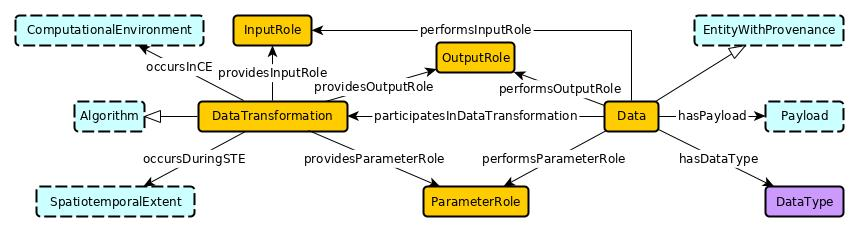

 __This pattern has been certified.__
Related submission, with evaluation history, can be found __here__

#  Graphical representation

__Diagram__

#  General description

  

#  Elements

_The __DataTransformationPattern__ Content OP locally defines the following ontology elements:_

 __executedIn__ (owl:ObjectProperty) 
  _[executedIn](../Submissions/DataTransformationPattern/executedIn.md "Submissions:DataTransformationPattern/executedIn") page_
 __hasDataType__ (owl:ObjectProperty) 
  _[hasDataType](../Submissions/DataTransformationPattern/hasDataType.md "Submissions:DataTransformationPattern/hasDataType") page_
 __hasPayload__ (owl:ObjectProperty) 
  _[hasPayload](../Submissions/DataTransformationPattern/hasPayload.md "Submissions:DataTransformationPattern/hasPayload") page_
 __implements__ (owl:ObjectProperty) 
  _[implements](../Submissions/DataTransformationPattern/implements.md "Submissions:DataTransformationPattern/implements") page_
 __occursIn__ (owl:ObjectProperty) 
  _[occursIn](../Submissions/DataTransformationPattern/occursIn.md "Submissions:DataTransformationPattern/occursIn") page_
 __performsInputRole__ (owl:ObjectProperty) 
  _[performsInputRole](../Submissions/DataTransformationPattern/performsInputRole.md "Submissions:DataTransformationPattern/performsInputRole") page_
 __performsOutputRole__ (owl:ObjectProperty) 
  _[performsOutputRole](../Submissions/DataTransformationPattern/performsOutputRole.md "Submissions:DataTransformationPattern/performsOutputRole") page_
 __performsParameterRole__ (owl:ObjectProperty) 
  _[performsParameterRole](../Submissions/DataTransformationPattern/performsParameterRole.md "Submissions:DataTransformationPattern/performsParameterRole") page_
 __providesInputDataRole__ (owl:ObjectProperty) 
  _[providesInputDataRole](../Submissions/DataTransformationPattern/providesInputDataRole.md "Submissions:DataTransformationPattern/providesInputDataRole") page_
 __providesOutputDataRole__ (owl:ObjectProperty) 
  _[providesOutputDataRole](../Submissions/DataTransformationPattern/providesOutputDataRole.md "Submissions:DataTransformationPattern/providesOutputDataRole") page_
 __providesParameterRole__ (owl:ObjectProperty) 
  _[providesParameterRole](../Submissions/DataTransformationPattern/providesParameterRole.md "Submissions:DataTransformationPattern/providesParameterRole") page_
 __Algorithm__ (owl:Class) 
  _[Algorithm](../Submissions/DataTransformationPattern/Algorithm.md "Submissions:DataTransformationPattern/Algorithm") page_
 __ComputationalEnvironment__ (owl:Class) 
  _[ComputationalEnvironment](../Submissions/DataTransformationPattern/ComputationalEnvironment.md "Submissions:DataTransformationPattern/ComputationalEnvironment") page_
 __DataTransformation__ (owl:Class) 
  _[DataTransformation](../Submissions/DataTransformationPattern/DataTransformation.md "Submissions:DataTransformationPattern/DataTransformation") page_
 __DataType__ (owl:Class) 
  _[DataType](../Submissions/DataTransformationPattern/DataType.md "Submissions:DataTransformationPattern/DataType") page_
 __EntityWithProvenance__ (owl:Class) 
  _[EntityWithProvenance](../Submissions/DataTransformationPattern/EntityWithProvenance.md "Submissions:DataTransformationPattern/EntityWithProvenance") page_
 __InputDataRole__ (owl:Class) 
  _[InputDataRole](../Submissions/DataTransformationPattern/InputDataRole.md "Submissions:DataTransformationPattern/InputDataRole") page_
 __OutputDataRole__ (owl:Class) 
  _[OutputDataRole](../Submissions/DataTransformationPattern/OutputDataRole.md "Submissions:DataTransformationPattern/OutputDataRole") page_
 __ParameterRole__ (owl:Class) 
  _[ParameterRole](../Submissions/DataTransformationPattern/ParameterRole.md "Submissions:DataTransformationPattern/ParameterRole") page_
 __Payload__ (owl:Class) 
  _[Payload](../Submissions/DataTransformationPattern/Payload.md "Submissions:DataTransformationPattern/Payload") page_
 __SpatiotemporalExtent__ (owl:Class) 
  _[SpatiotemporalExtent](../Submissions/DataTransformationPattern/SpatiotemporalExtent.md "Submissions:DataTransformationPattern/SpatiotemporalExtent") page_
 __aData__ (owl:Class) 
  _[aData](../Submissions/DataTransformationPattern/aData.md "Submissions:DataTransformationPattern/aData") page_
#  Additional information

#  Scenarios

__Scenarios about DataTransformationPattern__
No scenario is added to this Content OP.

#  Reviews

__Reviews about DataTransformationPattern__
There is no review about this proposal.
This revision (revision ID __13874__) takes in account the reviews: none

Other info at [evaluation tab](http://ontologydesignpatterns.org/wiki/index.php?title=Submissions:DataTransformationPattern&action=evaluation "http://ontologydesignpatterns.org/wiki/index.php?title=Submissions:DataTransformationPattern&action=evaluation")

  

#  Modeling issues

__Modeling issues about DataTransformationPattern__
There is no Modeling issue related to this proposal.

  

#  References

[Add a reference](index.php@title=Odp%253AAdd_reference&subject=../Submissions/DataTransformationPattern.md "http://ontologydesignpatterns.org/wiki/index.php?title=Odp:Add_reference&subject=Submissions%3ADataTransformationPattern")

  

Retrieved from "[http://ontologydesignpatterns.org/wiki/Submissions:DataTransformationPattern](../Submissions/DataTransformationPattern.md)"
 [Category](http://ontologydesignpatterns.org/wiki/Special:Categories "Special:Categories"): [ProposedContentOP](../Category/ProposedContentOP.md "Category:ProposedContentOP")