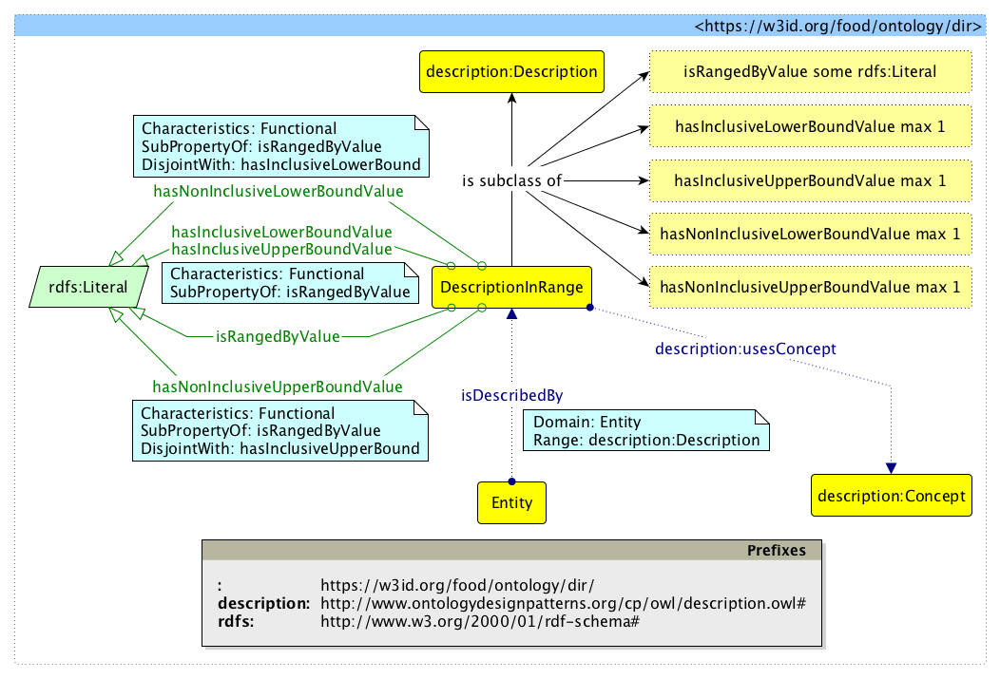

 __This pattern has been certified.__
Related submission, with evaluation history, can be found __here__

#  Graphical representation

__Diagram__

#  General description

  

#  Elements

_The __Description in Range__ Content OP locally defines the following ontology elements:_

[Submissions:Description in Range/DescriptionInRange](http://ontologydesignpatterns.org/wiki/Special:AddData/Ontology Element Form/Submissions:Description_in_Range/DescriptionInRange "Submissions:Description in Range/DescriptionInRange (not yet written)")  _[DescriptionInRange](http://ontologydesignpatterns.org/wiki/Special:AddData/Ontology Element Form/Submissions:Description_in_Range/DescriptionInRange "Submissions:Description in Range/DescriptionInRange (not yet written)") page_
[Submissions:Description in Range/Entity](http://ontologydesignpatterns.org/wiki/Special:AddData/Ontology Element Form/Submissions:Description_in_Range/Entity "Submissions:Description in Range/Entity (not yet written)")  _[Entity](http://ontologydesignpatterns.org/wiki/Special:AddData/Ontology Element Form/Submissions:Description_in_Range/Entity "Submissions:Description in Range/Entity (not yet written)") page_
[Submissions:Description in Range/isRangedByValue](http://ontologydesignpatterns.org/wiki/Special:AddData/Ontology Element Form/Submissions:Description_in_Range/isRangedByValue "Submissions:Description in Range/isRangedByValue (not yet written)")  _[isRangedByValue](http://ontologydesignpatterns.org/wiki/Special:AddData/Ontology Element Form/Submissions:Description_in_Range/isRangedByValue "Submissions:Description in Range/isRangedByValue (not yet written)") page_
[Submissions:Description in Range/hasInclusiveLowerBoundValue](http://ontologydesignpatterns.org/wiki/Special:AddData/Ontology Element Form/Submissions:Description_in_Range/hasInclusiveLowerBoundValue "Submissions:Description in Range/hasInclusiveLowerBoundValue (not yet written)")  _[hasInclusiveLowerBoundValue](http://ontologydesignpatterns.org/wiki/Special:AddData/Ontology Element Form/Submissions:Description_in_Range/hasInclusiveLowerBoundValue "Submissions:Description in Range/hasInclusiveLowerBoundValue (not yet written)") page_
[Submissions:Description in Range/hasNonInclusiveLowerBoundValue](http://ontologydesignpatterns.org/wiki/Special:AddData/Ontology Element Form/Submissions:Description_in_Range/hasNonInclusiveLowerBoundValue "Submissions:Description in Range/hasNonInclusiveLowerBoundValue (not yet written)")  _[hasNonInclusiveLowerBoundValue](http://ontologydesignpatterns.org/wiki/Special:AddData/Ontology Element Form/Submissions:Description_in_Range/hasNonInclusiveLowerBoundValue "Submissions:Description in Range/hasNonInclusiveLowerBoundValue (not yet written)") page_
[Submissions:Description in Range/hasInclusiveUpperBoundValue](http://ontologydesignpatterns.org/wiki/Special:AddData/Ontology Element Form/Submissions:Description_in_Range/hasInclusiveUpperBoundValue "Submissions:Description in Range/hasInclusiveUpperBoundValue (not yet written)")  _[hasInclusiveUpperBoundValue](http://ontologydesignpatterns.org/wiki/Special:AddData/Ontology Element Form/Submissions:Description_in_Range/hasInclusiveUpperBoundValue "Submissions:Description in Range/hasInclusiveUpperBoundValue (not yet written)") page_
[Submissions:Description in Range/hasNonInclusiveUpperBoundValue](http://ontologydesignpatterns.org/wiki/Special:AddData/Ontology Element Form/Submissions:Description_in_Range/hasNonInclusiveUpperBoundValue "Submissions:Description in Range/hasNonInclusiveUpperBoundValue (not yet written)")  _[hasNonInclusiveUpperBoundValue](http://ontologydesignpatterns.org/wiki/Special:AddData/Ontology Element Form/Submissions:Description_in_Range/hasNonInclusiveUpperBoundValue "Submissions:Description in Range/hasNonInclusiveUpperBoundValue (not yet written)") page_
[Submissions:Description in Range/isDescribedBy](http://ontologydesignpatterns.org/wiki/Special:AddData/Ontology Element Form/Submissions:Description_in_Range/isDescribedBy "Submissions:Description in Range/isDescribedBy (not yet written)")  _[isDescribedBy](http://ontologydesignpatterns.org/wiki/Special:AddData/Ontology Element Form/Submissions:Description_in_Range/isDescribedBy "Submissions:Description in Range/isDescribedBy (not yet written)") page_
[Submissions:Description in Range/describes](http://ontologydesignpatterns.org/wiki/Special:AddData/Ontology Element Form/Submissions:Description_in_Range/describes "Submissions:Description in Range/describes (not yet written)")  _[describes](http://ontologydesignpatterns.org/wiki/Special:AddData/Ontology Element Form/Submissions:Description_in_Range/describes "Submissions:Description in Range/describes (not yet written)") page_
#  Additional information

#  Scenarios

__Scenarios about Description in Range__
No scenario is added to this Content OP.

#  Reviews

__Reviews about Description in Range__
There is no review about this proposal.
This revision (revision ID __12611__) takes in account the reviews: none

Other info at [evaluation tab](http://ontologydesignpatterns.org/wiki/index.php?title=Submissions:Description_in_Range&action=evaluation "http://ontologydesignpatterns.org/wiki/index.php?title=Submissions:Description_in_Range&action=evaluation")

  

#  Modeling issues

__Modeling issues about Description in Range__
There is no Modeling issue related to this proposal.

  

#  References

[Add a reference](index.php@title=Odp%253AAdd_reference&subject=Submissions%253ADescription+in+Range.html "http://ontologydesignpatterns.org/wiki/index.php?title=Odp:Add_reference&subject=Submissions%3ADescription+in+Range")

  

Retrieved from "[http://ontologydesignpatterns.org/wiki/Submissions:Description\_in\_Range](../Submissions/Description_in_Range.md)"
 [Categories](http://ontologydesignpatterns.org/wiki/Special:Categories "Special:Categories"): [ProposedContentOP](../Category/ProposedContentOP.md "Category:ProposedContentOP") | [Submitted to event](../Category/Submitted_to_event.md "Category:Submitted to event")