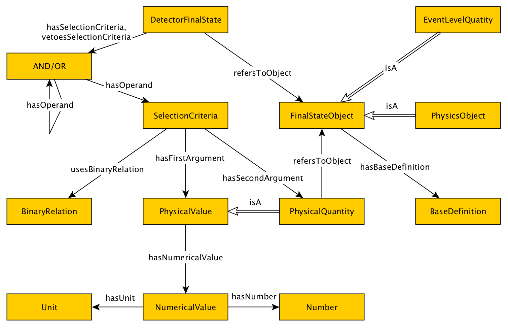

 __This pattern has been certified.__
Related submission, with evaluation history, can be found __here__

#  Graphical representation

__Diagram__

#  General description

  

#  Elements

_The __DetectorFinalState__ Content OP locally defines the following ontology elements:_

#  Additional information

#  Scenarios

__Scenarios about DetectorFinalState__
No scenario is added to this Content OP.

#  Reviews

__Reviews about DetectorFinalState__
There is no review about this proposal.
This revision (revision ID __12326__) takes in account the reviews: none

Other info at [evaluation tab](http://ontologydesignpatterns.org/wiki/index.php?title=Submissions:DetectorFinalState&action=evaluation "http://ontologydesignpatterns.org/wiki/index.php?title=Submissions:DetectorFinalState&action=evaluation")

  

#  Modeling issues

__Modeling issues about DetectorFinalState__
There is no Modeling issue related to this proposal.

  

#  References

[Add a reference](index.php@title=Odp%253AAdd_reference&subject=../Submissions/DetectorFinalState "http://ontologydesignpatterns.org/wiki/index.php?title=Odp:Add_reference&subject=Submissions%3ADetectorFinalState")

  

Retrieved from "[http://ontologydesignpatterns.org/wiki/Submissions:DetectorFinalState](../Submissions/DetectorFinalState)"
 [Category](http://ontologydesignpatterns.org/wiki/Special:Categories "Special:Categories"): [ProposedContentOP](../Category/ProposedContentOP "Category:ProposedContentOP")