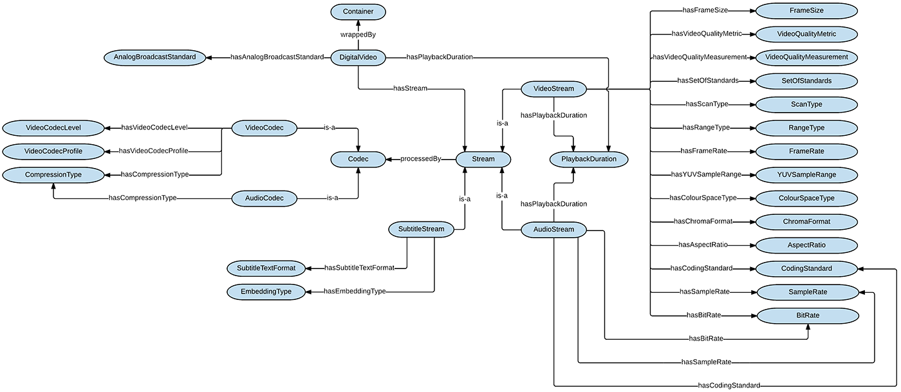

 __This pattern has been certified.__
Related submission, with evaluation history, can be found __here__

#  Graphical representation

__Diagram__

#  General description

  

#  Elements

_The __DigitalVideo__ Content OP locally defines the following ontology elements:_

 __DigitalVideo__ (owl:Class) A digital video file. 
  _[DigitalVideo](../Submissions/DigitalVideo/DigitalVideo.md "Submissions:DigitalVideo/DigitalVideo") page_
 __Codec__ (owl:Class) A codec is a device or computer program capable of encoding or decoding a digital data stream or signal. 
  _[Codec](../Submissions/DigitalVideo/Codec.md "Submissions:DigitalVideo/Codec") page_
 __AudioCodec__ (owl:Class) An audio codec is a device or computer program capable of coding or decoding a digital data stream of audio. 
E.g. MP3  _[AudioCodec](../Submissions/DigitalVideo/AudioCodec.md "Submissions:DigitalVideo/AudioCodec") page_
 __VideoCodec__ (owl:Class) A video codec is an electronic circuit or software that compresses or decompresses digital video, thus converting raw (uncompressed) digital video to a compressed format or vice-versa. 
E.g. QuickTime H.264 (Apple's implementation for H.264/MPEG-4 AVC coding format)  _[VideoCodec](../Submissions/DigitalVideo/VideoCodec.md "Submissions:DigitalVideo/VideoCodec") page_
 __Stream__ (owl:Class) A (data) stream is a sequence of digitally encoded coherent signals (packets of data or data packets) used to transmit or receive information that is in the process of being transmitted. The term stream is used here to define raw, uncompressed content (video or audio) prior to being encoded into a wrapper or after being decoded from a wrapper. 
  _[Stream](../Submissions/DigitalVideo/Stream.md "Submissions:DigitalVideo/Stream") page_
 __AudioStream__ (owl:Class) An audio stream is a stream where the carried data is audio content. 
  _[AudioStream](../Submissions/DigitalVideo/AudioStream.md "Submissions:DigitalVideo/AudioStream") page_
 __VideoStream__ (owl:Class) A video stream is a stream where the carried data is video content. 
  _[VideoStream](../Submissions/DigitalVideo/VideoStream.md "Submissions:DigitalVideo/VideoStream") page_
 __SubtitleStream__ (owl:Class) A subtitle stream is a stream where the carried data is subtitle content for a video. 
  _[SubtitleStream](../Submissions/DigitalVideo/SubtitleStream.md "Submissions:DigitalVideo/SubtitleStream") page_
 __Container__ (owl:Class) A container or wrapper format is a metafile format whose specification describes how different elements of data and metadata coexist in a computer file. 
E.g. Matroska (MKV), MP4, etc.  _[Container](../Submissions/DigitalVideo/Container.md "Submissions:DigitalVideo/Container") page_
 __Descriptor__ (owl:Class) Descriptors are the various elements describing a digital video, a container, a stream or a codec. 
  _[Descriptor](../Submissions/DigitalVideo/Descriptor.md "Submissions:DigitalVideo/Descriptor") page_
 __AnalogBroadcastStandard__ (owl:Class) The video color encoding system, if the video originates from analog television broadcasts. 
E.g. NTSC, PAL, etc.  _[AnalogBroadcastStandard](../Submissions/DigitalVideo/AnalogBroadcastStandard.md "Submissions:DigitalVideo/AnalogBroadcastStandard") page_
 __AspectRatio__ (owl:Class) The aspect ratio of an image describes the proportional relationship between its width and its height. It is commonly expressed as two numbers separated by a colon, as in 16:9. 
E.g. 16:9, 4:3, etc.  _[AspectRatio](../Submissions/DigitalVideo/AspectRatio.md "Submissions:DigitalVideo/AspectRatio") page_
 __Bit Rate__ (owl:Class) The bitrate is the data rate for a video or audio file. Video and audio data rates are given in bits per second. 
E.g. 2 MBits/s  _[BitRate](../Submissions/DigitalVideo/BitRate.md "Submissions:DigitalVideo/BitRate") page_
 __ChromaFormat__ (owl:Class) The chroma subsampling type. Chroma subsampling is the practice of encoding images by implementing less resolution for chroma information than for luma information, taking advantage of the human visual system's lower acuity for color differences than for luminance. 
E.g. 4:2:0  _[ChromaFormat](../Submissions/DigitalVideo/ChromaFormat.md "Submissions:DigitalVideo/ChromaFormat") page_
 __CodingStandard__ (owl:Class) Also known as coding format or compression format. 
E.g. H.264/MPEG-4 AVC  _[CodingStandard](../Submissions/DigitalVideo/CodingStandard.md "Submissions:DigitalVideo/CodingStandard") page_
 __ColourSpaceType__ (owl:Class) A color space is a specific organization of colors. It allows for reproducible representations of color, in both analog and digital representations. A color space may be arbitrary, with particular colors assigned to a set of physical color swatches and corresponding assigned names or numbers. 
E.g. YUV, RGB, etc.  _[ClourSpaceType](../Submissions/DigitalVideo/ClourSpaceType.md "Submissions:DigitalVideo/ClourSpaceType") page_
 __CompressionType__ (owl:Class) The type of video compression. 
E.g. lossy, lossless or uncompressed  _[CompressionType](../Submissions/DigitalVideo/CompressionType.md "Submissions:DigitalVideo/CompressionType") page_
 __EmbeddingType__ (owl:Class) The type of embedment used to attach a subtitle stream to a video. 
E.g. hard, prerendered, soft, etc.  _[EmbeddingType](../Submissions/DigitalVideo/EmbeddingType.md "Submissions:DigitalVideo/EmbeddingType") page_
 __FrameRate__ (owl:Class) Frame rate, also known as frame frequency, is the frequency (rate) at which an imaging device produces unique consecutive images called frames. The term applies equally well to film and video cameras, computer graphics, and motion capture systems. Frame rate is most often expressed in frames per second (FPS) and is also expressed in progressive scan monitors as hertz (Hz). 
E.g. 60 FPS  _[FrameRate](../Submissions/DigitalVideo/FrameRate.md "Submissions:DigitalVideo/FrameRate") page_
 __FrameSize__ (owl:Class) The dimensions of a video's frame. 
E.g. 1920 x 1080  _[FrameSize](../Submissions/DigitalVideo/FrameSize.md "Submissions:DigitalVideo/FrameSize") page_
 __PlaybackDuration__ (owl:Class) The duration of a video, video stream or audio stream. 
E.g. 22 minutes  _[PlaybackDuration](../Submissions/DigitalVideo/PlaybackDuration.md "Submissions:DigitalVideo/PlaybackDuration") page_
 __RangeType__ (owl:Class) The type of range a video is created for. 
E.g. broadcast range or full range  _[RangeType](../Submissions/DigitalVideo/RangeType.md "Submissions:DigitalVideo/RangeType") page_
 __SampleRate__ (owl:Class) The audio sample rate is the number of samples of audio carried per second, measured in Hz or kHz (one kHz being 1 000 Hz). For example, 44 100 samples per second can be expressed as either 44 100 Hz, or 44.1 kHz.
The video sample rate of a digital video format determines how often the light intensity of each video line is sampled. 

E.g. 96 kHz, 74.25MHz, etc.  _[SampleRate](../Submissions/DigitalVideo/SampleRate.md "Submissions:DigitalVideo/SampleRate") page_
 __ScanType__ (owl:Class) Progressive or interlaced scan. 
  _[ScanType](../Submissions/DigitalVideo/ScanType.md "Submissions:DigitalVideo/ScanType") page_
 __SetOfStandards__ (owl:Class) Sets of standards standardize the format of a video stream. 
E.g. BT.601 or BT.709  _[SetOfStandards](../Submissions/DigitalVideo/SetOfStandards.md "Submissions:DigitalVideo/SetOfStandards") page_
 __E.g. SubRip, SubViewer, etc.__ (owl:Class) The file format of subtitles. 
  _[SubtitleTextFormat](../Submissions/DigitalVideo/SubtitleTextFormat.md "Submissions:DigitalVideo/SubtitleTextFormat") page_
 __VideoCodecLevel__ (owl:Class) A video codec level is a specified set of constraints that indicate a degree of required decoder performance for a profile. 
E.g. 4  _[VideoCodecLevel](../Submissions/DigitalVideo/VideoCodecLevel.md "Submissions:DigitalVideo/VideoCodecLevel") page_
 __VideoCodecProfile__ (owl:Class) The video codec profile is a set of capabilities and constraints apllied in the encoder. It allows the decoder to recognize the requirements to decode a specific stream. 
E.g. baseline profile, extended profile, main profile, high profile, etc.  _[VideoCodecProfile](../Submissions/DigitalVideo/VideoCodecProfile.md "Submissions:DigitalVideo/VideoCodecProfile") page_
 __VideoQualityMeasurement__ (owl:Class) Measurement carried out according to the video quality metric. 
  _[VideoQualityMeasurement](../Submissions/DigitalVideo/VideoQualityMeasurement.md "Submissions:DigitalVideo/VideoQualityMeasurement") page_
 __VideoQualityMetric__ (owl:Class) Process or software used to measure the quality of a video. 
E.g. VQM  _[VideoQualityMetric](../Submissions/DigitalVideo/VideoQualityMetric.md "Submissions:DigitalVideo/VideoQualityMetric") page_
 __YUVSampleRange__ (owl:Class) YUV Sample Range 
E.g. 16-235  _[YUVSampleRange](../Submissions/DigitalVideo/YUVSampleRange.md "Submissions:DigitalVideo/YUVSampleRange") page_
 __hasBitRate__ (owl:ObjectProperty) Associates an audio or video stream with a bit rate. 
  _[hasBitRate](../Submissions/DigitalVideo/hasBitRate.md "Submissions:DigitalVideo/hasBitRate") page_
 __wrappedBy__ (owl:ObjectProperty) Associates a digital video file with a container type. 
  _[wrappedBy](../Submissions/DigitalVideo/wrappedBy.md "Submissions:DigitalVideo/wrappedBy") page_
 __hasStream__ (owl:ObjectProperty) Associates a digital video with a stream. 
  _[hasStream](../Submissions/DigitalVideo/hasStream.md "Submissions:DigitalVideo/hasStream") page_
 __hasAudioStream__ (owl:ObjectProperty) Associates a digital video with an audio stream. 
  _[hasAudioStream](../Submissions/DigitalVideo/hasAudioStream.md "Submissions:DigitalVideo/hasAudioStream") page_
 __hasVideoStream__ (owl:ObjectProperty) Associates a digital video with a video stream. 
  _[hasVideoStream](../Submissions/DigitalVideo/hasVideoStream.md "Submissions:DigitalVideo/hasVideoStream") page_
 __hasSubtitleStream__ (owl:ObjectProperty) Associates a digital video with a subtitle stream. 
  _[hasSubtitleStream](../Submissions/DigitalVideo/hasSubtitleStream.md "Submissions:DigitalVideo/hasSubtitleStream") page_
 __hasCodingStandard__ (owl:ObjectProperty) Associates a video or audio stream with a coding standard. 
  _[hasCodingStandard](../Submissions/DigitalVideo/hasCodingStandard.md "Submissions:DigitalVideo/hasCodingStandard") page_
 __hasRangeType__ (owl:ObjectProperty) Associates a video stream with a range type. 
  _[hasRangeType](../Submissions/DigitalVideo/hasRangeType.md "Submissions:DigitalVideo/hasRangeType") page_
 __hasVideoQualityMeasurement__ (owl:ObjectProperty) Associates a video stream with a video quality measurement. 
  _[hasVideoQualityMeasurement](../Submissions/DigitalVideo/hasVideoQualityMeasurement.md "Submissions:DigitalVideo/hasVideoQualityMeasurement") page_
 __hasChromaFormat__ (owl:ObjectProperty) Associates a video stream with a chroma format. 
  _[hasChromaFormat](../Submissions/DigitalVideo/hasChromaFormat.md "Submissions:DigitalVideo/hasChromaFormat") page_
 __hasEmbeddingType__ (owl:ObjectProperty) Associates a subtitle stream with an embedding type. 
  _[hasEmbeddingType](../Submissions/DigitalVideo/hasEmbeddingType.md "Submissions:DigitalVideo/hasEmbeddingType") page_
 __hasAspectRatio__ (owl:ObjectProperty) Associates a video stream with an aspect ratio. 
  _[hasAspectRatio](../Submissions/DigitalVideo/hasAspectRatio.md "Submissions:DigitalVideo/hasAspectRatio") page_
 __hasSubtitleTextFormat__ (owl:ObjectProperty) Associates a subtitle stream with a subtitle text format. 
  _[hasSubtitleTextFormat](../Submissions/DigitalVideo/hasSubtitleTextFormat.md "Submissions:DigitalVideo/hasSubtitleTextFormat") page_
 __hasVideoQualityMetric__ (owl:ObjectProperty) Associates a video stream with a video quality metric. 
  _[hasVideoQualityMetric](../Submissions/DigitalVideo/hasVideoQualityMetric.md "Submissions:DigitalVideo/hasVideoQualityMetric") page_
 __hasCompressionType__ (owl:ObjectProperty) Associates a video or audio codec with a compression type. 
  _[hasCompressionType](../Submissions/DigitalVideo/hasCompressionType.md "Submissions:DigitalVideo/hasCompressionType") page_
 __hasScanType__ (owl:ObjectProperty) Associates a video stream with a scan type. 
  _[hasScanType](../Submissions/DigitalVideo/hasScanType.md "Submissions:DigitalVideo/hasScanType") page_
 __hasVideoCodecProfile__ (owl:ObjectProperty) Associates a video codec with a video codec profile. 
  _[hasVideoCodecProfile](../Submissions/DigitalVideo/hasVideoCodecProfile.md "Submissions:DigitalVideo/hasVideoCodecProfile") page_
 __hasColourSpaceType__ (owl:ObjectProperty) Associates a video stream with a colour space type. 
  _[hasColourSpaceType](../Submissions/DigitalVideo/hasColourSpaceType.md "Submissions:DigitalVideo/hasColourSpaceType") page_
 __hasFrameSize__ (owl:ObjectProperty) Associates a video stream with a frame size. 
  _[hasFrameSize](../Submissions/DigitalVideo/hasFrameSize.md "Submissions:DigitalVideo/hasFrameSize") page_
 __hasSetOfStandards__ (owl:ObjectProperty) Associates a video stream with a set of standards. 
  _[hasSetOfStandards](../Submissions/DigitalVideo/hasSetOfStandards.md "Submissions:DigitalVideo/hasSetOfStandards") page_
 __processedBy__ (owl:ObjectProperty) Associates a stream with a codec. 
  _[processedBy](../Submissions/DigitalVideo/processedBy.md "Submissions:DigitalVideo/processedBy") page_
 __hasAnalogBroadcastStandard__ (owl:ObjectProperty) Associates a digital video with an analog broadcast standard. 
  _[hasAnalogBroadcastStandard](../Submissions/DigitalVideo/hasAnalogBroadcastStandard.md "Submissions:DigitalVideo/hasAnalogBroadcastStandard") page_
 __hasVideoCodecLevel__ (owl:ObjectProperty) Associates a video codec with a video codec level. 
  _[hasVideoCodecLevel](../Submissions/DigitalVideo/hasVideoCodecLevel.md "Submissions:DigitalVideo/hasVideoCodecLevel") page_
 __hasFrameRate__ (owl:ObjectProperty) Associates a video stream with a frame rate. 
  _[hasFrameRate](../Submissions/DigitalVideo/hasFrameRate.md "Submissions:DigitalVideo/hasFrameRate") page_
 __hasPlaybackDuration__ (owl:ObjectProperty) Associates a digital video, a video stream or an audio stream with a playback duration. 
  _[hasPlaybackDuration](../Submissions/DigitalVideo/hasPlaybackDuration.md "Submissions:DigitalVideo/hasPlaybackDuration") page_
 __hasYUVSampleRange__ (owl:ObjectProperty) Associates a video stream with a YUV sample range. 
  _[hasYUVSampleRange](../Submissions/DigitalVideo/hasYUVSampleRange.md "Submissions:DigitalVideo/hasYUVSampleRange") page_
 __hasSampleRate__ (owl:ObjectProperty) Associates a video stream or audio stream with a sample rate. 
  _[hasSampleRate](../Submissions/DigitalVideo/hasSampleRate.md "Submissions:DigitalVideo/hasSampleRate") page_
#  Additional information

#  Scenarios

__Scenarios about DigitalVideo__
No scenario is added to this Content OP.

#  Reviews

__Reviews about DigitalVideo__
There is no review about this proposal.
This revision (revision ID __13288__) takes in account the reviews: none

Other info at [evaluation tab](http://ontologydesignpatterns.org/wiki/index.php?title=Submissions:DigitalVideo&action=evaluation "http://ontologydesignpatterns.org/wiki/index.php?title=Submissions:DigitalVideo&action=evaluation")

  

#  Modeling issues

__Modeling issues about DigitalVideo__
There is no Modeling issue related to this proposal.

  

#  References

[Add a reference](index.php@title=Odp%253AAdd_reference&subject=../Submissions/DigitalVideo.md "http://ontologydesignpatterns.org/wiki/index.php?title=Odp:Add_reference&subject=Submissions%3ADigitalVideo")

* The homepage of the PERICLES project that supported the development of this ODP. [Project Home Page](http://www.pericles-project.eu/ "http://www.pericles-project.eu/") | [reference page](../Community/References/PERICLES_project_homepage.md "Community:References/PERICLES project homepage")
* The paper presenting the ODP that was accepted for publication in the WOP'15 proceedings. [Workshop publication](http://ceur-ws.org/Vol-1461/WOP2015_pattern_abstract_4.pdf "http://ceur-ws.org/Vol-1461/WOP2015_pattern_abstract_4.pdf") | [reference page](../Community/References/An_Ontology_Design_Pattern_for_Digital_Video.md "Community:References/An Ontology Design Pattern for Digital Video")

  

Retrieved from "[http://ontologydesignpatterns.org/wiki/Submissions:DigitalVideo](../Submissions/DigitalVideo.md)"
 [Categories](http://ontologydesignpatterns.org/wiki/Special:Categories "Special:Categories"): [ProposedContentOP](../Category/ProposedContentOP.md "Category:ProposedContentOP") | [Submitted to event](../Category/Submitted_to_event.md "Category:Submitted to event")