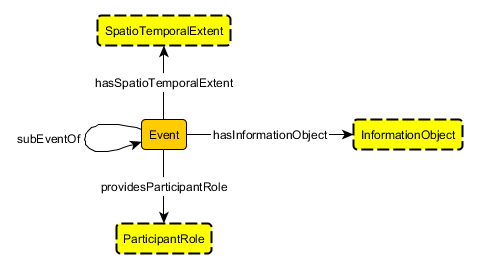

 __This pattern has been certified.__
Related submission, with evaluation history, can be found __here__

#  Graphical representation

__Diagram__

#  General description

  

#  Elements

_The __EventCore__ Content OP locally defines the following ontology elements:_

__DASE\_RULE__ (owl:AnnotationProperty) Attached to an axiom, this annotation property provides information on the original (SWRL) rule from which the axiom was obtained through translation. 
  _[DASE\_RULE](../Submissions/EventCore/DASE_RULE.md "Submissions:EventCore/DASE RULE") page_
 __freshProp1__ (owl:ObjectProperty) This property is artificially generated in order to express the following rule in OWL:  :Event(?x) ^ :providesParticipantRole(?x,?p) ^ :subEventOf(?x,?y) -> :providesParticipantRole(?y,?p). 
The rule is translated into two axioms: 

1. :Event SubClassOf: :freshProp1 some Self 

2. inverse (:subEventOf) o :freshProp1 o :providesParticipantRole SubPropertyOf: : :providesParticipantRole 

  _[freshProp1](../Submissions/EventCore/freshProp1.md "Submissions:EventCore/freshProp1") page_
 __freshProp2__ (owl:ObjectProperty) This property is artificially generated in order to express the following rule in OWL:  :Event(?x) ^ :hasSpatioTemporalExtent(?x,?w) ^ :subEventOf(?x,?y) ^ :Event(?y) ^ :hasSpatioTemporalExtent(?y,?z) -> :subSpatioTemporalExtentOf(?w,?z).
The rule is translated into two axioms: 

1. :Event SubClassOf: :freshProp2 some Self 

2. inverse (:hasSpatioTemporalExtent) o :freshProp2 o :subEventOf o :freshProp2 o :hasSpatioTemporalExtent SubPropertyOf: :subSpatioTemporalExtentOf 

  _[freshProp2](../Submissions/EventCore/freshProp2.md "Submissions:EventCore/freshProp2") page_
 __hasInformationObject__ (owl:ObjectProperty) Property relating Event to InformationObject in this pattern. The domain of this property is not restricted to Event since it is possible that non-event to have an information object. The range is always InformationObject since it makes no sense to have a property named hasInformationObject to point to anything other than information object. 
  _[hasInformationObject](../Submissions/EventCore/hasInformationObject.md "Submissions:EventCore/hasInformationObject") page_
 __hasSpatioTemporalExtent__ (owl:ObjectProperty) Property relating Event to SpatioTemporalExtent in this pattern. The range is always SpatioTemporalExtent (globally) since it makes no sense to have a property named hasSpatioTemporalExtent to point to anything other than spatiotemporal extent. Tthe domain is not set to Event as non-Event may also have spatiotemporal extent. 
  _[hasSpatioTemporalExtent](../Submissions/EventCore/hasSpatioTemporalExtent.md "Submissions:EventCore/hasSpatioTemporalExtent") page_
 __providesParticipantRole__ (owl:ObjectProperty) Property relating Event to ParticipantRole in this pattern. The range is always ParticipantRole since it makes no sense to have a property named as providesParticipantRole not to point to a participant role. The domain is not set to Event as non-Event may also provide a participant role. 
  _[providesParticipantRole](../Submissions/EventCore/providesParticipantRole.md "Submissions:EventCore/providesParticipantRole") page_
 __subEventOf__ (owl:ObjectProperty) Property expressing partonomic relation between two events. Domain and range are always Event. 
  _[subEventOf](../Submissions/EventCore/subEventOf.md "Submissions:EventCore/subEventOf") page_
 __subSpatioTemporalExtentOf__ (owl:ObjectProperty) Property indicating partonomic relation between two spatiotemporal extents. The Event pattern only assumes that this is given by the spatiotemporal extent pattern actually used. Thus, domain and range are not explicitly stated and this property is included in axioms resulted by OWL translation of the following rule: :Event(?x) ^ :hasSpatioTemporalExtent(?x,?w) ^ :subEventOf(?x,?y) ^ :Event(?y) ^ :hasSpatioTemporalExtent(?y,?z) -> :subSpatioTemporalExtentOf(?w,?z) 
  _[subSpatioTemporalExtentOf](../Submissions/EventCore/subSpatioTemporalExtentOf.md "Submissions:EventCore/subSpatioTemporalExtentOf") page_
 __Event__ (owl:Class) Represents any kind of events. An event possesses a spatiotemporal extent, provides at least one participant-role, which is performed by some entity (agents or otherwise), and may be a sub-event of another event. An event may also have additional descriptive information, which is consolidated through an information object. 
  _[Event](../Submissions/EventCore/Event.md "Submissions:EventCore/Event") page_
 __InformationObject__ (owl:Class) An entity that encapsulates all descriptive or non-defining information of the corresponding event, e.g., names, additional identifiers, textual descriptions, etc. Should normally be aligned to a separate Information Object pattern. 
  _[InformationObject](../Submissions/EventCore/InformationObject.md "Submissions:EventCore/InformationObject") page_
 __ParticipantRole__ (owl:Class) Every ParticipantRole represents a reified relationship between an event and one of its participants. Should normally be aligend to a separate Participant-Role pattern. 
  _[ParticipantRole](../Submissions/EventCore/ParticipantRole.md "Submissions:EventCore/ParticipantRole") page_
 __SpatioTemporalExtent__ (owl:Class) Hook to a complex notion representing a unified spatial and temporal extent. Intended to cover non-static or discontinuous spatiotemporal extent. Should be aligned to a separate Spatiotemporal Extent pattern. 
  _[SpatioTemporalExtent](../Submissions/EventCore/SpatioTemporalExtent.md "Submissions:EventCore/SpatioTemporalExtent") page_
#  Additional information

#  Scenarios

__Scenarios about EventCore__
No scenario is added to this Content OP.

#  Reviews

__Reviews about EventCore__
There is no review about this proposal.
This revision (revision ID __12751__) takes in account the reviews: none

Other info at [evaluation tab](http://ontologydesignpatterns.org/wiki/index.php?title=Submissions:EventCore&action=evaluation "http://ontologydesignpatterns.org/wiki/index.php?title=Submissions:EventCore&action=evaluation")

  

#  Modeling issues

__Modeling issues about EventCore__
There is no Modeling issue related to this proposal.

  

#  References

[Add a reference](index.php@title=Odp%253AAdd_reference&subject=../Submissions/EventCore.md "http://ontologydesignpatterns.org/wiki/index.php?title=Odp:Add_reference&subject=Submissions%3AEventCore")

  

Retrieved from "[http://ontologydesignpatterns.org/wiki/Submissions:EventCore](../Submissions/EventCore.md)"
 [Categories](http://ontologydesignpatterns.org/wiki/Special:Categories "Special:Categories"): [ProposedContentOP](../Category/ProposedContentOP.md "Category:ProposedContentOP") | [Submitted to event](../Category/Submitted_to_event.md "Category:Submitted to event")