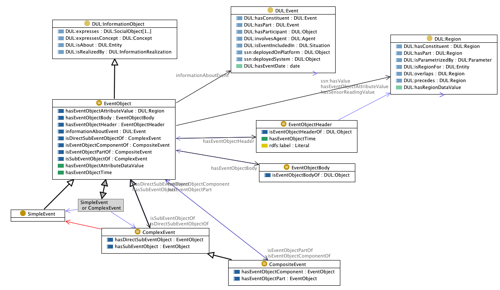

 __This pattern has been certified.__
Related submission, with evaluation history, can be found __here__

#  Graphical representation

__Diagram__

#  General description

  

#  Elements

_The __EventProcessing__ Content OP locally defines the following ontology elements:_

 __SimpleEvent__ (owl:Class) An event object that is not an abstraction of other event objects, nor is composed of other event objects. 
  _[SimpleEvent](http://ontologydesignpatterns.org/wiki/Submissions:EventProcessing/SimpleEvent "Submissions:EventProcessing/SimpleEvent") page_
 __EventObject__ (owl:Class) An object that represents, encodes, or records an event, generally for the purpose of computer processing. 
  

An event object may consist of an event object header and a body, where the header is defined as the part of the event object that can be interpreted by the event processing system, i.e. and event object needs to contain at least some information (e.g. with a known vocabulary) that can be used by the event processing system. Note that the open world assumption allows us to choose not to explicitly specify a header, despite the restriction that it exists. 

  

An event object is either a complex event, i.e. an event object that has some relation (either through abstraction or componency) to other event objects, or a simple event. 

  

An event object records information about an actual event, which is then by implication a documented event (i.e. participating in an event documentation situation). 

  _[EventObject](../Submissions/EventProcessing/EventObject.md "Submissions:EventProcessing/EventObject") page_
 __SensorOutput__ (owl:Class) Class representing the alignement to ssn:SensorOutput, expressing the restriction that an ssn:SensorOutput is either a complex event or a simple event, depending on the sensor used. 
  _[SensorOutput](../Submissions/EventProcessing/SensorOutput.md "Submissions:EventProcessing/SensorOutput") page_
 __ComplexEvent__ (owl:Class) An event that summarizes, represents, or denotes a set of other events, i.e. it is an abstraction over other events. Anything that is not a complex event is instead a simple event. 
  _[ComplexEvent](http://ontologydesignpatterns.org/wiki/Submissions:EventProcessing/ComplexEvent "Submissions:EventProcessing/ComplexEvent") page_
 __CompositeEvent__ (owl:Class) An event object that is composed of a set of other event objects, i.e. its parts. 
  _[CompositeEvent](http://ontologydesignpatterns.org/wiki/Submissions:EventProcessing/CompositeEvent "Submissions:EventProcessing/CompositeEvent") page_
 __hasEventObjectPart__ (owl:TransitiveProperty) This transitive property represents a partonomy relation between event objects. An event object can consist of several "partial events" that together make up the complete event object. The parts of the event object do not exist on their own, but exist to "make up" the whole of the encapsulating event, likewise the encapsulating event is not complete without its parts. Please note the difference between this stronger relation, compared to the "hasSubEvent"-property which merely relates event objects to each other, e.g. expressing the triggering of abstractions, but without implying that the events are parts of each other. 
  _[hasEventObjectPart](../Submissions/EventProcessing/hasEventObjectPart.md "Submissions:EventProcessing/hasEventObjectPart") page_
 __EventObjectHeader__ (owl:Class) Some event processing systems need to distinguish between an event object header and its body, where the event object header is the part of the event object with known content (e.g. known vocabulary) that can be directly processed by the event processing system. Although a header is considered mandatory for an event object, if not specified what the header consists of, it can be inferred by the system through the fact that it contains the "known" part, as opposed to the body that may contain a payload that the system cannot interpret. 
  _[EventObjectHeader](../Submissions/EventProcessing/EventObjectHeader.md "Submissions:EventProcessing/EventObjectHeader") page_
 __hasEventObjectAttributeValue__ (owl:ObjectProperty) 
  _[hasEventObjectAttributeValue](../Submissions/EventProcessing/hasEventObjectAttributeValue.md "Submissions:EventProcessing/hasEventObjectAttributeValue") page_
 __hasEventObjectAttributeDataValue__ (owl:DatatypeProperty) 
  _[hasEventObjectAttributeDataValue](../Submissions/EventProcessing/hasEventObjectAttributeDataValue.md "Submissions:EventProcessing/hasEventObjectAttributeDataValue") page_
 __hasEventObjectTime__ (owl:DatatypeProperty) 
  _[hasEventObjectTime](../Submissions/EventProcessing/hasEventObjectTime.md "Submissions:EventProcessing/hasEventObjectTime") page_
 __isEventObjectHeaderOf__ (owl:ObjectProperty) 
  _[isEventObjectHeaderOf](../Submissions/EventProcessing/isEventObjectHeaderOf.md "Submissions:EventProcessing/isEventObjectHeaderOf") page_
 __EventObjectPart__ (owl:Class) 
  _[EventObjectPart](../Submissions/EventProcessing/EventObjectPart.md "Submissions:EventProcessing/EventObjectPart") page_
 __hasSubEventObject__ (owl:TransitiveProperty) A relation that connects a complex event with the low-level events it is a higher-level representation of. An event object may reference another event, on a lower level of abstraction or granularity, upon which is it is based or from which it was derived or triggered, making that other event a "sub event" of this aggregated or more abstract event object. Note that for modelling instance data, normally, the non-transitive sub-property "hasDirectSubEventObject" should be used, based on which the presence of this transitive relation can be inferred. 
  _[hasSubEventObject](../Submissions/EventProcessing/hasSubEventObject.md "Submissions:EventProcessing/hasSubEventObject") page_
 __EventObjectBody__ (owl:Class) Some event processing systems need to distinguish between an event object header and its body, where the event object header is the part of the event object with known content (e.g. known vocabulary) that can be directly processed by the event processing system, and the body is the rest of the event object. The body may always be empty or missing. 
  _[EventObjectBody](../Submissions/EventProcessing/EventObjectBody.md "Submissions:EventProcessing/EventObjectBody") page_
 __isEventObjectBodyOf__ (owl:ObjectProperty) 
  _[isEventObjectBodyOf](../Submissions/EventProcessing/isEventObjectBodyOf.md "Submissions:EventProcessing/isEventObjectBodyOf") page_
 __hasEventObjectHeader__ (owl:ObjectProperty) Some event processing systems need to distinguish between an event object header and its body, where the event object header is the part of the event object with known content (e.g. known vocabulary) that can be directly processed by the event processing system. This property relates an event object to its header part. 
  _[hasEventObjectHeader](../Submissions/EventProcessing/hasEventObjectHeader.md "Submissions:EventProcessing/hasEventObjectHeader") page_
 __informationAboutEvent__ (owl:ObjectProperty) 
  _[informationAboutEvent](../Submissions/EventProcessing/informationAboutEvent.md "Submissions:EventProcessing/informationAboutEvent") page_
 __hasEventLocation__ (owl:ObjectProperty) 
  _[hasEventLocation](../Submissions/EventProcessing/hasEventLocation.md "Submissions:EventProcessing/hasEventLocation") page_
 __hasEventObjectBody__ (owl:ObjectProperty) Some event processing systems need to distinguish between an event object header and its body, where the event object header is the part of the event object with known content (e.g. known vocabulary) that can be directly processed by the event processing system. This property relates an event object to its body part. 
  _[hasEventObjectBody](../Submissions/EventProcessing/hasEventObjectBody.md "Submissions:EventProcessing/hasEventObjectBody") page_
 __refersToEventObjectConstituent__ (owl:ObjectProperty) Event objects that use a header/body structure can use this property to refer to the constituents (i.e. direct sub-events in an abstraction hierarchy) of the event object. Through a property chain axiom, the presence of a "hasDirectSubEventObject" relation can be inferred. 
  _[refersToEventObjectConstituent](../Submissions/EventProcessing/refersToEventObjectConstituent.md "Submissions:EventProcessing/refersToEventObjectConstituent") page_
 __refersToEventObjectComponent__ (owl:ObjectProperty) Event objects that use a header/body structure can use this property to refer to the components (i.e. direct parts) of the event object. Through a property chain axiom, the presence of a "hasEventObjectComponent" relation can be inferred. 
  _[refersToEventObjectComponent](../Submissions/EventProcessing/refersToEventObjectComponent.md "Submissions:EventProcessing/refersToEventObjectComponent") page_
 __isEventObjectComponentOf__ (owl:ObjectProperty) 
  _[isEventObjectComponentOf](../Submissions/EventProcessing/isEventObjectComponentOf.md "Submissions:EventProcessing/isEventObjectComponentOf") page_
 __hasEventObjectComponent__ (owl:ObjectProperty) This non-transitive property expresses the direct relation between an event object and its direct parts, i.e. its components. Using this property a hierarchy of components can be expressed for an event object. The components of the event object do not exist on their own, but exist to "make up" the whole of the encapsulating event, likewise the encapsulating event is not complete without its parts. Please note the difference between this stronger relation, compared to the "hasSubEvent"-property which merely relates event objects to each other, e.g. expressing the triggering of abstractions, but without implying that the events are parts of each other. 
  _[hasEventObjectComponent](../Submissions/EventProcessing/hasEventObjectComponent.md "Submissions:EventProcessing/hasEventObjectComponent") page_
 __isEventObjectPartOf__ (owl:TransitiveProperty) 
  _[isEventObjectPartOf](../Submissions/EventProcessing/isEventObjectPartOf.md "Submissions:EventProcessing/isEventObjectPartOf") page_
 __hasSensorReadingValue__ (owl:ObjectProperty) Property for expresseing the alignemet to the SSN ontology, equivalent to ssn:hasValue. 
  _[hasSensorReadingValue](../Submissions/EventProcessing/hasSensorReadingValue.md "Submissions:EventProcessing/hasSensorReadingValue") page_
 __hasDirectSubEventObject__ (owl:ObjectProperty) A relation that connects a complex event with the low-level events it is a higher-level representation of. This is a non-transitive relation that can be used to create a hierarchy of levels of sub-events, that represents the reasoning/triggering or abstraction process that led up to the creation or detection of a complex event. The transitive superproperty hasSubEventObject allows for direclty querying for the transitive closure of sub-events, regardless of the hierarchy, even if only this non-transitive sub-property is used in the data. 
  _[hasDirectSubEventObject](../Submissions/EventProcessing/hasDirectSubEventObject.md "Submissions:EventProcessing/hasDirectSubEventObject") page_
 __isDirectSubEventObjectOf__ (owl:ObjectProperty) 
  _[isDirectSubEventObjectOf](../Submissions/EventProcessing/isDirectSubEventObjectOf.md "Submissions:EventProcessing/isDirectSubEventObjectOf") page_
 __isSubEventObjectOf__ (owl:TransitiveProperty) 
  _[isSubEventObjectOf](../Submissions/EventProcessing/isSubEventObjectOf.md "Submissions:EventProcessing/isSubEventObjectOf") page_
 __hasEventObjectSystemTime__ (owl:DatatypeProperty) The timestamp of the event according to the event processing system (in terms of its internal clock time), i.e. when the event object was received byt the event processing system through the stream. 
  _[hasEventObjectSystemTime](../Submissions/EventProcessing/hasEventObjectSystemTime.md "Submissions:EventProcessing/hasEventObjectSystemTime") page_
 __hasEventObjectExpirationTime__ (owl:DatatypeProperty) Time limit on the validity of this event object. 
  _[hasEventObjectExpirationTime](../Submissions/EventProcessing/hasEventObjectExpirationTime.md "Submissions:EventProcessing/hasEventObjectExpirationTime") page_
 __hasEventObjectSamplingTime__ (owl:DatatypeProperty) The time the event was detected and recorded as data, e.g. when it was recorded by a sensor in terms of the sensor's internal clock. 
  _[hasEventObjectSamplingTime](../Submissions/EventProcessing/hasEventObjectSamplingTime.md "Submissions:EventProcessing/hasEventObjectSamplingTime") page_
 __hasEventObjectApplicationTime__ (owl:DatatypeProperty) The timestamp assigned by the source of the data when it was transmitted, i.e. when it entered the stream. 
  _[hasEventObjectApplicationTime](../Submissions/EventProcessing/hasEventObjectApplicationTime.md "Submissions:EventProcessing/hasEventObjectApplicationTime") page_
#  Additional information

Pattern authors: Eva Blomqvist and Mikko Rinne

#  Scenarios

__Scenarios about EventProcessing__
No scenario is added to this Content OP.

#  Reviews

__Reviews about EventProcessing__
This revision (revision ID __11646__) takes in account the reviews: [VojtechSvatek about EventProcessing](../Reviews/VojtechSvatek_about_EventProcessing.md "Reviews:VojtechSvatek about EventProcessing")

Other info at [evaluation tab](http://ontologydesignpatterns.org/wiki/index.php?title=Submissions:EventProcessing&action=evaluation "http://ontologydesignpatterns.org/wiki/index.php?title=Submissions:EventProcessing&action=evaluation")

  

#  Modeling issues

__Modeling issues about EventProcessing__
There is no Modeling issue related to this proposal.

  

#  References

[Add a reference](index.php@title=Odp%253AAdd_reference&subject=../Submissions/EventProcessing.md "http://ontologydesignpatterns.org/wiki/index.php?title=Odp:Add_reference&subject=Submissions%3AEventProcessing")

  

Retrieved from "[http://ontologydesignpatterns.org/wiki/Submissions:EventProcessing](../Submissions/EventProcessing.md)"
 [Categories](http://ontologydesignpatterns.org/wiki/Special:Categories "Special:Categories"): [ProposedContentOP](../Category/ProposedContentOP.md "Category:ProposedContentOP") | [Submitted to event](../Category/Submitted_to_event.md "Category:Submitted to event") | [Review assigned](../Category/Review_assigned.md "Category:Review assigned")