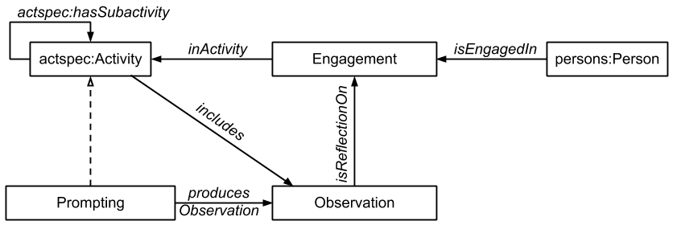

 __This pattern has been certified.__
Related submission, with evaluation history, can be found __here__

#  Graphical representation

__Diagram__

#  General description

  

#  Elements

_The __Experience & Observation__ Content OP locally defines the following ontology elements:_

 __Engagement__ (owl:Class) The product of a reflection upon an observation, which embodies subjective traits of an experience (Example: "After reading this passage of 'To Kill a Mockingbird', I came to a clearer understanding of the many facets of social intolerance"). 
  _[Engagement](../Submissions/Experience_&_Observation/Engagement.md "Submissions:Experience & Observation/Engagement") page_
 __Observation__ (owl:Class) The product of an act of scrutiny which may or may not have been performed with a critical disposition (Example: "My thoughts from reading this passage of 'To Kill a Mockingbird'"). 
  _[Observation](../Submissions/Experience_&_Observation/Observation.md "Submissions:Experience & Observation/Observation") page_
 __inActivity__ (owl:ObjectProperty) what activity/ies are affecting or affected by a certain engagement 
  _[inActivity](../Submissions/Experience_&_Observation/inActivity.md "Submissions:Experience & Observation/inActivity") page_
 __isReflectionOn__ (owl:ObjectProperty) Used to connect the subjective elements of an experience with the corresponding observation, which is extrapolated from the content being interacted with and in itself may not be including a critique. 
  _[isReflectionOn](../Submissions/Experience_&_Observation/isReflectionOn.md "Submissions:Experience & Observation/isReflectionOn") page_
 __isReflectedUponIn__ (owl:ObjectProperty) Inverse of isReflectionOn 
  _[isReflectedUponin](../Submissions/Experience_&_Observation/isReflectedUponin.md "Submissions:Experience & Observation/isReflectedUponin") page_
 __isEngagedIn__ (owl:ObjectProperty) Because an activity may engage other participants than the one performing it, engagements are in general considered individual rather than collective, therefore each participants has their own engagement and only some of them will be conscious and/or documented. 
  _[isEngagedIn](../Submissions/Experience_&_Observation/isEngagedIn.md "Submissions:Experience & Observation/isEngagedIn") page_
 __hasEngagement__ (owl:ObjectProperty) inverse of inActivity 
  _[hasEngagement](../Submissions/Experience_&_Observation/hasEngagement.md "Submissions:Experience & Observation/hasEngagement") page_
 __producedObservation__ (owl:ObjectProperty) This property can be used to denote that something is (even indirectly, not necessary through direct reflection) responsible for the existence of an observation. 
  _[producedObservation](../Submissions/Experience_&_Observation/producedObservation.md "Submissions:Experience & Observation/producedObservation") page_
 __includes__ (owl:ObjectProperty) A relation of mereological nature that connects a given observation with the activity that originates them: it strengthens the argument that observations are always active processes from a cognitive standpoint, regardless of how conscious they may be. 
A standard mereological property from another content pattern may be used in lieu of this one and therefore aligned with it.  _[includes](../Submissions/Experience_&_Observation/includes.md "Submissions:Experience & Observation/includes") page_
#  Additional information

#  Scenarios

__Scenarios about Experience & Observation__
No scenario is added to this Content OP.

#  Reviews

__Reviews about Experience & Observation__
There is no review about this proposal.
This revision (revision ID __14298__) takes in account the reviews: none

Other info at [evaluation tab](http://ontologydesignpatterns.org/wiki/index.php?title=Submissions:Experience_%26_Observation&action=evaluation "http://ontologydesignpatterns.org/wiki/index.php?title=Submissions:Experience_%26_Observation&action=evaluation")

  

#  Modeling issues

__Modeling issues about Experience & Observation__
There is no Modeling issue related to this proposal.

  

#  References

[Add a reference](index.php@title=Odp%253AAdd_reference&subject=Submissions%253AExperience+&amp%3B+Observation.html "http://ontologydesignpatterns.org/wiki/index.php?title=Odp:Add_reference&subject=Submissions%3AExperience+%26amp%3B+Observation")

  

Retrieved from "[http://ontologydesignpatterns.org/wiki/Submissions:Experience\_%26\_Observation](../Submissions/Experience_&_Observation.md)"
 [Category](http://ontologydesignpatterns.org/wiki/Special:Categories "Special:Categories"): [ProposedContentOP](../Category/ProposedContentOP.md "Category:ProposedContentOP")