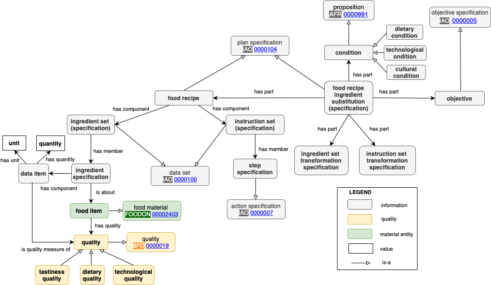

 __This pattern has been certified.__
Related submission, with evaluation history, can be found __here__

#  Graphical representation

__Diagram__

#  General description

  

#  Elements

_The __Food Recipe Ingredient Substitution Ontology Design Pattern__ Content OP locally defines the following ontology elements:_

#  Additional information

#  Scenarios

__Scenarios about Food Recipe Ingredient Substitution Ontology Design Pattern__
No scenario is added to this Content OP.

#  Reviews

__Reviews about Food Recipe Ingredient Substitution Ontology Design Pattern__
There is no review about this proposal.
This revision (revision ID __14309__) takes in account the reviews: none

Other info at [evaluation tab](http://ontologydesignpatterns.org/wiki/index.php?title=Submissions:Food_Recipe_Ingredient_Substitution_Ontology_Design_Pattern&action=evaluation "http://ontologydesignpatterns.org/wiki/index.php?title=Submissions:Food_Recipe_Ingredient_Substitution_Ontology_Design_Pattern&action=evaluation")

  

#  Modeling issues

__Modeling issues about Food Recipe Ingredient Substitution Ontology Design Pattern__
There is no Modeling issue related to this proposal.

  

#  References

[Add a reference](index.php@title=Odp%253AAdd_reference&subject=Submissions%253AFood+Recipe+Ingredient+Substitution+Ontology+Design+Pattern.html "http://ontologydesignpatterns.org/wiki/index.php?title=Odp:Add_reference&subject=Submissions%3AFood+Recipe+Ingredient+Substitution+Ontology+Design+Pattern")

  

Retrieved from "[http://ontologydesignpatterns.org/wiki/Submissions:Food\_Recipe\_Ingredient\_Substitution\_Ontology\_Design\_Pattern](../Submissions/Food_Recipe_Ingredient_Substitution_Ontology_Design_Pattern.md)"
 [Category](http://ontologydesignpatterns.org/wiki/Special:Categories "Special:Categories"): [ProposedContentOP](../Category/ProposedContentOP.md "Category:ProposedContentOP")