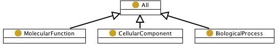

 __This pattern has been certified.__
Related submission, with evaluation history, can be found __here__

#  Graphical representation

__Diagram__

#  General description

  

#  Elements

_The __GO Top__ Content OP locally defines the following ontology elements:_

 __Cellular component__ (owl:Class) The part of a cell or its extracellular environment in which a gene product is located. A gene product may be located in one or more parts of a cell and its location may be as specific as a particular macromolecular complex, that is, a stable, persistent association of macromolecules that function together. 

  _[CellularComponent](../Submissions/GO_Top/CellularComponent.md "Submissions:GO Top/CellularComponent") page_

 __Molecular function__ (owl:Class) Elemental activities, such as catalysis or binding, describing the actions of a gene product at the molecular level. A given gene product may exhibit one or more molecular functions. 

  _[MolecularFunction](../Submissions/GO_Top/MolecularFunction.md "Submissions:GO Top/MolecularFunction") page_

 __Biological process__ (owl:Class) Those processes specifically pertinent to the functioning of integrated living units: cells, tissues, organs, and organisms. A process is a collection of molecular events with a defined beginning and end. 

  _[BiologicalProcess](../Submissions/GO_Top/BiologicalProcess.md "Submissions:GO Top/BiologicalProcess") page_

 __part of__ (owl:ObjectProperty) Transitive part of relation from obo2owl in the gene ontology 

  _[partOf](../Submissions/GO_Top/partOf.md "Submissions:GO Top/partOf") page_
#  Additional information

This pattern is peculiar to the biomolecular domain, where types of entities, rather than specific instances, are the main focus of interest. As a result, the Gene Ontology, based on this top-level categories, is a huge TBox.
 [Part of](../Submissions/PartOf.md "Submissions:PartOf") can have this pattern as a specialization, if the three gene-related categories are considered as owl:subClassOf  [Entity](../Submissions/PartOf/Entity.md "Submissions:PartOf/Entity").

#  Scenarios

__Scenarios about GO Top__
No scenario is added to this Content OP.

#  Reviews

__Reviews about GO Top__
There is no review about this proposal.
This revision (revision ID __9268__) takes in account the reviews: none

Other info at [evaluation tab](http://ontologydesignpatterns.org/wiki/index.php?title=Submissions:GO_Top&action=evaluation "http://ontologydesignpatterns.org/wiki/index.php?title=Submissions:GO_Top&action=evaluation")

  

#  Modeling issues

__Modeling issues about GO Top__
There is no Modeling issue related to this proposal.

  

#  References

[Add a reference](index.php@title=Odp%253AAdd_reference&subject=Submissions%253AGO+Top.html "http://ontologydesignpatterns.org/wiki/index.php?title=Odp:Add_reference&subject=Submissions%3AGO+Top")

* The Gene Ontology website [Documentation](http://www.geneontology.org "http://www.geneontology.org") | [reference page](../Community/References/Gene_ontology.md "Community:References/Gene ontology")

Retrieved from "[http://ontologydesignpatterns.org/wiki/Submissions:GO\_Top](../Submissions/GO_Top.md)"
 [Category](http://ontologydesignpatterns.org/wiki/Special:Categories "Special:Categories"): [ProposedContentOP](../Category/ProposedContentOP.md "Category:ProposedContentOP")