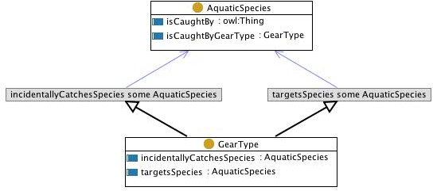

 __This pattern has been certified.__
Related submission, with evaluation history, can be found __here__

#  Graphical representation

__Diagram__

#  General description

  

#  Elements

_The __GearSpecies__ Content OP locally defines the following ontology elements:_

 __AquaticSpecies__ (owl:Class) Aquatic species are conceptual entities that are characterized together with resources and water areas. 
Mappable to fi:Species, fi:SpeciesRef, fi:SpeciesFeature, etc.

It has related axioms from FIGIS Schema that are included in the classes linked to the fi:Species class, such as fi:SpeciesRef (holding association with fi:AqResRef, which holds association with fi:WaterAreaRef). 

  _[AquaticSpecies](../Submissions/GearSpecies/AquaticSpecies.md "Submissions:GearSpecies/AquaticSpecies") page_
 __GearType__ (owl:Class) Gear types are conceptual entities that are characterized together with AquaticSpecies that are either targeted or can be incidentally caught. 
Mappable to fi:GearTypeRef 

  _[GearType](../Submissions/GearSpecies/GearType.md "Submissions:GearSpecies/GearType") page_
 __incidentallyCatchesSpecies__ (owl:ObjectProperty) 
  _[incidentallyCatchesSpecies](../Submissions/GearSpecies/incidentallyCatchesSpecies.md "Submissions:GearSpecies/incidentallyCatchesSpecies") page_
 __targetsSpecies__ (owl:ObjectProperty) 
  _[targetsSpecies](../Submissions/GearSpecies/targetsSpecies.md "Submissions:GearSpecies/targetsSpecies") page_
 __isCaughtByGearType__ (owl:ObjectProperty) 
  _[isCaughtByGearType](../Submissions/GearSpecies/isCaughtByGearType.md "Submissions:GearSpecies/isCaughtByGearType") page_
 __isCaughtBy__ (owl:ObjectProperty) 
  _[isCaughtBy](../Submissions/GearSpecies/isCaughtBy.md "Submissions:GearSpecies/isCaughtBy") page_
 __catchesSpecies__ (owl:ObjectProperty) 
  _[catchesSpecies](../Submissions/GearSpecies/catchesSpecies.md "Submissions:GearSpecies/catchesSpecies") page_
#  Additional information

(type): [http://www.w3.org/2002/07/owl#Ontology](http://www.w3.org/2002/07/owl#Ontology "http://www.w3.org/2002/07/owl#Ontology")

(versionInfo): Created by Alessandro Adamou

(imports): [http://www.ontologydesignpatterns.org/schemas/cpannotationschema.owl](http://www.ontologydesignpatterns.org/schemas/cpannotationschema.owl "http://www.ontologydesignpatterns.org/schemas/cpannotationschema.owl")

(versionInfo): 1.1

#  Scenarios

__Scenarios about GearSpecies__
No scenario is added to this Content OP.

#  Reviews

__Reviews about GearSpecies__
There is no review about this proposal.
This revision (revision ID __9089__) takes in account the reviews: none

Other info at [evaluation tab](http://ontologydesignpatterns.org/wiki/index.php?title=Submissions:GearSpecies&action=evaluation "http://ontologydesignpatterns.org/wiki/index.php?title=Submissions:GearSpecies&action=evaluation")

  

#  Modeling issues

__Modeling issues about GearSpecies__
There is no Modeling issue related to this proposal.

  

#  References

[Add a reference](index.php@title=Odp%253AAdd_reference&subject=../Submissions/GearSpecies.md "http://ontologydesignpatterns.org/wiki/index.php?title=Odp:Add_reference&subject=Submissions%3AGearSpecies")

  

Retrieved from "[http://ontologydesignpatterns.org/wiki/Submissions:GearSpecies](../Submissions/GearSpecies.md)"
 [Category](http://ontologydesignpatterns.org/wiki/Special:Categories "Special:Categories"): [ProposedContentOP](../Category/ProposedContentOP.md "Category:ProposedContentOP")