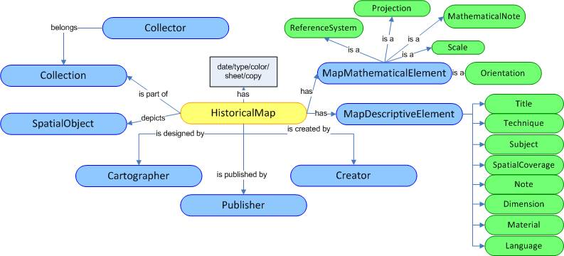

 __This pattern has been certified.__
Related submission, with evaluation history, can be found __here__

#  Graphical representation

__Diagram__

#  General description

  

#  Elements

_The __HistoricalMap__ Content OP locally defines the following ontology elements:_

 __PrimeMeridian__ (owl:Class) The first lline of longitude from which the longitute is calculated. 
  _[PrimeMeridian](../Submissions/HistoricalMap/PrimeMeridian.md "Submissions:HistoricalMap/PrimeMeridian") page_
 __MapMathematicalElement__ (owl:Class) The mathematical parameters for creating a map. 
  _[MapMathematicalElement](../Submissions/HistoricalMap/MapMathematicalElement.md "Submissions:HistoricalMap/MapMathematicalElement") page_
 __Scale__ (owl:Class) The mathematical ratio that gives the size of something in the earth surface and the size of it in the map. 
  _[Scale](../Submissions/HistoricalMap/Scale.md "Submissions:HistoricalMap/Scale") page_
 __ReferenceSystem__ (owl:Class) The system of axes that uses coordinates to establish position 
  _[ReferenceSystem](../Submissions/HistoricalMap/ReferenceSystem.md "Submissions:HistoricalMap/ReferenceSystem") page_
 __Projection__ (owl:Class) The mathematical process for representing earth in the plane. 
  _[Projection](../Submissions/HistoricalMap/Projection.md "Submissions:HistoricalMap/Projection") page_
 __Orientation__ (owl:Class) The position of the map in relation to the North (True, Magnetic, Grid North). 
  _[Orientation](../Submissions/HistoricalMap/Orientation.md "Submissions:HistoricalMap/Orientation") page_
 __MathematicalNote__ (owl:Class) Any note written on the map concerning mathematical information. 
  _[MathematicalNote](../Submissions/HistoricalMap/MathematicalNote.md "Submissions:HistoricalMap/MathematicalNote") page_
 __Collection__ (owl:Class) Several things (historical maps) grouped together or considered as a whole (Wordnet). 
  _[Collection](../Submissions/HistoricalMap/Collection.md "Submissions:HistoricalMap/Collection") page_
 __HistoricalMap__ (owl:Class) A diagrammatic representation of the earth's surface (or part of it) belonging to the past (Wordnet). 
  _[HistoricalMap](../Submissions/HistoricalMap/HistoricalMap.md "Submissions:HistoricalMap/HistoricalMap") page_
 __includes__ (owl:ObjectProperty) 
  _[includes](../Submissions/HistoricalMap/includes.md "Submissions:HistoricalMap/includes") page_
 __hasCurrentOwner__ (owl:ObjectProperty) 
  _[hasCurrentOwner](../Submissions/HistoricalMap/hasCurrentOwner.md "Submissions:HistoricalMap/hasCurrentOwner") page_
 __Collector__ (owl:Class) A person or organisation that owns 1 or more historical maps. 
  _[Collector](../Submissions/HistoricalMap/Collector.md "Submissions:HistoricalMap/Collector") page_
 __Actor__ (owl:Class) A person who acts and gets things done (Wordnet). 
  _[Actor](../Submissions/HistoricalMap/Actor.md "Submissions:HistoricalMap/Actor") page_
 __MapElement__ (owl:Class) A characteristic of map. 
  _[MapElement](../Submissions/HistoricalMap/MapElement.md "Submissions:HistoricalMap/MapElement") page_
 __Title__ (owl:Class) The heading of the map.There may be more than one titles (sub-titles). 
  _[Title](../Submissions/HistoricalMap/Title.md "Submissions:HistoricalMap/Title") page_
 __Technique__ (owl:Class) The process by which the map was created or published. 
  _[Technique](../Submissions/HistoricalMap/Technique.md "Submissions:HistoricalMap/Technique") page_
 __Subject__ (owl:Class) The theme of the map e.g. the establishment of new national borders 
  _[Subject](../Submissions/HistoricalMap/Subject.md "Submissions:HistoricalMap/Subject") page_
 __SpatialCoverage__ (owl:Class) The spatial extend of the geographic area that is depicted in the map. 
  _[SpatialCoverage](../Submissions/HistoricalMap/SpatialCoverage.md "Submissions:HistoricalMap/SpatialCoverage") page_
 __Language__ (owl:Class) The language(s) used for the literals in the map. 
  _[Language](../Submissions/HistoricalMap/Language.md "Submissions:HistoricalMap/Language") page_
 __Dimension__ (owl:Class) The dimensions of the map, length and width. 
  _[Dimension](../Submissions/HistoricalMap/Dimension.md "Submissions:HistoricalMap/Dimension") page_
 __Note__ (owl:Class) Any note (except mathematical) that is written on the map. 
  _[Note](../Submissions/HistoricalMap/Note.md "Submissions:HistoricalMap/Note") page_
 __Material__ (owl:Class) The material of which the map is published. 
  _[Material](../Submissions/HistoricalMap/Material.md "Submissions:HistoricalMap/Material") page_
 __MapDescriptiveElement__ (owl:Class) All the metadata that are used for describing a map and for its cataloguing. 
  _[MapDescriptiveElement](../Submissions/HistoricalMap/MapDescriptiveElement.md "Submissions:HistoricalMap/MapDescriptiveElement") page_
 __SpatialObject__ (owl:Class) The class spatial-object represents everything that can have a spatial representation. It is superclass of feature and geometry (Geosparql). 
  _[SpatialObject](../Submissions/HistoricalMap/SpatialObject.md "Submissions:HistoricalMap/SpatialObject") page_
 __Creator__ (owl:Class) The person who created the map. 
  _[Creator](../Submissions/HistoricalMap/Creator.md "Submissions:HistoricalMap/Creator") page_
 __created__ (owl:ObjectProperty) 
  _[created](../Submissions/HistoricalMap/created.md "Submissions:HistoricalMap/created") page_
 __Cartographer__ (owl:Class) A person who makes maps. 
  _[Cartographer](../Submissions/HistoricalMap/Cartographer.md "Submissions:HistoricalMap/Cartographer") page_
 __Publisher__ (owl:Class) The person responsible for the publication of the map. 
  _[Publisher](../Submissions/HistoricalMap/Publisher.md "Submissions:HistoricalMap/Publisher") page_
 __designed__ (owl:ObjectProperty) 
  _[designed](../Submissions/HistoricalMap/designed.md "Submissions:HistoricalMap/designed") page_
 __published__ (owl:ObjectProperty) 
  _[published](../Submissions/HistoricalMap/published.md "Submissions:HistoricalMap/published") page_
 __isPublishedBy__ (owl:ObjectProperty) 
  _[isPublishedBy](../Submissions/HistoricalMap/isPublishedBy.md "Submissions:HistoricalMap/isPublishedBy") page_
 __hasOrientation__ (owl:ObjectProperty) 
  _[hasOrientation](../Submissions/HistoricalMap/hasOrientation.md "Submissions:HistoricalMap/hasOrientation") page_
 __hasLanguage__ (owl:ObjectProperty) 
  _[hasLanguage](../Submissions/HistoricalMap/hasLanguage.md "Submissions:HistoricalMap/hasLanguage") page_
 __hasProjection__ (owl:FunctionalProperty) 
  _[hasProjection](../Submissions/HistoricalMap/hasProjection.md "Submissions:HistoricalMap/hasProjection") page_
 __isCreatedBy__ (owl:ObjectProperty) 
  _[isCreatedBy](../Submissions/HistoricalMap/isCreatedBy.md "Submissions:HistoricalMap/isCreatedBy") page_
 __hasTitle__ (owl:ObjectProperty) 
  _[hasTitle](../Submissions/HistoricalMap/hasTitle.md "Submissions:HistoricalMap/hasTitle") page_
 __hasReferenceSystem__ (owl:FunctionalProperty) 
  _[hasReferenceSystem](../Submissions/HistoricalMap/hasReferenceSystem.md "Submissions:HistoricalMap/hasReferenceSystem") page_
 __hasSubject__ (owl:ObjectProperty) 
  _[hasSubject](../Submissions/HistoricalMap/hasSubject.md "Submissions:HistoricalMap/hasSubject") page_
 __isMadeBy__ (owl:ObjectProperty) 
  _[isMadeBy](../Submissions/HistoricalMap/isMadeBy.md "Submissions:HistoricalMap/isMadeBy") page_
 __isPartOf__ (owl:ObjectProperty) 
  _[isPartOf](../Submissions/HistoricalMap/isPartOf.md "Submissions:HistoricalMap/isPartOf") page_
 __hasScale__ (owl:FunctionalProperty) 
  _[hasScale](../Submissions/HistoricalMap/hasScale.md "Submissions:HistoricalMap/hasScale") page_
 __hasNote__ (owl:ObjectProperty) 
  _[hasNote](../Submissions/HistoricalMap/hasNote.md "Submissions:HistoricalMap/hasNote") page_
 __hasDimension__ (owl:ObjectProperty) 
  _[hasDimension](../Submissions/HistoricalMap/hasDimension.md "Submissions:HistoricalMap/hasDimension") page_
 __hasMathematicalNote__ (owl:ObjectProperty) 
  _[hasMathematicalNote](../Submissions/HistoricalMap/hasMathematicalNote.md "Submissions:HistoricalMap/hasMathematicalNote") page_
 __hasPrimeMeridian__ (owl:ObjectProperty) 
  _[hasPrimeMeridian](../Submissions/HistoricalMap/hasPrimeMeridian.md "Submissions:HistoricalMap/hasPrimeMeridian") page_
 __isDesignedBy__ (owl:ObjectProperty) 
  _[isDesignedBy](../Submissions/HistoricalMap/isDesignedBy.md "Submissions:HistoricalMap/isDesignedBy") page_
 __isMadeOf__ (owl:ObjectProperty) 
  _[isMadeOf](../Submissions/HistoricalMap/isMadeOf.md "Submissions:HistoricalMap/isMadeOf") page_
 __isCurrentOwnerOf__ (owl:ObjectProperty) 
  _[isCurrentOwnerOf](../Submissions/HistoricalMap/isCurrentOwnerOf.md "Submissions:HistoricalMap/isCurrentOwnerOf") page_
 __hasDateOfPublication__ (owl:ObjectProperty) 
  _[hasDateOfPublication](../Submissions/HistoricalMap/hasDateOfPublication.md "Submissions:HistoricalMap/hasDateOfPublication") page_
 __MyProperties__ (owl:ObjectProperty) 
  _[MyProperties](../Submissions/HistoricalMap/MyProperties.md "Submissions:HistoricalMap/MyProperties") page_
 __isPublishedAt__ (owl:ObjectProperty) 
  _[isPublishedAt](../Submissions/HistoricalMap/isPublishedAt.md "Submissions:HistoricalMap/isPublishedAt") page_
 __isMathematicalNoteOf__ (owl:ObjectProperty) 
  _[isMathematicalNoteOf](../Submissions/HistoricalMap/isMathematicalNoteOf.md "Submissions:HistoricalMap/isMathematicalNoteOf") page_
 __isEditedBy__ (owl:ObjectProperty) 
  _[isEditedBy](../Submissions/HistoricalMap/isEditedBy.md "Submissions:HistoricalMap/isEditedBy") page_
 __edited__ (owl:ObjectProperty) 
  _[edited](../Submissions/HistoricalMap/edited.md "Submissions:HistoricalMap/edited") page_
 __isLanguageOf__ (owl:ObjectProperty) 
  _[isLanguageOf](../Submissions/HistoricalMap/isLanguageOf.md "Submissions:HistoricalMap/isLanguageOf") page_
 __isOrientationOf__ (owl:ObjectProperty) 
  _[isOrientationOf](../Submissions/HistoricalMap/isOrientationOf.md "Submissions:HistoricalMap/isOrientationOf") page_
 __hasDateOfEdition__ (owl:ObjectProperty) 
  _[hasDateOfEdition](../Submissions/HistoricalMap/hasDateOfEdition.md "Submissions:HistoricalMap/hasDateOfEdition") page_
 __isDepictedIn__ (owl:ObjectProperty) 
  _[isDepictedIn](../Submissions/HistoricalMap/isDepictedIn.md "Submissions:HistoricalMap/isDepictedIn") page_
 __depicts__ (owl:ObjectProperty) 
  _[depicts](../Submissions/HistoricalMap/depicts.md "Submissions:HistoricalMap/depicts") page_
 __hasPlaceOfPublication__ (owl:ObjectProperty) 
  _[hasPlaceOfPublication](../Submissions/HistoricalMap/hasPlaceOfPublication.md "Submissions:HistoricalMap/hasPlaceOfPublication") page_
 __hasDateOfCreation__ (owl:ObjectProperty) 
  _[hasDateOfCreation](../Submissions/HistoricalMap/hasDateOfCreation.md "Submissions:HistoricalMap/hasDateOfCreation") page_
 __hasColor__ (owl:ObjectProperty) 
  _[hasColor](../Submissions/HistoricalMap/hasColor.md "Submissions:HistoricalMap/hasColor") page_
 __type__ (owl:DatatypeProperty) 
  _[type](../Submissions/HistoricalMap/type.md "Submissions:HistoricalMap/type") page_
 __copy__ (owl:DatatypeProperty) 
  _[copy](../Submissions/HistoricalMap/copy.md "Submissions:HistoricalMap/copy") page_
 __numberOfSheets__ (owl:DatatypeProperty) 
  _[numberOfSheets](../Submissions/HistoricalMap/numberOfSheets.md "Submissions:HistoricalMap/numberOfSheets") page_
 __date__ (owl:DatatypeProperty) 
  _[date](../Submissions/HistoricalMap/date.md "Submissions:HistoricalMap/date") page_
#  Additional information

#  Scenarios

__Scenarios about HistoricalMap__
No scenario is added to this Content OP.

#  Reviews

__Reviews about HistoricalMap__
There is no review about this proposal.
This revision (revision ID __11533__) takes in account the reviews: none

Other info at [evaluation tab](http://ontologydesignpatterns.org/wiki/index.php?title=Submissions:HistoricalMap&action=evaluation "http://ontologydesignpatterns.org/wiki/index.php?title=Submissions:HistoricalMap&action=evaluation")

  

#  Modeling issues

__Modeling issues about HistoricalMap__
There is no Modeling issue related to this proposal.

  

#  References

[Add a reference](index.php@title=Odp%253AAdd_reference&subject=../Submissions/HistoricalMap.md "http://ontologydesignpatterns.org/wiki/index.php?title=Odp:Add_reference&subject=Submissions%3AHistoricalMap")

  

Retrieved from "[http://ontologydesignpatterns.org/wiki/Submissions:HistoricalMap](../Submissions/HistoricalMap.md)"
 [Categories](http://ontologydesignpatterns.org/wiki/Special:Categories "Special:Categories"): [ProposedContentOP](../Category/ProposedContentOP.md "Category:ProposedContentOP") | [Waiting for review](../Category/Waiting_for_review.md "Category:Waiting for review")