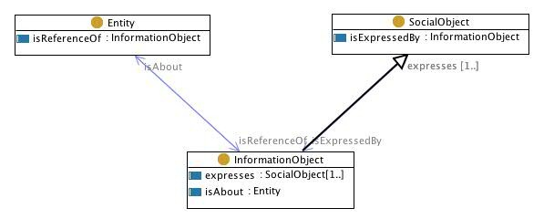

 __This pattern has been certified.__
Related submission, with evaluation history, can be found __here__

#  Graphical representation

__Diagram__

#  General description

  

#  Elements

_The __IntensionExtension__ Content OP locally defines the following ontology elements:_

 __expresses__ (owl:ObjectProperty) The relation between an InformationObject and a 'meaning'.
What is a meaning is dependent on the background approach/theory that one assumes. For example, lexicographers that write dictionaries, glossaries, etc. assume that the meaning of term is a paraphrase (or 'gloss', or 'definition'). Another approach is provided by concept schemes like thesauri and lexicons, which assume that the meaning of a term is a 'concept', possibly encoded as a 'lemma', 'synset', or 'descriptor'. Still another approach is that of psychologists and cognitive scientists, which often assume that the meaning of an information object is a concept encoded in the mind or cognitive system of an agent. A radically different approach is taken by social scientists and semioticians, who usually assume that meaning of an information object is spread across the members of a community that use that object. The logical approach to meaning is completely different, since it assumes that the meaning of e.g. a term is equivalent to the set of individuals that the term can be applied to; for example, the meaning of 'Ali' is e.g. an individual person called Ali, the meaning of 'Airplane' is e.g. the set of airplanes, etc. Finally, an approach taken by structuralist linguistics and frame semantics is that a meaning is the relational context in which an information object can be applied; for example, a meaning of 'Airplane' is situated e.g. in the context ('frame') of passenger airline flights.

  

These different approaches are not necessarily conflicting, and they mostly talk about different aspects of so-called 'semantics'. They can be summarized, and modelled withih DOLCE-Ultralite, as follows:

(1) Intensional meaning

 - Relational meaning (as for frame semantics). Here it is modelled as the expresses relation between instances of InformationObject and instances of Description

 - Conceptual meaning (as for psychological and 'concept scheme' semantics). Here it is modelled as the expresses relation between instances of InformationObject and instances of Concept

 - Paraphrase meaning (as for lexicographic semantics). Here it is modelled as the expresses relation between instances of InformationObject and different instances of InformationObject that act as 'paraphrases'

 - Cultural meaning (as for social science semantics). Here it is modelled as the expresses relation between instances of InformationObject and instances of SocialObject

  

(2) Extensional meaning (as for logic and formal semantics)

 - Object-level formal meaning (as in the traditional first-order logic semantics). Here it is modelled as the expresses relation between instances of InformationObject and instances of Collection

 - Modal formal meaning (as in possible-world semantics). Here it is modelled as the expresses relation between instances of InformationObject and instances of Collections as located in another Collection that isFormallyRepresentedIn a PossibleWorld

  

For example:

- the term Beehive expresses the Concept Beehive

- the term Beehive expresses the Description BeingABeehive, a relation that defines concepts such as Bee, Honey, Habitation, etc.

- the text of Italian Constitution expresses the 'content' of the Constitution

- your email expresses an aggressive attitude 

  _[expresses](../Submissions/IntensionExtension/expresses.md "Submissions:IntensionExtension/expresses") page_
 __isAbout__ (owl:ObjectProperty) A relation between information objects and any Entity (including information objects). It can be used to talk about e.g. entities are references of proper nouns: the proper noun 'Leonardo da Vinci' isAbout the Person Leonardo da Vinci; as well as to talk about sets of entities that can be described by a common noun: the common noun 'person' isAbout the set of all persons in a domain of discourse, which can be represented bu reusing the pattern CollectionEntity. 
  _[isAbout](../Submissions/IntensionExtension/isAbout.md "Submissions:IntensionExtension/isAbout") page_
 __isExpressedBy__ (owl:ObjectProperty) The relation between an InformationObject and a 'meaning'.
What is a meaning is dependent on the background approach/theory that one assumes. For example, lexicographers that write dictionaries, glossaries, etc. assume that the meaning of term is a paraphrase (or 'gloss', or 'definition'). Another approach is provided by concept schemes like thesauri and lexicons, which assume that the meaning of a term is a 'concept', possibly encoded as a 'lemma', 'synset', or 'descriptor'. Still another approach is that of psychologists and cognitive scientists, which often assume that the meaning of an information object is a concept encoded in the mind or cognitive system of an agent. A radically different approach is taken by social scientists and semioticians, who usually assume that meaning of an information object is spread across the members of a community that use that object. The logical approach to meaning is completely different, since it assumes that the meaning of e.g. a term is equivalent to the set of individuals that the term can be applied to; for example, the meaning of 'Ali' is e.g. an individual person called Ali, the meaning of 'Airplane' is e.g. the set of airplanes, etc. Finally, an approach taken by structuralist linguistics and frame semantics is that a meaning is the relational context in which an information object can be applied; for example, a meaning of 'Airplane' is situated e.g. in the context ('frame') of passenger airline flights.

  

These different approaches are not necessarily conflicting, and they mostly talk about different aspects of so-called 'semantics'. They can be summarized, and modelled withih DOLCE-Ultralite, as follows:

(1) Intensional meaning

 - Relational meaning (as for frame semantics). Here it is modelled as the expresses relation between instances of InformationObject and instances of Description

 - Conceptual meaning (as for psychological and 'concept scheme' semantics). Here it is modelled as the expresses relation between instances of InformationObject and instances of Concept

 - Paraphrase meaning (as for lexicographic semantics). Here it is modelled as the expresses relation between instances of InformationObject and different instances of InformationObject that act as 'paraphrases'

 - Cultural meaning (as for social science semantics). Here it is modelled as the expresses relation between instances of InformationObject and instances of SocialObject

  

(2) Extensional meaning (as for logic and formal semantics)

 - Object-level formal meaning (as in the traditional first-order logic semantics). Here it is modelled as the expresses relation between instances of InformationObject and instances of Collection

 - Modal formal meaning (as in possible-world semantics). Here it is modelled as the expresses relation between instances of InformationObject and instances of Collections as located in another Collection that isFormallyRepresentedIn a PossibleWorld

  

For example:

- the term Beehive expresses the Concept Beehive

- the term Beehive expresses the Description BeingABeehive, a relation that defines concepts such as Bee, Honey, Habitation, etc.

- the text of Italian Constitution expresses the 'content' of the Constitution

- your email expresses an aggressive attitude 

  _[isExpressedBy](../Submissions/IntensionExtension/isExpressedBy.md "Submissions:IntensionExtension/isExpressedBy") page_
 __isReferenceOf__ (owl:ObjectProperty) A relation between information objects and any Entity (including information objects). It can be used to talk about e.g. entities are references of proper nouns: the proper noun 'Leonardo da Vinci' isAbout the Person Leonardo da Vinci; as well as to talk about sets of entities that can be described by a common noun: the common noun 'person' isAbout the set of all persons in a domain of discourse, which can be represented in DOLCE-Ultralite as an individual of the class: Collection . 
  _[isReferenceOf](../Submissions/IntensionExtension/isReferenceOf.md "Submissions:IntensionExtension/isReferenceOf") page_
 __InformationObject__ (owl:Class) A piece of information, such as a musical composition, a text, a word, a picture, independently from how it is concretely realized. 
  _[InformationObject](../Submissions/IntensionExtension/InformationObject.md "Submissions:IntensionExtension/InformationObject") page_
 __SocialObject__ (owl:Class) Any Object that exists within some communication Event, in which at least one PhysicalObject participates in. 
In other words, all objects that have been created in the process of social communication: for the sake of communication (InformationObject), for incorporating new individuals (SocialAgent, Place), for contextualizing existing entities (Situation), for collecting existing entities (Collection), or for describing existing entities (Description, Concept). 

  _[SocialObject](../Submissions/IntensionExtension/SocialObject.md "Submissions:IntensionExtension/SocialObject") page_
#  Additional information

The intension and extension pattern. It allows to represent the intensional expression and extensional reference of information objects. This pattern is extracted from DOLCE-UltraLite by partial clone of elements.

#  Scenarios

__Scenarios about IntensionExtension__
No scenario is added to this Content OP.

#  Reviews

__Reviews about IntensionExtension__
There is no review about this proposal.
This revision (revision ID __9095__) takes in account the reviews: none

Other info at [evaluation tab](http://ontologydesignpatterns.org/wiki/index.php?title=Submissions:IntensionExtension&action=evaluation "http://ontologydesignpatterns.org/wiki/index.php?title=Submissions:IntensionExtension&action=evaluation")

  

#  Modeling issues

__Modeling issues about IntensionExtension__
There is no Modeling issue related to this proposal.

  

#  References

[Add a reference](index.php@title=Odp%253AAdd_reference&subject=../Submissions/IntensionExtension.md "http://ontologydesignpatterns.org/wiki/index.php?title=Odp:Add_reference&subject=Submissions%3AIntensionExtension")

  

Retrieved from "[http://ontologydesignpatterns.org/wiki/Submissions:IntensionExtension](../Submissions/IntensionExtension.md)"
 [Category](http://ontologydesignpatterns.org/wiki/Special:Categories "Special:Categories"): [ProposedContentOP](../Category/ProposedContentOP.md "Category:ProposedContentOP")