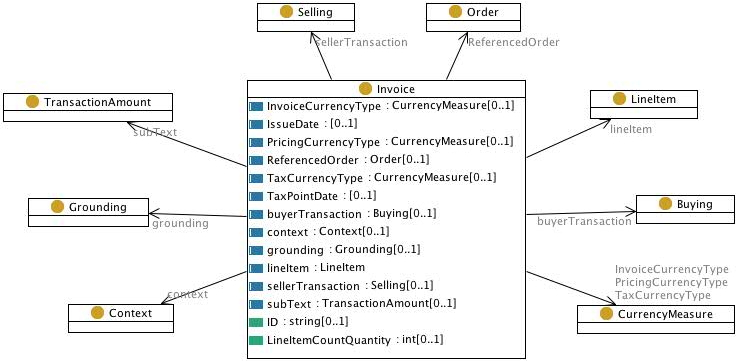

 __This pattern has been certified.__
Related submission, with evaluation history, can be found __here__

#  Graphical representation

__Diagram__

#  General description

  

#  Elements

_The __Invoice__ Content OP locally defines the following ontology elements:_

 __Buying__ (owl:Class) The intention to buy in a financial transaction or order 

  _[Buying](../Submissions/Invoice/Buying.md "Submissions:Invoice/Buying") page_

 __Context__ (owl:Class) The context of an invoice (space, time, organization) 

  _[Context](../Submissions/Invoice/Context.md "Submissions:Invoice/Context") page_

 __Currency measure__ (owl:Class) A currency unit, e.g. euro cent, dollar 

  _[CurrencyMeasure](../Submissions/Invoice/CurrencyMeasure.md "Submissions:Invoice/CurrencyMeasure") page_

 __Grounding__ (owl:Class) A physical invoice document 

  _[Grounding](../Submissions/Invoice/Grounding.md "Submissions:Invoice/Grounding") page_

 __Invoice__ (owl:Class) An invoice (information object) 

  _[Invoice](../Submissions/Invoice/Invoice.md "Submissions:Invoice/Invoice") page_

 __Line item__ (owl:Class) A single item in a commercial transaction 

  _[LineItem](Submissions%253AInvoice/LineItem.html "Submissions:Invoice/LineItem") page_

 __Order__ (owl:Class) A stated intention, either spoken or written, to engage in a commercial transaction for specific products or services. From a buyer's point of view it expresses the intention to buy and is called a purchase order ( [buying](../Submissions/Invoice/Buying.md "Submissions:Invoice/Buying") in this pattern). From a seller's point of view it expresses the intention to sell and is referred to as a sales order ( [selling](../Submissions/Invoice/Selling.md "Submissions:Invoice/Selling") in this pattern) 

  _[Order](../Submissions/Invoice/Order.md "Submissions:Invoice/Order") page_

 __Selling__ (owl:Class) The intention to sell in a financial transaction or order 

  _[Selling](../Submissions/Invoice/Selling.md "Submissions:Invoice/Selling") page_

 __Transaction amount__ (owl:Class) The amount of currency involved in the transaction referred in the invoice 

  _[TransactionAmount](http://ontologydesignpatterns.org/wiki/Submissions:Invoice/TransactionAmount "Submissions:Invoice/TransactionAmount") page_

 __buyer transaction__ (owl:ObjectProperty) A relation between an invoice and a buying (buyer-oriented transaction) 

  _[buyerTransaction](http://ontologydesignpatterns.org/wiki/Submissions:Invoice/buyerTransaction "Submissions:Invoice/buyerTransaction") page_
[Submissions:Invoice/context](http://ontologydesignpatterns.org/wiki/Special:AddData/Ontology Element Form/Submissions:Invoice/context "Submissions:Invoice/context (not yet written)")  _[context](http://ontologydesignpatterns.org/wiki/Special:AddData/Ontology Element Form/Submissions:Invoice/context "Submissions:Invoice/context (not yet written)") page_

 __grounding__ (owl:ObjectProperty) A relation between an invoice and the document that realizes it 

  _[grounding](Submissions%253AInvoice/grounding.html "Submissions:Invoice/grounding") page_

 __invoice currency code__ (owl:DatatypeProperty) A relation between an invoice and the code of its currency 

  _[invoiceCurrencyCode](../Submissions/Invoice/invoiceCurrencyCode.md "Submissions:Invoice/invoiceCurrencyCode") page_
[Submissions:Invoice/invoiceCurrencyType](http://ontologydesignpatterns.org/wiki/Special:AddData/Ontology Element Form/Submissions:Invoice/invoiceCurrencyType "Submissions:Invoice/invoiceCurrencyType (not yet written)")  _[invoiceCurrencyType](http://ontologydesignpatterns.org/wiki/Special:AddData/Ontology Element Form/Submissions:Invoice/invoiceCurrencyType "Submissions:Invoice/invoiceCurrencyType (not yet written)") page_

 __issue date__ (owl:ObjectProperty) A relation between an invoice and a date description, e.g. from W3 Time ontology 

  _[issuedate](../Submissions/Invoice/issuedate.md "Submissions:Invoice/issuedate") page_

 __line item__ (owl:ObjectProperty) A relation between an invoice and a line item 

  _[lineItem](../Submissions/Invoice/lineItem.md "Submissions:Invoice/lineItem") page_
[Submissions:Invoice/priceCurrencyType](http://ontologydesignpatterns.org/wiki/Special:AddData/Ontology Element Form/Submissions:Invoice/priceCurrencyType "Submissions:Invoice/priceCurrencyType (not yet written)")  _[priceCurrencyType](http://ontologydesignpatterns.org/wiki/Special:AddData/Ontology Element Form/Submissions:Invoice/priceCurrencyType "Submissions:Invoice/priceCurrencyType (not yet written)") page_
[Submissions:Invoice/referenceOrder](http://ontologydesignpatterns.org/wiki/Special:AddData/Ontology Element Form/Submissions:Invoice/referenceOrder "Submissions:Invoice/referenceOrder (not yet written)")  _[referenceOrder](http://ontologydesignpatterns.org/wiki/Special:AddData/Ontology Element Form/Submissions:Invoice/referenceOrder "Submissions:Invoice/referenceOrder (not yet written)") page_
[Submissions:Invoice/sellerTransaction](http://ontologydesignpatterns.org/wiki/Special:AddData/Ontology Element Form/Submissions:Invoice/sellerTransaction "Submissions:Invoice/sellerTransaction (not yet written)")  _[sellerTransaction](http://ontologydesignpatterns.org/wiki/Special:AddData/Ontology Element Form/Submissions:Invoice/sellerTransaction "Submissions:Invoice/sellerTransaction (not yet written)") page_
[Submissions:Invoice/subText](http://ontologydesignpatterns.org/wiki/Special:AddData/Ontology Element Form/Submissions:Invoice/subText "Submissions:Invoice/subText (not yet written)")  _[subText](http://ontologydesignpatterns.org/wiki/Special:AddData/Ontology Element Form/Submissions:Invoice/subText "Submissions:Invoice/subText (not yet written)") page_
[Submissions:Invoice/taxCurrencyType](http://ontologydesignpatterns.org/wiki/Special:AddData/Ontology Element Form/Submissions:Invoice/taxCurrencyType "Submissions:Invoice/taxCurrencyType (not yet written)")  _[taxCurrencyType](http://ontologydesignpatterns.org/wiki/Special:AddData/Ontology Element Form/Submissions:Invoice/taxCurrencyType "Submissions:Invoice/taxCurrencyType (not yet written)") page_
[Submissions:Invoice/taxPointDate](http://ontologydesignpatterns.org/wiki/Special:AddData/Ontology Element Form/Submissions:Invoice/taxPointDate "Submissions:Invoice/taxPointDate (not yet written)")  _[taxPointDate](http://ontologydesignpatterns.org/wiki/Special:AddData/Ontology Element Form/Submissions:Invoice/taxPointDate "Submissions:Invoice/taxPointDate (not yet written)") page_

 __ID__ (owl:DatatypeProperty) The identifier for an invoice 

  _[ID](../Submissions/Invoice/ID.md "Submissions:Invoice/ID") page_

 __line item count quantity__ (owl:DatatypeProperty) a relation to express how many instances of a line item are involved in an order referred by an invoice 

  _[lineItemCountQuantity](../Submissions/Invoice/lineItemCountQuantity.md "Submissions:Invoice/lineItemCountQuantity") page_
#  Additional information

#  Scenarios

__Scenarios about Invoice__
No scenario is added to this Content OP.

#  Reviews

__Reviews about Invoice__
There is no review about this proposal.
This revision (revision ID __9096__) takes in account the reviews: none

Other info at [evaluation tab](http://ontologydesignpatterns.org/wiki/index.php?title=Submissions:Invoice&action=evaluation "http://ontologydesignpatterns.org/wiki/index.php?title=Submissions:Invoice&action=evaluation")

  

#  Modeling issues

__Modeling issues about Invoice__
There is no Modeling issue related to this proposal.

  

#  References

[Add a reference](index.php@title=Odp%253AAdd_reference&subject=../Submissions/Invoice.md "http://ontologydesignpatterns.org/wiki/index.php?title=Odp:Add_reference&subject=Submissions%3AInvoice")

  

Retrieved from "[http://ontologydesignpatterns.org/wiki/Submissions:Invoice](../Submissions/Invoice.md)"
 [Category](http://ontologydesignpatterns.org/wiki/Special:Categories "Special:Categories"): [ProposedContentOP](../Category/ProposedContentOP.md "Category:ProposedContentOP")