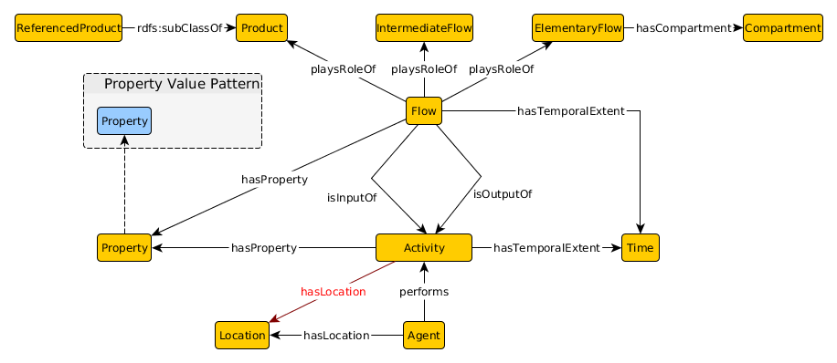

 __This pattern has been certified.__
Related submission, with evaluation history, can be found __here__

#  Graphical representation

__Diagram__

#  General description

  

#  Elements

_The __LCA Pattern__ Content OP locally defines the following ontology elements:_

 __hasCompartment__ (owl:ObjectProperty) 
  _[hasCompartment](../Submissions/LCA_Pattern/hasCompartment.md "Submissions:LCA Pattern/hasCompartment") page_
 __hasLocation__ (owl:ObjectProperty) 
  _[hasLocation](../Submissions/LCA_Pattern/hasLocation.md "Submissions:LCA Pattern/hasLocation") page_
 __hasProperty__ (owl:ObjectProperty) 
  _[hasProperty](../Submissions/LCA_Pattern/hasProperty.md "Submissions:LCA Pattern/hasProperty") page_
 __hasTemporalExtent__ (owl:ObjectProperty) 
  _[hasTemporalExtent](../Submissions/LCA_Pattern/hasTemporalExtent.md "Submissions:LCA Pattern/hasTemporalExtent") page_
 __isInputOf__ (owl:ObjectProperty) 
  _[isInputOf](../Submissions/LCA_Pattern/isInputOf.md "Submissions:LCA Pattern/isInputOf") page_
 __isOutputOf__ (owl:ObjectProperty) 
  _[isOutputOf](../Submissions/LCA_Pattern/isOutputOf.md "Submissions:LCA Pattern/isOutputOf") page_
 __performs__ (owl:ObjectProperty) 
  _[performs](../Submissions/LCA_Pattern/performs.md "Submissions:LCA Pattern/performs") page_
 __playsRoleOf__ (owl:ObjectProperty) 
  _[playsRoleOf](../Submissions/LCA_Pattern/playsRoleOf.md "Submissions:LCA Pattern/playsRoleOf") page_
 __Activity__ (owl:Class) Each activity is performed by at least one agent such as an coal power plant that performs the generation of electricity. 
  _[Activity](../Submissions/LCA_Pattern/Activity.md "Submissions:LCA Pattern/Activity") page_
 __Agent__ (owl:Class) 
  _[Agent](../Submissions/LCA_Pattern/Agent.md "Submissions:LCA Pattern/Agent") page_
 __Compartment__ (owl:Class) 
  _[Compartment](../Submissions/LCA_Pattern/Compartment.md "Submissions:LCA Pattern/Compartment") page_
 __ElementaryFlow__ (owl:Class) It describes material or energy that is entering the system from the environment without any previous transformation by humans or is leaving the system by being released into the environment without further human transformation 
  _[ElementaryFlow](../Submissions/LCA_Pattern/ElementaryFlow.md "Submissions:LCA Pattern/ElementaryFlow") page_
 __Flow__ (owl:Class) Flows are streams of material or energy that can act as the inputs and outputs of activities. 
  _[Flow](../Submissions/LCA_Pattern/Flow.md "Submissions:LCA Pattern/Flow") page_
 __IntermediateFlow__ (owl:Class) Intermediate flows occur between processes of the studied system. 
  _[IntermediateFlow](../Submissions/LCA_Pattern/IntermediateFlow.md "Submissions:LCA Pattern/IntermediateFlow") page_
 __Location__ (owl:Class) 
  _[Location](../Submissions/LCA_Pattern/Location.md "Submissions:LCA Pattern/Location") page_
 __Product__ (owl:Class) 
  _[Product](../Submissions/LCA_Pattern/Product.md "Submissions:LCA Pattern/Product") page_
 __Property__ (owl:Class) 
  _[Property](../Submissions/LCA_Pattern/Property.md "Submissions:LCA Pattern/Property") page_
 __ReferencedProduct__ (owl:Class) 
  _[ReferencedProduct](../Submissions/LCA_Pattern/ReferencedProduct.md "Submissions:LCA Pattern/ReferencedProduct") page_
 __Time__ (owl:Class) 
  _[Time](../Submissions/LCA_Pattern/Time.md "Submissions:LCA Pattern/Time") page_
__air__ (owl:NamedIndividual) 
  _[air](../Submissions/LCA_Pattern/air.md "Submissions:LCA Pattern/air") page_
__soil__ (owl:NamedIndividual) 
  _[soil](../Submissions/LCA_Pattern/soil.md "Submissions:LCA Pattern/soil") page_
__water__ (owl:NamedIndividual) 
  _[water](../Submissions/LCA_Pattern/water.md "Submissions:LCA Pattern/water") page_
#  Additional information

In a nutshell, estimating the environmental impact of a certain product requires an understanding of all impacts accumulated during the creation, lifetime, and decommissioning of said product. With respect to the solar panel example introduced in our related paper, the creation of the solar arrays requires multiple activities such as the transportation of resources, the generation of electric power by a coal power plant necessary to manufacture certain parts of the panels, or the disposal of polluted sludge accumulated during the production. In other words, the Eco-efficiency of solar panels depends on the activities involved in all stages of their life-cycle.

#  Scenarios

__Scenarios about LCA Pattern__
No scenario is added to this Content OP.

#  Reviews

__Reviews about LCA Pattern__
There is no review about this proposal.
This revision (revision ID __12311__) takes in account the reviews: none

Other info at [evaluation tab](http://ontologydesignpatterns.org/wiki/index.php?title=Submissions:LCA_Pattern&action=evaluation "http://ontologydesignpatterns.org/wiki/index.php?title=Submissions:LCA_Pattern&action=evaluation")

  

#  Modeling issues

__Modeling issues about LCA Pattern__
There is no Modeling issue related to this proposal.

  

#  References

[Add a reference](index.php@title=Odp%253AAdd_reference&subject=Submissions%253ALCA+Pattern.html "http://ontologydesignpatterns.org/wiki/index.php?title=Odp:Add_reference&subject=Submissions%3ALCA+Pattern")

  

Retrieved from "[http://ontologydesignpatterns.org/wiki/Submissions:LCA\_Pattern](../Submissions/LCA_Pattern.md)"
 [Category](http://ontologydesignpatterns.org/wiki/Special:Categories "Special:Categories"): [ProposedContentOP](../Category/ProposedContentOP.md "Category:ProposedContentOP")