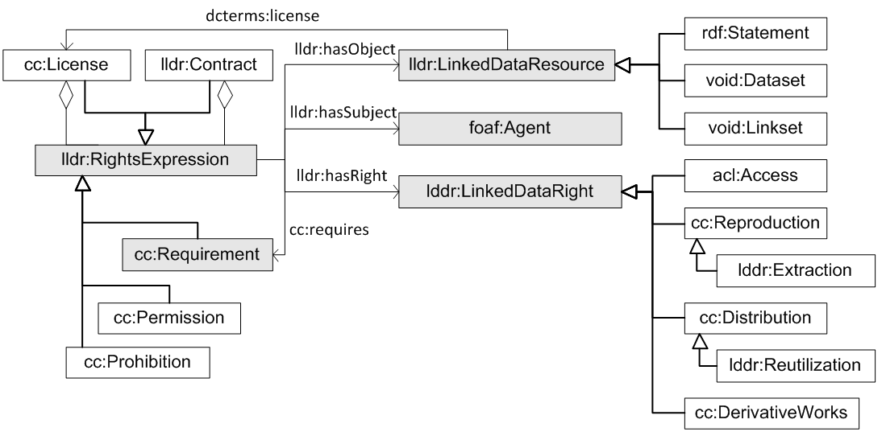

 __This pattern has been certified.__
Related submission, with evaluation history, can be found __here__

#  Graphical representation

__Diagram__

#  General description

  

#  Elements

_The __LicenseLinkedDataResources__ Content OP locally defines the following ontology elements:_

[Submissions:LicenseLinkedDataResources/http://vocab.deri.ie/void](http://ontologydesignpatterns.org/wiki/Special:AddData/Ontology Element Form/Submissions:LicenseLinkedDataResources/http://vocab.deri.ie/void "Submissions:LicenseLinkedDataResources/http://vocab.deri.ie/void (not yet written)")  _[http://vocab.deri.ie/void#](http://ontologydesignpatterns.org/wiki/Special:AddData/Ontology Element Form/Submissions:LicenseLinkedDataResources/http://vocab.deri.ie/void "Submissions:LicenseLinkedDataResources/http://vocab.deri.ie/void (not yet written)") page_
[Submissions:LicenseLinkedDataResources/http://xmlns.com/foaf/0.1/](http://ontologydesignpatterns.org/wiki/Special:AddData/Ontology Element Form/Submissions:LicenseLinkedDataResources/http://xmlns.com/foaf/0.1/ "Submissions:LicenseLinkedDataResources/http://xmlns.com/foaf/0.1/ (not yet written)")  _[http://xmlns.com/foaf/0.1/](http://ontologydesignpatterns.org/wiki/Special:AddData/Ontology Element Form/Submissions:LicenseLinkedDataResources/http://xmlns.com/foaf/0.1/ "Submissions:LicenseLinkedDataResources/http://xmlns.com/foaf/0.1/ (not yet written)") page_
[Submissions:LicenseLinkedDataResources/http://creativecommons.org/ns](http://ontologydesignpatterns.org/wiki/Special:AddData/Ontology Element Form/Submissions:LicenseLinkedDataResources/http://creativecommons.org/ns "Submissions:LicenseLinkedDataResources/http://creativecommons.org/ns (not yet written)")  _[http://creativecommons.org/ns#](http://ontologydesignpatterns.org/wiki/Special:AddData/Ontology Element Form/Submissions:LicenseLinkedDataResources/http://creativecommons.org/ns "Submissions:LicenseLinkedDataResources/http://creativecommons.org/ns (not yet written)") page_
[Submissions:LicenseLinkedDataResources/http://purl.org/dc/terms/](http://ontologydesignpatterns.org/wiki/Special:AddData/Ontology Element Form/Submissions:LicenseLinkedDataResources/http://purl.org/dc/terms/ "Submissions:LicenseLinkedDataResources/http://purl.org/dc/terms/ (not yet written)")  _[http://purl.org/dc/terms/](http://ontologydesignpatterns.org/wiki/Special:AddData/Ontology Element Form/Submissions:LicenseLinkedDataResources/http://purl.org/dc/terms/ "Submissions:LicenseLinkedDataResources/http://purl.org/dc/terms/ (not yet written)") page_
[Submissions:LicenseLinkedDataResources/http://purl.org/dc/elements/1.1/](http://ontologydesignpatterns.org/wiki/Special:AddData/Ontology Element Form/Submissions:LicenseLinkedDataResources/http://purl.org/dc/elements/1.1/ "Submissions:LicenseLinkedDataResources/http://purl.org/dc/elements/1.1/ (not yet written)")  _[http://purl.org/dc/elements/1.1/](http://ontologydesignpatterns.org/wiki/Special:AddData/Ontology Element Form/Submissions:LicenseLinkedDataResources/http://purl.org/dc/elements/1.1/ "Submissions:LicenseLinkedDataResources/http://purl.org/dc/elements/1.1/ (not yet written)") page_
#  Additional information

#  Scenarios

__Scenarios about LicenseLinkedDataResources__
No scenario is added to this Content OP.

#  Reviews

__Reviews about LicenseLinkedDataResources__
This revision (revision ID __11657__) takes in account the reviews: none

Other info at [evaluation tab](http://ontologydesignpatterns.org/wiki/index.php?title=Submissions:LicenseLinkedDataResources&action=evaluation "http://ontologydesignpatterns.org/wiki/index.php?title=Submissions:LicenseLinkedDataResources&action=evaluation")

  

#  Modeling issues

__Modeling issues about LicenseLinkedDataResources__
There is no Modeling issue related to this proposal.

  

#  References

[Add a reference](index.php@title=Odp%253AAdd_reference&subject=../Submissions/LicenseLinkedDataResources.md "http://ontologydesignpatterns.org/wiki/index.php?title=Odp:Add_reference&subject=Submissions%3ALicenseLinkedDataResources")

  

  

Retrieved from "[http://ontologydesignpatterns.org/wiki/Submissions:LicenseLinkedDataResources](../Submissions/LicenseLinkedDataResources.md)"
 [Categories](http://ontologydesignpatterns.org/wiki/Special:Categories "Special:Categories"): [ProposedContentOP](../Category/ProposedContentOP.md "Category:ProposedContentOP") | [Submitted to event](../Category/Submitted_to_event.md "Category:Submitted to event") | [Review assigned](../Category/Review_assigned.md "Category:Review assigned")