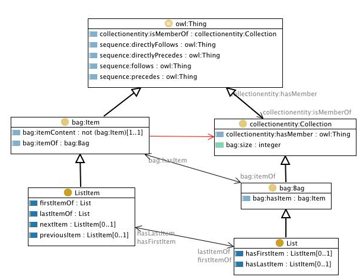

 __This pattern has been certified.__
Related submission, with evaluation history, can be found __here__

#  Graphical representation

__Diagram__

#  General description

  

#  Elements

_The __List__ Content OP locally defines the following ontology elements:_

 __ListItem__ (owl:Class) ListItem - Element belonging to a list 
  _[ListItem](../Submissions/List/ListItem.md "Submissions:List/ListItem") page_
 __List__ (owl:Class) List - An ordered array of items, that can be present in multiple copies 
  _[List](../Submissions/List/List.md "Submissions:List/List") page_
 __lastItemOf__ (owl:ObjectProperty) 
  _[lastItemOf](../Submissions/List/lastItemOf.md "Submissions:List/lastItemOf") page_
 __hasLastItem__ (owl:FunctionalProperty) last item - The link to the last item of the list 
  _[hasLastItem](../Submissions/List/hasLastItem.md "Submissions:List/hasLastItem") page_
 __firstItemOf__ (owl:ObjectProperty) 
  _[firstItemOf](../Submissions/List/firstItemOf.md "Submissions:List/firstItemOf") page_
 __nextItem__ (owl:FunctionalProperty) next item - The link to the next item in a list (ordered collection) 
  _[nextItem](../Submissions/List/nextItem.md "Submissions:List/nextItem") page_
 __previousItem__ (owl:FunctionalProperty) previous item - The link to the previous item in a list (ordered collection) 
  _[previousItem](../Submissions/List/previousItem.md "Submissions:List/previousItem") page_
 __hasFirstItem__ (owl:FunctionalProperty) first item - The link to the first item of the list 
  _[hasFirstItem](../Submissions/List/hasFirstItem.md "Submissions:List/hasFirstItem") page_
#  Additional information

The collections ontology (part of the SWAN ontologies) that this pattern is based on was created by Paolo Ciccarese - Massachusetts General Hospital/Harvard Medical School, and Marco Ocana - Balboa Systems Inc. The original ontologies, and related information, are available under a [Creative Commons License](http://creativecommons.org/licenses/by/1.0/ "http://creativecommons.org/licenses/by/1.0/").

#  Scenarios

__Scenarios about List__
No scenario is added to this Content OP.

#  Reviews

__Reviews about List__
There is no review about this proposal.
This revision (revision ID __10369__) takes in account the reviews: none

Other info at [evaluation tab](http://ontologydesignpatterns.org/wiki/index.php?title=Submissions:List&action=evaluation "http://ontologydesignpatterns.org/wiki/index.php?title=Submissions:List&action=evaluation")

  

#  Modeling issues

__Modeling issues about List__
There is no Modeling issue related to this proposal.

  

#  References

[Add a reference](index.php@title=Odp%253AAdd_reference&subject=../Submissions/List.md "http://ontologydesignpatterns.org/wiki/index.php?title=Odp:Add_reference&subject=Submissions%3AList")

  

Retrieved from "[http://ontologydesignpatterns.org/wiki/Submissions:List](../Submissions/List.md)"
 [Category](http://ontologydesignpatterns.org/wiki/Special:Categories "Special:Categories"): [ProposedContentOP](../Category/ProposedContentOP.md "Category:ProposedContentOP")