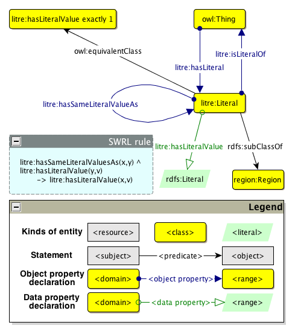

 __This pattern has been certified.__
Related submission, with evaluation history, can be found __here__

#  Graphical representation

__Diagram__

#  General description

  

#  Elements

_The __Literal Reification__ Content OP locally defines the following ontology elements:_

[Submissions:Literal Reification/Literal](http://ontologydesignpatterns.org/wiki/Special:AddData/Ontology Element Form/Submissions:Literal_Reification/Literal "Submissions:Literal Reification/Literal (not yet written)")  _[Literal](http://ontologydesignpatterns.org/wiki/Special:AddData/Ontology Element Form/Submissions:Literal_Reification/Literal "Submissions:Literal Reification/Literal (not yet written)") page_
[Submissions:Literal Reification/hasSameLiteralValueAs](http://ontologydesignpatterns.org/wiki/Special:AddData/Ontology Element Form/Submissions:Literal_Reification/hasSameLiteralValueAs "Submissions:Literal Reification/hasSameLiteralValueAs (not yet written)")  _[hasSameLiteralValueAs](http://ontologydesignpatterns.org/wiki/Special:AddData/Ontology Element Form/Submissions:Literal_Reification/hasSameLiteralValueAs "Submissions:Literal Reification/hasSameLiteralValueAs (not yet written)") page_
[Submissions:Literal Reification/hasLiteral](http://ontologydesignpatterns.org/wiki/Special:AddData/Ontology Element Form/Submissions:Literal_Reification/hasLiteral "Submissions:Literal Reification/hasLiteral (not yet written)")  _[hasLiteral](http://ontologydesignpatterns.org/wiki/Special:AddData/Ontology Element Form/Submissions:Literal_Reification/hasLiteral "Submissions:Literal Reification/hasLiteral (not yet written)") page_
[Submissions:Literal Reification/isLiteralOf](http://ontologydesignpatterns.org/wiki/Special:AddData/Ontology Element Form/Submissions:Literal_Reification/isLiteralOf "Submissions:Literal Reification/isLiteralOf (not yet written)")  _[isLiteralOf](http://ontologydesignpatterns.org/wiki/Special:AddData/Ontology Element Form/Submissions:Literal_Reification/isLiteralOf "Submissions:Literal Reification/isLiteralOf (not yet written)") page_
[Submissions:Literal Reification/hasLiteralValue](http://ontologydesignpatterns.org/wiki/Special:AddData/Ontology Element Form/Submissions:Literal_Reification/hasLiteralValue "Submissions:Literal Reification/hasLiteralValue (not yet written)")  _[hasLiteralValue](http://ontologydesignpatterns.org/wiki/Special:AddData/Ontology Element Form/Submissions:Literal_Reification/hasLiteralValue "Submissions:Literal Reification/hasLiteralValue (not yet written)") page_
#  Additional information

#  Scenarios

__Scenarios about Literal Reification__
* Used frequently in the Web 2.0, descriptive tags such as the ones used in folksonomies are keywords (e.g., strings) assigned to a particular resource, such as a web document, with the intent to describe it. Just like words in any natural language, tags may have different meanings depending on the context in which they are used. For instance, the word “Paris” may be either a name of a city or a first name of a person. Here, it is clear that the act of tagging with “Paris” both the Wikipedia pages about the Eiffel Tower and the one about Paris Hilton hides two different intents: in the former case, “Paris” denotes the city in which the tower stands; in the latter case, “Paris” denotes a particular person, i.e., Paris Hilton. Using the literal reification pattern it is possible to express descriptive tags as first class objects in OWL, by considering them as proper individuals of the class litre:Literal. Different individuals may thus represent different meanings even if their literal values are identical. [>>>](../Submissions/Literal_Reification/Scenario_1.md "http://ontologydesignpatterns.org/wiki/Submissions:Literal_Reification/Scenario_1")
* NameHistory3.0 is a (fictional) institution that keeps track of all the names of people, and stores them as an ABox of the FOAF ontology. In particular, each person is stored as an individual of the class foaf:Person with a specific first name (data property foaf:givenName) and family name (data property foaf:familyName). On 24/09/2010, Bruce Wayne formally applied for changing his first name to Jack. Since NameHistory3.0 has to keep track of everything concerning names of people, on that date “Jack” was added as Mr. Wayne's first name. It was then that NameHistory3.0 noticed that, without any additional information, it is not possible to know which of the two first names are legally valid at any given point in time. A solution to that scenario, which avoids any modification of the ontology model and consequently of the entire triple store (operation that is obviously time-consuming and error-prone), is to use the literal reification pattern in combination with the new expressivity for punning in OWL 2. Through them, it is possible to define a literal individual as also belonging to the class foaf:givenName – that is actually defined as a data property, but may be additionally be meta-modelled as a class. We can now associate a particular time interval to each literal, so as to represent when the literal itself, i.e., the given name, is legally valid. [>>>](../Submissions/Literal_Reification/Scenario_2.md "http://ontologydesignpatterns.org/wiki/Submissions:Literal_Reification/Scenario_2")

#  Reviews

__Reviews about Literal Reification__
This revision (revision ID __10190__) takes in account the reviews: none

Other info at [evaluation tab](http://ontologydesignpatterns.org/wiki/index.php?title=Submissions:Literal_Reification&action=evaluation "http://ontologydesignpatterns.org/wiki/index.php?title=Submissions:Literal_Reification&action=evaluation")

  

#  Modeling issues

__Modeling issues about Literal Reification__
There is no Modeling issue related to this proposal.

  

#  References

[Add a reference](index.php@title=Odp%253AAdd_reference&subject=Submissions%253ALiteral+Reification.html "http://ontologydesignpatterns.org/wiki/index.php?title=Odp:Add_reference&subject=Submissions%3ALiteral+Reification")

  

Retrieved from "[http://ontologydesignpatterns.org/wiki/Submissions:Literal\_Reification](../Submissions/Literal_Reification.md)"
 [Categories](http://ontologydesignpatterns.org/wiki/Special:Categories "Special:Categories"): [ProposedContentOP](../Category/ProposedContentOP.md "Category:ProposedContentOP") | [Submitted to event](../Category/Submitted_to_event.md "Category:Submitted to event") | [Review assigned](../Category/Review_assigned.md "Category:Review assigned")