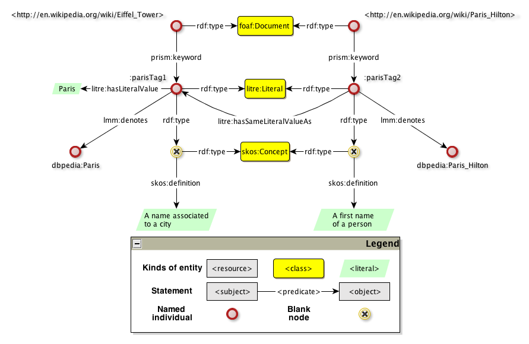

__Description:__ Used frequently in the Web 2.0, descriptive tags such as the ones used in folksonomies are keywords (e.g., strings) assigned to a particular resource, such as a web document, with the intent to describe it. Just like words in any natural language, tags may have different meanings depending on the context in which they are used. For instance, the word “Paris” may be either a name of a city or a first name of a person. Here, it is clear that the act of tagging with “Paris” both the Wikipedia pages about the Eiffel Tower and the one about Paris Hilton hides two different intents: in the former case, “Paris” denotes the city in which the tower stands; in the latter case, “Paris” denotes a particular person, i.e., Paris Hilton. Using the literal reification pattern it is possible to express descriptive tags as first class objects in OWL, by considering them as proper individuals of the class litre:Literal. Different individuals may thus represent different meanings even if their literal values are identical.
__Diagram__

__OWL file:__ [http://www.essepuntato.it/2010/06/sc1.ttl](http://www.essepuntato.it/2010/06/sc1.ttl "http://www.essepuntato.it/2010/06/sc1.ttl")

Retrieved from "[http://ontologydesignpatterns.org/wiki/Submissions:Literal\_Reification/Scenario\_1](../../Submissions/AgentRole/Scenario_1.md)"
 [Category](http://ontologydesignpatterns.org/wiki/Special:Categories "Special:Categories"): [Scenario](../../Category/Scenario.md "Category:Scenario")