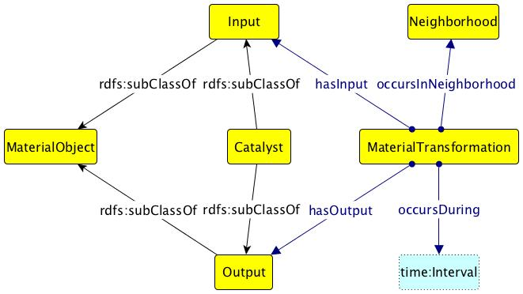

 __This pattern has been certified.__
Related submission, with evaluation history, can be found __here__

#  Graphical representation

__Diagram__

#  General description

  

#  Elements

_The __Material Transformation__ Content OP locally defines the following ontology elements:_

 __hasCatalyst__ (owl:ObjectProperty) 
  _[hasCatalyst](../Submissions/Material_Transformation/hasCatalyst "Submissions:Material Transformation/hasCatalyst") page_
 __hasEmbodiedEnergy__ (owl:ObjectProperty) 
  _[hasEmbodiedEnergy](../Submissions/Material_Transformation/hasEmbodiedEnergy "Submissions:Material Transformation/hasEmbodiedEnergy") page_
 __hasEnergyUnit__ (owl:ObjectProperty) 
  _[hasEnergyUnit](../Submissions/Material_Transformation/hasEnergyUnit "Submissions:Material Transformation/hasEnergyUnit") page_
 __hasEnergyValue__ (owl:ObjectProperty) 
  _[hasEnergyValue](../Submissions/Material_Transformation/hasEnergyValue "Submissions:Material Transformation/hasEnergyValue") page_
 __hasInput__ (owl:ObjectProperty) 
  _[hasInput](../Submissions/Material_Transformation/hasInput "Submissions:Material Transformation/hasInput") page_
 __hasOutput__ (owl:ObjectProperty) 
  _[hasOutput](../Submissions/Material_Transformation/hasOutput "Submissions:Material Transformation/hasOutput") page_
 __needsEnergy__ (owl:ObjectProperty) 
  _[needsEnergy](../Submissions/Material_Transformation/needsEnergy "Submissions:Material Transformation/needsEnergy") page_
 __occursAtTimeInterval__ (owl:ObjectProperty) 
  _[occursAtTimeInterval](../Submissions/Material_Transformation/occursAtTimeInterval "Submissions:Material Transformation/occursAtTimeInterval") page_
 __occursInNeighborhood__ (owl:ObjectProperty) 
  _[occursInNeighborhood](../Submissions/Material_Transformation/occursInNeighborhood "Submissions:Material Transformation/occursInNeighborhood") page_
 __asLiteral__ (owl:DatatypeProperty) 
  _[asLiteral](../Submissions/Material_Transformation/asLiteral "Submissions:Material Transformation/asLiteral") page_
 __asNumeric__ (owl:DatatypeProperty) 
  _[asNumeric](../Submissions/Material_Transformation/asNumeric "Submissions:Material Transformation/asNumeric") page_
 __Catalyst__ (owl:Class) 
  _[Catalyst](../Submissions/Material_Transformation/Catalyst "Submissions:Material Transformation/Catalyst") page_
 __Energy__ (owl:Class) 
  _[Energy](../Submissions/Material_Transformation/Energy "Submissions:Material Transformation/Energy") page_
 __EnergyUnit__ (owl:Class) 
  _[EnergyUnit](../Submissions/Material_Transformation/EnergyUnit "Submissions:Material Transformation/EnergyUnit") page_
 __EnergyValue__ (owl:Class) 
  _[EnergyValue](../Submissions/Material_Transformation/EnergyValue "Submissions:Material Transformation/EnergyValue") page_
 __MaterialTransformation__ (owl:Class) 
  _[MaterialTransformation](../Submissions/Material_Transformation/MaterialTransformation "Submissions:Material Transformation/MaterialTransformation") page_
 __MaterialType__ (owl:Class) 
  _[MaterialType](../Submissions/Material_Transformation/MaterialType "Submissions:Material Transformation/MaterialType") page_
 __Neighborhood__ (owl:Class) 
  _[Neighborhood](../Submissions/Material_Transformation/Neighborhood "Submissions:Material Transformation/Neighborhood") page_
 __Product__ (owl:Class) 
  _[Product](../Submissions/Material_Transformation/Product "Submissions:Material Transformation/Product") page_
 __Resource__ (owl:Class) 
  _[Resource](../Submissions/Material_Transformation/Resource "Submissions:Material Transformation/Resource") page_
#  Additional information

There are two axioms that we need in this pattern but not expressible in OWL. 
The first says that there is at least one of the input that is not in the output of the transformation, which cannot be expressed in FOL as the formula:
ALL x.( MaterialTransformation(x) IMPLIES Exists y.(hasInput(x,y) AND NOT hasOutput(x,y) ) )
The second states that there is at least one of the output that is not part of the input of the transformation:
ALL x.( MaterialTransformation(x) IMPLIES Exists y.(hasOutput(x,y) AND NOT hasInput(x,y) ) )
Thus, this OWL encoding does not contain any axiom expressing the above two.

A full description of the pattern can be found in the SWJ publication "An Ontology Design Pattern and Its Use Case for Modeling Material Transformation".
[http://www.semantic-web-journal.net/content/ontology-design-pattern-and-its-use-case-modeling-material-transformation-1](http://www.semantic-web-journal.net/content/ontology-design-pattern-and-its-use-case-modeling-material-transformation-1 "http://www.semantic-web-journal.net/content/ontology-design-pattern-and-its-use-case-modeling-material-transformation-1")

#  Scenarios

__Scenarios about Material Transformation__
No scenario is added to this Content OP.

#  Reviews

__Reviews about Material Transformation__
There is no review about this proposal.
This revision (revision ID __13251__) takes in account the reviews: none

Other info at [evaluation tab](http://ontologydesignpatterns.org/wiki/index.php?title=Submissions:Material_Transformation&action=evaluation "http://ontologydesignpatterns.org/wiki/index.php?title=Submissions:Material_Transformation&action=evaluation")

  

#  Modeling issues

__Modeling issues about Material Transformation__
There is no Modeling issue related to this proposal.

  

#  References

[Add a reference](index.php@title=Odp%253AAdd_reference&subject=Submissions%253AMaterial+Transformation.html "http://ontologydesignpatterns.org/wiki/index.php?title=Odp:Add_reference&subject=Submissions%3AMaterial+Transformation")

* Semantic Web Journal Paper [Journal Paper](http://www.semantic-web-journal.net "http://www.semantic-web-journal.net") | [reference page](../Community/References/SWJ_Paper "Community:References/SWJ Paper")
* Material Transformation Peer Reviewed SWJ Paper "An Ontology Design Pattern and Its Use Case for Modeling Material Transformation" [Journal Paper](http://www.semantic-web-journal.net/content/ontology-design-pattern-and-its-use-case-modeling-material-transformation-1 "http://www.semantic-web-journal.net/content/ontology-design-pattern-and-its-use-case-modeling-material-transformation-1") | [reference page](../Community/References/SWJ_Paper_2 "Community:References/SWJ Paper 2")

  

Retrieved from "[http://ontologydesignpatterns.org/wiki/Submissions:Material\_Transformation](../Submissions/Material_Transformation)"
 [Categories](http://ontologydesignpatterns.org/wiki/Special:Categories "Special:Categories"): [ProposedContentOP](../Category/ProposedContentOP "Category:ProposedContentOP") | [Waiting for review](../Category/Waiting_for_review "Category:Waiting for review") | [Submitted to event](../Category/Submitted_to_event "Category:Submitted to event")