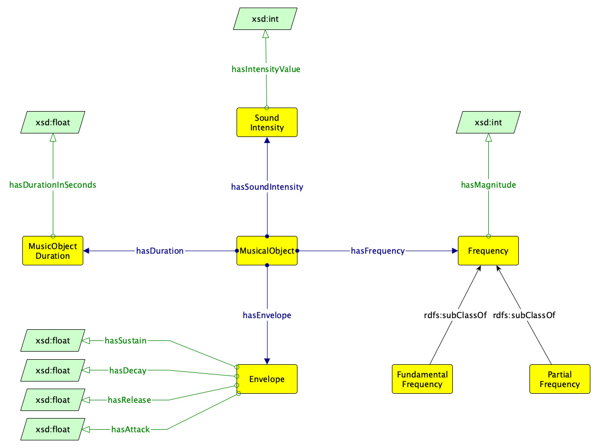

 __This pattern has been certified.__
Related submission, with evaluation history, can be found __here__

#  Graphical representation

__Diagram__

#  General description

  

#  Elements

_The __Musicalobject__ Content OP locally defines the following ontology elements:_

 __Envelope__ (owl:Class) The envelope of a musical object's soundwave. In physics and engineering, the envelope of an oscillating signal is a smooth curve outlining its extremes. 
  _[Envelope](../Submissions/Musicalobject/Envelope "Submissions:Musicalobject/Envelope") page_
 __Frequency__ (owl:Class) The frequency of a musical object. 
  _[Frequency](../Submissions/Musicalobject/Frequency "Submissions:Musicalobject/Frequency") page_
 __FundamentalFrequency__ (owl:Class) The foundamental frequency of a musical object. The fundamental frequency is defined as the frequency of the lowest constituing partial of a signal. 
  _[FundamentalFrequency](../Submissions/Musicalobject/FundamentalFrequency "Submissions:Musicalobject/FundamentalFrequency") page_
 __PartialFrequency__ (owl:Class) A frequency other than the foundamental Frequencyuency. 
  _[PartialFrequency](../Submissions/Musicalobject/PartialFrequency "Submissions:Musicalobject/PartialFrequency") page_
 __MusicalObject__ (owl:Class) A musical object is the result of the realisation of a set of instructions that the musician or a computer system uses to realise a piece of music (e.g. music notation). 
  _[MusicalObject](../Submissions/Musicalobject/MusicalObject "Submissions:Musicalobject/MusicalObject") page_
 __MusicalObjectDuration__ (owl:Class) The duration of a musical object. 
  _[MusicalObjectDuration](../Submissions/Musicalobject/MusicalObjectDuration "Submissions:Musicalobject/MusicalObjectDuration") page_
 __SoundIntensity__ (owl:Class) The intensity of the sound produced by a musical object. 
  _[SoundIntensity](../Submissions/Musicalobject/SoundIntensity "Submissions:Musicalobject/SoundIntensity") page_
 __hasDuration__ (owl:ObjectProperty) Connects a musical object to its duration. 
  _[hasDuration](../Submissions/Musicalobject/hasDuration "Submissions:Musicalobject/hasDuration") page_
 __hasEnvelope__ (owl:ObjectProperty) Connects a musical object to the envelope of the soundwave it produces. 
  _[hasEnvelope](../Submissions/Musicalobject/hasEnvelope "Submissions:Musicalobject/hasEnvelope") page_
 __hasFrequency__ (owl:ObjectProperty) Connects a musical object to the frequencies it produces. 
  _[hasFrequency](../Submissions/Musicalobject/hasFrequency "Submissions:Musicalobject/hasFrequency") page_
 __hasSoundIntensity__ (owl:ObjectProperty) Connects a musical object to the sound intensity produced. 
  _[hasSoundIntensity](../Submissions/Musicalobject/hasSoundIntensity "Submissions:Musicalobject/hasSoundIntensity") page_
 __isDurationOf__ (owl:ObjectProperty) Inverse of hasDuration. Connects the duration of a musical event to the musical event itself. 
  _[isDurationOf](../Submissions/Musicalobject/isDurationOf "Submissions:Musicalobject/isDurationOf") page_
 __isEnvelopeOf__ (owl:ObjectProperty) Inverse of hasEvelope. Connects the envelope of a musical event to the musical event itself. 
  _[isEnvelopeOf](../Submissions/Musicalobject/isEnvelopeOf "Submissions:Musicalobject/isEnvelopeOf") page_
 __isFrequencyOf__ (owl:ObjectProperty) Inverse of hasFrequency. Connects the frequency of a musical event to the musical event itself. 
  _[isFrequencyOf](../Submissions/Musicalobject/isFrequencyOf "Submissions:Musicalobject/isFrequencyOf") page_
 __isSoundIntensityOf__ (owl:ObjectProperty) Inverse of hasSoundIntensity. Connects the sound intensity of a musical event to the musical event itself. 
  _[isSoundIntensityOf](../Submissions/Musicalobject/isSoundIntensityOf "Submissions:Musicalobject/isSoundIntensityOf") page_
 __hasAttack__ (owl:DatatypeProperty) Describes the attack time (expressed in seconds) of the soundwave's envelope, according to the ADSR model. 
  _[hasAttack](../Submissions/Musicalobject/hasAttack "Submissions:Musicalobject/hasAttack") page_
 __hasDecay__ (owl:DatatypeProperty) Describes the decay time (epressed in seconds) of the soundwave's envelope, according to the ADSR model. 
  _[hasDecay](../Submissions/Musicalobject/hasDecay "Submissions:Musicalobject/hasDecay") page_
 __hasDurationInSeconds__ (owl:DatatypeProperty) Expresses the duration in seconds of a musical object. 
  _[hasDurationInSeconds](../Submissions/Musicalobject/hasDurationInSeconds "Submissions:Musicalobject/hasDurationInSeconds") page_
 __hasFrequencyMagnitude__ (owl:DatatypeProperty) The amplitude of a frequency component of a complex sound. 
  _[hasFrequencyMagnitude](../Submissions/Musicalobject/hasFrequencyMagnitude "Submissions:Musicalobject/hasFrequencyMagnitude") page_
 __hasIntensityValue__ (owl:DatatypeProperty) The value of the sound intensity of a musical object. 
  _[hasIntensityValue](../Submissions/Musicalobject/hasIntensityValue "Submissions:Musicalobject/hasIntensityValue") page_
 __hasRelease__ (owl:DatatypeProperty) Describes the release time (epressed in seconds) of the soundwave's envelope, according to the ADSR model. 
  _[hasRelease](../Submissions/Musicalobject/hasRelease "Submissions:Musicalobject/hasRelease") page_
 __hasSustain__ (owl:DatatypeProperty) Describes the sustain time (epressed in seconds) of the soundwave's envelope, according to the ADSR model. 
  _[hasSustain](../Submissions/Musicalobject/hasSustain "Submissions:Musicalobject/hasSustain") page_
#  Additional information

#  Scenarios

__Scenarios about Musicalobject__
No scenario is added to this Content OP.

#  Reviews

__Reviews about Musicalobject__
There is no review about this proposal.
This revision (revision ID __14258__) takes in account the reviews: none

Other info at [evaluation tab](http://ontologydesignpatterns.org/wiki/index.php?title=Submissions:Musicalobject&action=evaluation "http://ontologydesignpatterns.org/wiki/index.php?title=Submissions:Musicalobject&action=evaluation")

  

#  Modeling issues

__Modeling issues about Musicalobject__
There is no Modeling issue related to this proposal.

  

#  References

[Add a reference](index.php@title=Odp%253AAdd_reference&subject=../Submissions/Musicalobject "http://ontologydesignpatterns.org/wiki/index.php?title=Odp:Add_reference&subject=Submissions%3AMusicalobject")

  

Retrieved from "[http://ontologydesignpatterns.org/wiki/Submissions:Musicalobject](../Submissions/Musicalobject)"
 [Category](http://ontologydesignpatterns.org/wiki/Special:Categories "Special:Categories"): [ProposedContentOP](../Category/ProposedContentOP "Category:ProposedContentOP")