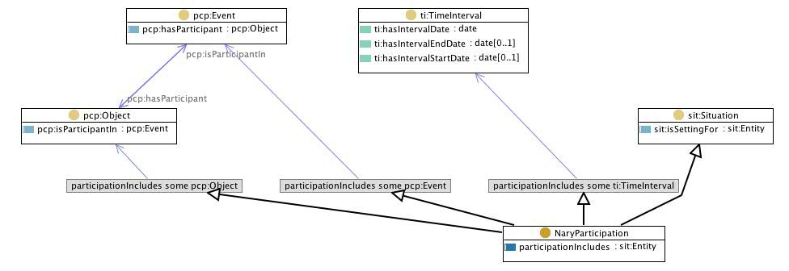

 __This pattern has been certified.__
Related submission, with evaluation history, can be found __here__

#  Graphical representation

__Diagram__

#  General description

  

#  Elements

_The __Nary Participation__ Content OP locally defines the following ontology elements:_

 __NaryParticipation__ (owl:Class) The reified class of n-ary participation relations, e.g. "prepare a coffee with coffee pot". 

  _[NaryParticipation](../Submissions/Nary_Participation/NaryParticipation.md "Submissions:Nary Participation/NaryParticipation") page_

 __participationIncludes__ (owl:ObjectProperty) The relation holding between an  [NaryParticipation](../Submissions/Nary_Participation/NaryParticipation.md "Submissions:Nary Participation/NaryParticipation") and any  [Entity](../Submissions/Situation/Entity.md "Submissions:Situation/Entity"). 

  _[participationIncludes](../Submissions/Nary_Participation/participationIncludes.md "Submissions:Nary Participation/participationIncludes") page_

 __isIncludedInParticipation__ (owl:ObjectProperty) The relation holding between any  [Entity](../Submissions/Situation/Entity.md "Submissions:Situation/Entity") and a  [NaryParticipation](../Submissions/Nary_Participation/NaryParticipation.md "Submissions:Nary Participation/NaryParticipation"). 

  _[isIncludedInParticipation](../Submissions/Nary_Participation/isIncludedInParticipation.md "Submissions:Nary Participation/isIncludedInParticipation") page_
#  Additional information

#  Scenarios

__Scenarios about Nary Participation__
No scenario is added to this Content OP.

#  Reviews

__Reviews about Nary Participation__
There is no review about this proposal.
This revision (revision ID __9105__) takes in account the reviews: none

Other info at [evaluation tab](http://ontologydesignpatterns.org/wiki/index.php?title=Submissions:Nary_Participation&action=evaluation "http://ontologydesignpatterns.org/wiki/index.php?title=Submissions:Nary_Participation&action=evaluation")

  

#  Modeling issues

__Modeling issues about Nary Participation__
There is no Modeling issue related to this proposal.

  

#  References

[Add a reference](index.php@title=Odp%253AAdd_reference&subject=Submissions%253ANary+Participation.html "http://ontologydesignpatterns.org/wiki/index.php?title=Odp:Add_reference&subject=Submissions%3ANary+Participation")

  

Retrieved from "[http://ontologydesignpatterns.org/wiki/Submissions:Nary\_Participation](../Submissions/Nary_Participation.md)"
 [Category](http://ontologydesignpatterns.org/wiki/Special:Categories "Special:Categories"): [ProposedContentOP](../Category/ProposedContentOP.md "Category:ProposedContentOP")