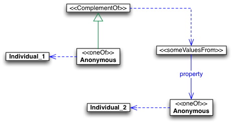

 __This pattern has been certified.__
Related submission, with evaluation history, can be found __here__

#  General information

  

#  Description

  

#  Example

  

#  Pattern reference

#  Scenarios

__Scenarios about NegativePropertyAssertions__
No scenario is added to this Content OP.

#  Reviews

__Reviews about NegativePropertyAssertions__
This revision (revision ID __5903__) takes in account the reviews: none

Other info at [evaluation tab](http://ontologydesignpatterns.org/wiki/index.php?title=Submissions:NegativePropertyAssertions&action=evaluation "http://ontologydesignpatterns.org/wiki/index.php?title=Submissions:NegativePropertyAssertions&action=evaluation")

  

Retrieved from "[http://ontologydesignpatterns.org/wiki/Submissions:NegativePropertyAssertions](../Submissions/NegativePropertyAssertions)"
 [Categories](http://ontologydesignpatterns.org/wiki/Special:Categories "Special:Categories"): [LogicalOP](../Category/LogicalOP "Category:LogicalOP") | [ProposedLogicalOP](../Category/ProposedLogicalOP "Category:ProposedLogicalOP") | [Review assigned](../Category/Review_assigned "Category:Review assigned") | [Submitted to event](../Category/Submitted_to_event "Category:Submitted to event")