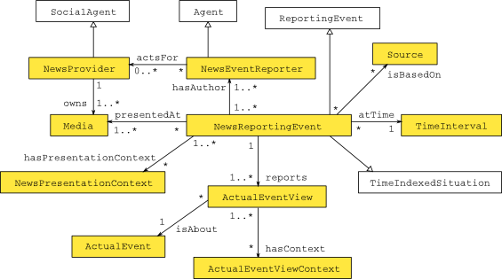

 __This pattern has been certified.__
Related submission, with evaluation history, can be found __here__

#  Graphical representation

__Diagram__

#  General description

  

#  Elements

_The __NewsReportingEvent__ Content OP locally defines the following ontology elements:_

 __hasPresentationContext__ (owl:ObjectProperty) This property can be used to link NewsReportingEvent to a NewsPresentationContext. 
  _[hasPresentationContext](../Submissions/NewsReportingEvent/hasPresentationContext "Submissions:NewsReportingEvent/hasPresentationContext") page_
 __owns__ (owl:ObjectProperty) This property can be used to link a certain NewsProvider with a Media that the NewsProvider ows, e.g. Fox News Channel is owned by Fox Entertainment Group, which also owns other Media (FXX Channel, etc.).
This is an universal property, it can be also used in different context (e.g. Ruslana owns a Persian cat). 

  _[owns](../Submissions/NewsReportingEvent/owns "Submissions:NewsReportingEvent/owns") page_
 __presentedAt__ (owl:ObjectProperty) This property can be used to link a NewsReportingEvent to a Media (TV station, radio station, newspaper, webpage) at which a certain ActualEventView was presented. 
This is an universal property and can be used in different contexts. 

  _[presentedAt](../Submissions/NewsReportingEvent/presentedAt "Submissions:NewsReportingEvent/presentedAt") page_
 __Media__ (owl:Class) An entity that allows a communication of news messages, for example a TV station, radio station, newspaper, website, etc. 
  _[Media](../Submissions/NewsReportingEvent/Media "Submissions:NewsReportingEvent/Media") page_
 __NewsEventReporter__ (owl:Class) An Actor (usually a Person) that is an author of a certain ActualEventView.
NewsEventReporter is not linked to an ActualEventView directly, it is connected to NewsReportingEvent, which is designed to document the act of reporting. 

  _[NewsEventReporter](../Submissions/NewsReportingEvent/NewsEventReporter "Submissions:NewsReportingEvent/NewsEventReporter") page_
 __NewsPresentationContext__ (owl:Class) Class for denoting circumstances of an actual event presentation. For example if an event was presented at the end of website, then end of website is its NewsPresentationContext.
NewsPresentationContext is not directly attached to an ActualEventView, it is attached to NewsReportingEvent, which designates the act of an event reporting. 

  _[NewsPresentationContext](../Submissions/NewsReportingEvent/NewsPresentationContext "Submissions:NewsReportingEvent/NewsPresentationContext") page_
 __NewsProvider__ (owl:Class) An entity, usually a company, that ows a certain Media. For example Fox Entertainment Group owns the Fox News Channel. Fox Entertainment Group is a NewsProvider. 
  _[NewsProvider](../Submissions/NewsReportingEvent/NewsProvider "Submissions:NewsReportingEvent/NewsProvider") page_
 __NewsReportingEvent__ (owl:Class) This is a subclass of ReportingEvent, designed to represent an act of reporting a certain actual event during a news programme or via other news media. 
  _[NewsReportingEvent](../Submissions/NewsReportingEvent/NewsReportingEvent "Submissions:NewsReportingEvent/NewsReportingEvent") page_
 __PresentationContext__ (owl:Class) Class for denoting circumstances of an entity presentation. If a waiter presented a dish with an apologetic smile, then the apologetic smile is a PresentationContext. 
  _[PresentationContext](../Submissions/NewsReportingEvent/PresentationContext "Submissions:NewsReportingEvent/PresentationContext") page_
#  Additional information

Pattern description is available at: [http://ontologydesignpatterns.org/wiki/Submissions:NewsReportingEvent](../Submissions/NewsReportingEvent "http://ontologydesignpatterns.org/wiki/Submissions:NewsReportingEvent")
Pattern description is included in: E. Kowalczuk, A. Ławrynowicz,

#  Scenarios

__Scenarios about NewsReportingEvent__
No scenario is added to this Content OP.

#  Reviews

__Reviews about NewsReportingEvent__
There is no review about this proposal.
This revision (revision ID __12892__) takes in account the reviews: none

Other info at [evaluation tab](http://ontologydesignpatterns.org/wiki/index.php?title=Submissions:NewsReportingEvent&action=evaluation "http://ontologydesignpatterns.org/wiki/index.php?title=Submissions:NewsReportingEvent&action=evaluation")

  

#  Modeling issues

__Modeling issues about NewsReportingEvent__
There is no Modeling issue related to this proposal.

  

#  References

[Add a reference](index.php@title=Odp%253AAdd_reference&subject=../Submissions/NewsReportingEvent "http://ontologydesignpatterns.org/wiki/index.php?title=Odp:Add_reference&subject=Submissions%3ANewsReportingEvent")

  

Retrieved from "[http://ontologydesignpatterns.org/wiki/Submissions:NewsReportingEvent](../Submissions/NewsReportingEvent)"
 [Categories](http://ontologydesignpatterns.org/wiki/Special:Categories "Special:Categories"): [ProposedContentOP](../Category/ProposedContentOP "Category:ProposedContentOP") | [Submitted to event](../Category/Submitted_to_event "Category:Submitted to event")