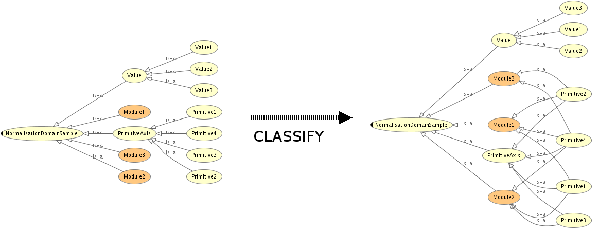

 __This pattern has been certified.__
Related submission, with evaluation history, can be found __here__

#  Graphical representation

__Diagram__

#  General information

  

#  Description

  

#  Example

  

#  Pattern reference

#  Additional information

#  Scenarios

__Scenarios about Normalization__
No scenario is added to this Content OP.

#  Reviews

__Reviews about Normalization__
This revision (revision ID __10071__) takes in account the reviews: none

Other info at [evaluation tab](http://ontologydesignpatterns.org/wiki/index.php?title=Submissions:Normalization&action=evaluation "http://ontologydesignpatterns.org/wiki/index.php?title=Submissions:Normalization&action=evaluation")

  

#  Modeling issues

__Modeling issues about Normalization__

  

#  References

[Add a reference](index.php@title=Odp%253AAdd_reference&subject=../Submissions/Normalization "http://ontologydesignpatterns.org/wiki/index.php?title=Odp:Add_reference&subject=Submissions%3ANormalization")

* Alan L. Rector. Modularisation of domain ontologies implemented in description logics and related formalisms including owl. In K-CAP '03: Proceedings of the 2nd international conference on Knowledge capture, pages 121{128, New York, NY, USA, 2003. ACM. [ISBN 1-58113-583-1](http://ontologydesignpatterns.org/wiki/Special:BookSources/1581135831). Documentation | [reference page](../Community/References/Modularisation_of_domain_ontologies_implemented_in_description_logics_and_related_formalisms_including_owl_3 "Community:References/Modularisation of domain ontologies implemented in description logics and related formalisms including owl 3")
* Normalization Ontology Design Pattern [Documentation](http://www.gong.manchester.ac.uk/odp/html/Normalisation.html "http://www.gong.manchester.ac.uk/odp/html/Normalisation.html") | [reference page](../Community/References/Normalization_ODP_2 "Community:References/Normalization ODP 2")
* Egana-Aranguren, Mikel. Role and Application of Ontology Design Patterns in Bio-ontologies. PhD thesis, School of Computer Science, University of Manchester, 2009. [Documentation](http://mikeleganaaranguren.files.wordpress.com/2010/01/thesis.pdf "http://mikeleganaaranguren.files.wordpress.com/2010/01/thesis.pdf") | [reference page](../Community/References/Role_and_Application_of_Ontology_Design_Patterns_in_Bio-ontologies "Community:References/Role and Application of Ontology Design Patterns in Bio-ontologies")

  

Retrieved from "[http://ontologydesignpatterns.org/wiki/Submissions:Normalization](../Submissions/Normalization)"
 [Categories](http://ontologydesignpatterns.org/wiki/Special:Categories "Special:Categories"): [LogicalOP](../Category/LogicalOP "Category:LogicalOP") | [ProposedLogicalOP](../Category/ProposedLogicalOP "Category:ProposedLogicalOP") | [Review assigned](../Category/Review_assigned "Category:Review assigned") | [Waiting for review](../Category/Waiting_for_review "Category:Waiting for review") | [Submitted to event](../Category/Submitted_to_event "Category:Submitted to event")