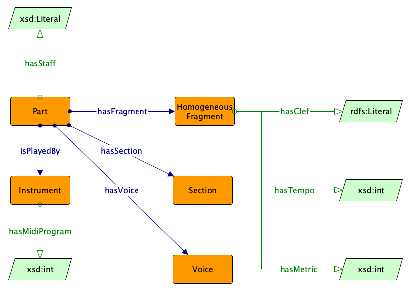

 __This pattern has been certified.__
Related submission, with evaluation history, can be found __here__

#  Graphical representation

__Diagram__

#  General description

  

#  Elements

_The __Notepattern__ Content OP locally defines the following ontology elements:_

 __SymbolicNote__ (owl:Class) A music note from the western temperament system. 
  _[SymbolicNote](../Submissions/Notepattern/SymbolicNote "Submissions:Notepattern/SymbolicNote") page_
 __Accidental__ (owl:Class) The accidental of a note (e.g. sharp). 
  _[Accidental](../Submissions/Notepattern/Accidental "Submissions:Notepattern/Accidental") page_
 __Position__ (owl:Class) The position of a symbolic note 
  _[Position](../Submissions/Notepattern/Position "Submissions:Notepattern/Position") page_
 __NotePitch__ (owl:Class) The pitch of a symbolic note. 
  _[NotePitch](../Submissions/Notepattern/NotePitch "Submissions:Notepattern/NotePitch") page_
 __NoteDuration__ (owl:Class) The quantised duration of a symbolic music note. 
  _[NoteDuration](../Submissions/Notepattern/NoteDuration "Submissions:Notepattern/NoteDuration") page_
 __NoteDynamic__ (owl:Class) The dynamic of a symbolic note. 
  _[NoteDynamic](../Submissions/Notepattern/NoteDynamic "Submissions:Notepattern/NoteDynamic") page_
 __hasMeasure__ (owl:DatatypeProperty) The measure (expressed in bars) to which a note belongs in a music score. 
  _[hasMeasure](../Submissions/Notepattern/hasMeasure "Submissions:Notepattern/hasMeasure") page_
 __hasMeasurePosition__ (owl:DatatypeProperty) The position the symbolic note have within the bar 
  _[hasMeasurePosition](../Submissions/Notepattern/hasMeasurePosition "Submissions:Notepattern/hasMeasurePosition") page_
 __hasMidiPitch__ (owl:DatatypeProperty) The pitch of a note expressed by means of its MIDI number. 
  _[hasMidiPitch](../Submissions/Notepattern/hasMidiPitch "Submissions:Notepattern/hasMidiPitch") page_
 __isDefinedByOctave__ (owl:DatatypeProperty) The octave on which the note is defined. 
  _[isDefinedByOctave](../Submissions/Notepattern/isDefinedByOctave "Submissions:Notepattern/isDefinedByOctave") page_
 __hasLiteralDynamic__ (owl:DatatypeProperty) The dynamic expressed in a music score by means of adjectives (e.g. piano). 
  _[hasLiteralDynamic](../Submissions/Notepattern/hasLiteralDynamic "Submissions:Notepattern/hasLiteralDynamic") page_
 __hasMidiVelocity__ (owl:DatatypeProperty) The dynamics of the note expressed symbolically by means of the MIDI command "velocity". 
  _[hasMidiVelocity](../Submissions/Notepattern/hasMidiVelocity "Submissions:Notepattern/hasMidiVelocity") page_
 __hasNoteDynamic__ (owl:ObjectProperty) Connects a symbolic note to its symbolic dynamic. 
  _[hasNoteDynamic](../Submissions/Notepattern/hasNoteDynamic "Submissions:Notepattern/hasNoteDynamic") page_
 __isDynamicOf__ (owl:ObjectProperty) Inverse of hasNoteDynamic. Connects a duration class to the symbolic note that have this specific dynamic. 
  _[isDynamicOf](../Submissions/Notepattern/isDynamicOf "Submissions:Notepattern/isDynamicOf") page_
 __hasNoteDuration__ (owl:ObjectProperty) Connects a symbolic note to its symbolic quantised duration. 
  _[hasNoteDuration](../Submissions/Notepattern/hasNoteDuration "Submissions:Notepattern/hasNoteDuration") page_
 __isDurationOfNote__ (owl:ObjectProperty) Inverse of hasNoteDuration. Connects a duration class to the symbolic note that have this specific duration. 
  _[isDurationOfNote](../Submissions/Notepattern/isDurationOfNote "Submissions:Notepattern/isDurationOfNote") page_
 __hasNotePitch__ (owl:ObjectProperty) Connects a symbolic note to its symbolic pitch. 
  _[hasNotePitch](../Submissions/Notepattern/hasNotePitch "Submissions:Notepattern/hasNotePitch") page_
 __isPitchOf__ (owl:ObjectProperty) Inverse of hasPitch. Connects a duration class to the symbolic note that have this specific pitch. 
  _[isPitchOf](../Submissions/Notepattern/isPitchOf "Submissions:Notepattern/isPitchOf") page_
 __hasAccidental__ (owl:ObjectProperty) The accidental of a note (e.g. sharp). 
  _[hasAccidental](../Submissions/Notepattern/hasAccidental "Submissions:Notepattern/hasAccidental") page_
 __isAccidentalOf__ (owl:ObjectProperty) Inverse of hasAccidental 
  _[isAccidentalOf](../Submissions/Notepattern/isAccidentalOf "Submissions:Notepattern/isAccidentalOf") page_
 __hasPosition__ (owl:ObjectProperty) Connects the symbolic note with its duration 
  _[hasPosition](../Submissions/Notepattern/hasPosition "Submissions:Notepattern/hasPosition") page_
 __isPositionOf__ (owl:ObjectProperty) Inverse of hasPosition 
  _[isPositionOf](../Submissions/Notepattern/isPositionOf "Submissions:Notepattern/isPositionOf") page_
  

#  Additional information

#  Scenarios

__Scenarios about Notepattern__
No scenario is added to this Content OP.

#  Reviews

__Reviews about Notepattern__
There is no review about this proposal.
This revision (revision ID __14262__) takes in account the reviews: none

Other info at [evaluation tab](http://ontologydesignpatterns.org/wiki/index.php?title=Submissions:Notepattern&action=evaluation "http://ontologydesignpatterns.org/wiki/index.php?title=Submissions:Notepattern&action=evaluation")

#  Modeling issues

__Modeling issues about Notepattern__
There is no Modeling issue related to this proposal.

#  References

[Add a reference](index.php@title=Odp%253AAdd_reference&subject=../Submissions/Notepattern "http://ontologydesignpatterns.org/wiki/index.php?title=Odp:Add_reference&subject=Submissions%3ANotepattern")

  

The Note Pattern models a music note both in relation to a music score and in relation to the musical object produced by playing such note.

Retrieved from "[http://ontologydesignpatterns.org/wiki/Submissions:Notepattern](../Submissions/Notepattern)"
 [Category](http://ontologydesignpatterns.org/wiki/Special:Categories "Special:Categories"): [ProposedContentOP](../Category/ProposedContentOP "Category:ProposedContentOP")