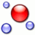

___isDefinedByOctave__ has [Category:OntologyElement](../../Category/OntologyElement.md "Category:OntologyElement") and is an [element of](../../Property/ElementOf.md "Property:ElementOf") [Notepattern](../../Submissions/Notepattern.md "Submissions:Notepattern")_

  

__Name__: isDefinedByOctave 

__Type:__ owl:DatatypeProperty 

__Description__: The octave on which the note is defined. 

Retrieved from "[http://ontologydesignpatterns.org/wiki/Submissions:Notepattern/isDefinedByOctave](../../Submissions/Notepattern/isDefinedByOctave.md)"
 [Category](http://ontologydesignpatterns.org/wiki/Special:Categories "Special:Categories"): [OntologyElement](../../Category/OntologyElement.md "Category:OntologyElement")