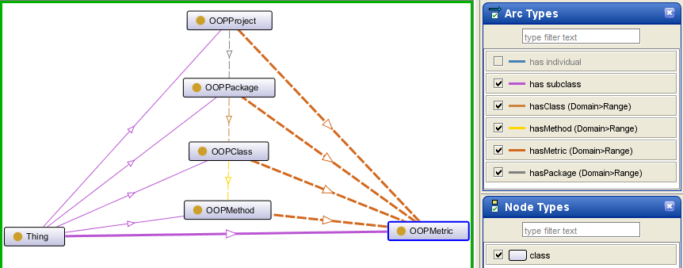

 __This pattern has been certified.__
Related submission, with evaluation history, can be found __here__

#  Graphical representation

__Diagram__

#  General description

  

#  Elements

_The __OOPMetrics__ Content OP locally defines the following ontology elements:_

 __hasClass__ (owl:ObjectProperty) Refers to an OOPClass from an OOPPackage.
  

Se refera la o OOPClass dintr-un OOPPackage. 

  _[hasClass](../Submissions/OOPMetrics/hasClass "Submissions:OOPMetrics/hasClass") page_
 __hasMethod__ (owl:ObjectProperty) Refers to an OOPMethod from an OOPClass.
  

Se refera la o OOPMethod dintr-o OOPClass. 

  _[hasMethod](../Submissions/OOPMetrics/hasMethod "Submissions:OOPMetrics/hasMethod") page_
 __hasMetric__ (owl:ObjectProperty) Refers to a software metric that an OOPProject/OOPPackage/OOPClass/OOPMethod has.
  

Se refera la o metrica soft pe care o are un/o OOPProject/OOPPackage/OOPClass/ OOPMethod. 

  _[hasMetric](../Submissions/OOPMetrics/hasMetric "Submissions:OOPMetrics/hasMetric") page_
 __hasPackage__ (owl:ObjectProperty) Refers to an OOPPackage from an OOPProject.
  

Se refera la un OOPPackage dintr-un OOPProject. 

  _[hasPackage](../Submissions/OOPMetrics/hasPackage "Submissions:OOPMetrics/hasPackage") page_
 __hasFloatValue__ (owl:DatatypeProperty) The real value of the software metric.
  

Valoarea reala pentru metrica soft. 

  _[hasFloatValue](../Submissions/OOPMetrics/hasFloatValue "Submissions:OOPMetrics/hasFloatValue") page_
 __hasIntegerValue__ (owl:DatatypeProperty) The integer value of the software metric.
  

Valoarea intreaga pentru metrica soft. 

  _[hasIntegerValue](../Submissions/OOPMetrics/hasIntegerValue "Submissions:OOPMetrics/hasIntegerValue") page_
 __hasName__ (owl:DatatypeProperty) This represents the name (more precisely the acronym) of the category of software metric. Such as: "WMC" for "Weighted Methods Count", TCC for "Tight Class Cohesion", etc.
  

Aceasta reprezinta numele (mai precis acronimul) pentru categoria de metrica soft. Cum ar fi: "WMC" pentru "Weighted Methods Count", TCC pentru "Tight Class Cohesion", etc. 

  _[hasName](../Submissions/OOPMetrics/hasName "Submissions:OOPMetrics/hasName") page_
 __OOPClass__ (owl:Class) This represents the "class" concept from object-oriented programming.
  

Aceasta reprezinta conceptul "clasa" din programarea orientata obiect. 

  _[OOPClass](../Submissions/OOPMetrics/OOPClass "Submissions:OOPMetrics/OOPClass") page_
 __OOPMethod__ (owl:Class) This represents the "method" concept from object-oriented programming.
  

Aceasta reprezinta conceptul "metoda" din programarea orientata obiect. 

  _[OOPMethod](../Submissions/OOPMetrics/OOPMethod "Submissions:OOPMetrics/OOPMethod") page_
 __OOPMetric__ (owl:Class) This represents a software metric specific to object-oriented programming.
  

Aceasta reprezinta o metrica soft specifica programarii orientate obiect. 

  _[OOPMetric](../Submissions/OOPMetrics/OOPMetric "Submissions:OOPMetrics/OOPMetric") page_
 __OOPPackage__ (owl:Class) This represents the "package" concept from object-oriented programming.
  

Aceasta reprezinta conceptul "pachet" din programarea orientata obiect. 

  _[OOPPackage](../Submissions/OOPMetrics/OOPPackage "Submissions:OOPMetrics/OOPPackage") page_
 __OOPProject__ (owl:Class) This represents a software project.
  

Aceasta reprezinta un proiect soft. 

  _[OOPProject](../Submissions/OOPMetrics/OOPProject "Submissions:OOPMetrics/OOPProject") page_
#  Additional information

Note from the author to the evaluators:
the title of the related article is: "An Ontology Pattern for Software Metrics", submission 21.

#  Scenarios

__Scenarios about OOPMetrics__
No scenario is added to this Content OP.

#  Reviews

__Reviews about OOPMetrics__
This revision (revision ID __11169__) takes in account the reviews: [MariaPoveda about OOPMetrics](../Reviews/MariaPoveda_about_OOPMetrics "Reviews:MariaPoveda about OOPMetrics"), [RinkeHoekstra about OOPMetrics](../Reviews/RinkeHoekstra_about_OOPMetrics "Reviews:RinkeHoekstra about OOPMetrics")

Other info at [evaluation tab](http://ontologydesignpatterns.org/wiki/index.php?title=Submissions:OOPMetrics&action=evaluation "http://ontologydesignpatterns.org/wiki/index.php?title=Submissions:OOPMetrics&action=evaluation")

  

#  Modeling issues

__Modeling issues about OOPMetrics__
There is no Modeling issue related to this proposal.

  

#  References

[Add a reference](index.php@title=Odp%253AAdd_reference&subject=../Submissions/OOPMetrics "http://ontologydesignpatterns.org/wiki/index.php?title=Odp:Add_reference&subject=Submissions%3AOOPMetrics")

  

Retrieved from "[http://ontologydesignpatterns.org/wiki/Submissions:OOPMetrics](../Submissions/OOPMetrics)"
 [Categories](http://ontologydesignpatterns.org/wiki/Special:Categories "Special:Categories"): [ProposedContentOP](../Category/ProposedContentOP "Category:ProposedContentOP") | [Submitted to event](../Category/Submitted_to_event "Category:Submitted to event") | [Review assigned](../Category/Review_assigned "Category:Review assigned")