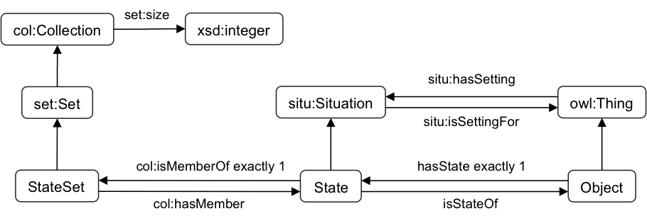

 __This pattern has been certified.__
Related submission, with evaluation history, can be found __here__

#  Graphical representation

__Diagram__

#  General description

  

#  Elements

_The __Object with states__ Content OP locally defines the following ontology elements:_

 __hasState__ (owl:ObjectProperty) Defines the state of an object. 
  _[hasState](../Submissions/Object_with_states/hasState "Submissions:Object with states/hasState") page_
 __isStateOf__ (owl:ObjectProperty) Defines the object that has an state 
  _[isStateOf](../Submissions/Object_with_states/isStateOf "Submissions:Object with states/isStateOf") page_
 __Object__ (owl:Class) Objects are entities that have different states and that in each state different restrictions on their properties apply. 
  _[Object](../Submissions/Object_with_states/Object "Submissions:Object with states/Object") page_
 __State__ (owl:Class) States are the different states that an object can have. States must belong to a single collection of non-duplicate elements (i.e., to a set). 
  _[State](../Submissions/Object_with_states/State "Submissions:Object with states/State") page_
 __StateSet__ (owl:Class) State sets are sets of states (i.e., collections of non-duplicate states). 
  _[StateSet](../Submissions/Object_with_states/StateSet "Submissions:Object with states/StateSet") page_
  

  

#  Additional information

#  Scenarios

__Scenarios about Object with states__
No scenario is added to this Content OP.

#  Reviews

__Reviews about Object with states__
This revision (revision ID __11707__) takes in account the reviews: [AlessandroAdamou about Object with states](../Reviews/AlessandroAdamou_about_Object_with_states "Reviews:AlessandroAdamou about Object with states"), [RinkeHoekstra about Object with states](../Reviews/RinkeHoekstra_about_Object_with_states "Reviews:RinkeHoekstra about Object with states"), [BenedictoRodriguezCastro about Object with states](../Reviews/BenedictoRodriguezCastro_about_Object_with_states "Reviews:BenedictoRodriguezCastro about Object with states"), [BenedictoRodriguezCastro about Object with states 2](../Reviews/BenedictoRodriguezCastro_about_Object_with_states_2 "Reviews:BenedictoRodriguezCastro about Object with states 2")

Other info at [evaluation tab](http://ontologydesignpatterns.org/wiki/index.php?title=Submissions:Object_with_states&action=evaluation "http://ontologydesignpatterns.org/wiki/index.php?title=Submissions:Object_with_states&action=evaluation")

  

#  Modeling issues

__Modeling issues about Object with states__
There is no Modeling issue related to this proposal.

  

#  References

[Add a reference](index.php@title=Odp%253AAdd_reference&subject=Submissions%253AObject+with+states.html "http://ontologydesignpatterns.org/wiki/index.php?title=Odp:Add_reference&subject=Submissions%3AObject+with+states")

  

Retrieved from "[http://ontologydesignpatterns.org/wiki/Submissions:Object\_with\_states](../Submissions/Object_with_states)"
 [Categories](http://ontologydesignpatterns.org/wiki/Special:Categories "Special:Categories"): [ProposedContentOP](../Category/ProposedContentOP "Category:ProposedContentOP") | [Review assigned](../Category/Review_assigned "Category:Review assigned") | [Submitted to event](../Category/Submitted_to_event "Category:Submitted to event")