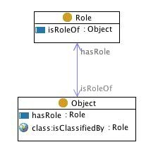

 __This pattern has been certified.__
Related submission, with evaluation history, can be found __here__

#  Graphical representation

__Diagram__

#  General description

  

#  Elements

_The __Objectrole__ Content OP locally defines the following ontology elements:_

 __Role__ (owl:Class) A  [Concept](../Submissions/Classification/Concept.md "Submissions:Classification/Concept") that classifies an  [Object](../Submissions/Objectrole/Object.md "Submissions:Objectrole/Object"). 

  _[Role](../Submissions/Objectrole/Role.md "Submissions:Objectrole/Role") page_

 __Object__ (owl:Class) Any physical, social, or mental object, or a substance. 

  _[Object](../Submissions/Objectrole/Object.md "Submissions:Objectrole/Object") page_

 __isRoleOf__ (owl:ObjectProperty) A relation between an  [Object](../Submissions/Objectrole/Object.md "Submissions:Objectrole/Object") and a  [Role](../Submissions/Objectrole/Role.md "Submissions:Objectrole/Role"), e.g. the 'student' is the role of 'John'.  [hasRole](../Submissions/Objectrole/hasRole.md "Submissions:Objectrole/hasRole") is its inverse. 

  _[isRoleOf](../Submissions/Objectrole/isRoleOf.md "Submissions:Objectrole/isRoleOf") page_

 __hasRole__ (owl:ObjectProperty) A relation between an  [Object](../Submissions/Objectrole/Object.md "Submissions:Objectrole/Object") and a  [Role](../Submissions/Objectrole/Role.md "Submissions:Objectrole/Role"), e.g. the person 'John' has role 'student'.  [isRoleOf](../Submissions/Objectrole/isRoleOf.md "Submissions:Objectrole/isRoleOf") is its inverse. 

  _[hasRole](../Submissions/Objectrole/hasRole.md "Submissions:Objectrole/hasRole") page_
#  Additional information

The elements of this Content OP are added with the elements of its components and/or the elements of the Content OPs it is a specialization of.

#  Scenarios

__Scenarios about Objectrole__
No scenario is added to this Content OP.

#  Reviews

__Reviews about Objectrole__
There is no review about this proposal.
This revision (revision ID __9106__) takes in account the reviews: none

Other info at [evaluation tab](http://ontologydesignpatterns.org/wiki/index.php?title=Submissions:Objectrole&action=evaluation "http://ontologydesignpatterns.org/wiki/index.php?title=Submissions:Objectrole&action=evaluation")

  

#  Modeling issues

__Modeling issues about Objectrole__

  

#  References

[Add a reference](index.php@title=Odp%253AAdd_reference&subject=../Submissions/Objectrole.md "http://ontologydesignpatterns.org/wiki/index.php?title=Odp:Add_reference&subject=Submissions%3AObjectrole")

  

Retrieved from "[http://ontologydesignpatterns.org/wiki/Submissions:Objectrole](../Submissions/Objectrole.md)"
 [Category](http://ontologydesignpatterns.org/wiki/Special:Categories "Special:Categories"): [ProposedContentOP](../Category/ProposedContentOP.md "Category:ProposedContentOP")