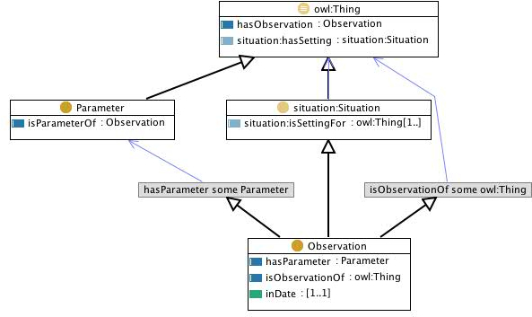

 __This pattern has been certified.__
Related submission, with evaluation history, can be found __here__

#  Graphical representation

__Diagram__

#  General description

  

#  Elements

_The __Observation__ Content OP locally defines the following ontology elements:_

 __hasObservation__ (owl:ObjectProperty) 
  _[hasObservation](../Submissions/Observation/hasObservation.md "Submissions:Observation/hasObservation") page_
 __hasParameter__ (owl:ObjectProperty) 
  _[hasParameter](../Submissions/Observation/hasParameter.md "Submissions:Observation/hasParameter") page_
 __isObservationOf__ (owl:ObjectProperty) 
  _[isObservationOf](../Submissions/Observation/isObservationOf.md "Submissions:Observation/isObservationOf") page_
 __isParameterOf__ (owl:ObjectProperty) 
  _[isParameterOf](../Submissions/Observation/isParameterOf.md "Submissions:Observation/isParameterOf") page_
 __inDate__ (owl:DatatypeProperty) 
  _[inDate](../Submissions/Observation/inDate.md "Submissions:Observation/inDate") page_
 __Observation__ (owl:Class) A specific situation where some thing is observed with respect ot a set of parameters. 
  _[Observation](../Submissions/Observation/Observation.md "Submissions:Observation/Observation") page_
 __Parameter__ (owl:Class) The parameters of an observation describe the context and content of the observation. For example in a medical context an observation of a patient may contain a set of symptoms, that are the parameters of that observation. 
  _[Parameter](../Submissions/Observation/Parameter.md "Submissions:Observation/Parameter") page_
#  Additional information

(type): [http://www.w3.org/2002/07/owl#Ontology](http://www.w3.org/2002/07/owl#Ontology "http://www.w3.org/2002/07/owl#Ontology")

(versionInfo): 1.0

(versionInfo): Created by Eva Blomqvist

(imports): [http://www.ontologydesignpatterns.org/cp/owl/situation.owl](http://www.ontologydesignpatterns.org/cp/owl/situation.owl "http://www.ontologydesignpatterns.org/cp/owl/situation.owl")

#  Scenarios

__Scenarios about Observation__
No scenario is added to this Content OP.

#  Reviews

__Reviews about Observation__
There is no review about this proposal.
This revision (revision ID __9107__) takes in account the reviews: none

Other info at [evaluation tab](http://ontologydesignpatterns.org/wiki/index.php?title=Submissions:Observation&action=evaluation "http://ontologydesignpatterns.org/wiki/index.php?title=Submissions:Observation&action=evaluation")

  

#  Modeling issues

__Modeling issues about Observation__
There is no Modeling issue related to this proposal.

  

#  References

[Add a reference](index.php@title=Odp%253AAdd_reference&subject=../Submissions/Observation.md "http://ontologydesignpatterns.org/wiki/index.php?title=Odp:Add_reference&subject=Submissions%3AObservation")

  

Retrieved from "[http://ontologydesignpatterns.org/wiki/Submissions:Observation](../Submissions/Observation.md)"
 [Category](http://ontologydesignpatterns.org/wiki/Special:Categories "Special:Categories"): [ProposedContentOP](../Category/ProposedContentOP.md "Category:ProposedContentOP")