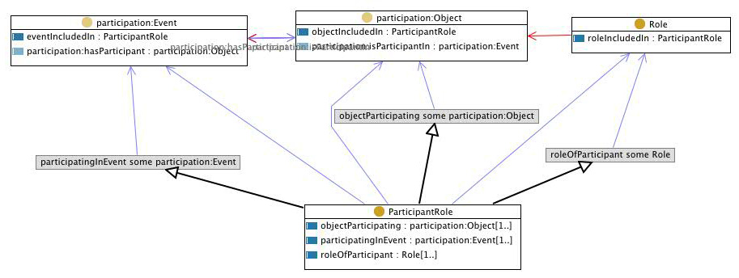

 __This pattern has been certified.__
Related submission, with evaluation history, can be found __here__

#  Graphical representation

__Diagram__

#  General description

  

#  Elements

_The __ParticipantRole__ Content OP locally defines the following ontology elements:_

 __Role__ (owl:Class) A concept that classifies an object. 
  _[Role](../Submissions/ParticipantRole/Role "Submissions:ParticipantRole/Role") page_
 __ParticipantRole__ (owl:Class) A situation that represents the role(s) of a specific object (or objects) participating in and event (or events). 
  _[ParticipantRole](../Submissions/ParticipantRole/ParticipantRole "Submissions:ParticipantRole/ParticipantRole") page_
 __participatingInEvent__ (owl:ObjectProperty) 
  _[participatingInEvent](../Submissions/ParticipantRole/participatingInEvent "Submissions:ParticipantRole/participatingInEvent") page_
 __objectParticipating__ (owl:ObjectProperty) 
  _[objectParticipating](../Submissions/ParticipantRole/objectParticipating "Submissions:ParticipantRole/objectParticipating") page_
 __roleOfParticipant__ (owl:ObjectProperty) 
  _[roleOfParticipant](../Submissions/ParticipantRole/roleOfParticipant "Submissions:ParticipantRole/roleOfParticipant") page_
 __objectIncludedIn__ (owl:ObjectProperty) 
  _[objectIncludedIn](../Submissions/ParticipantRole/objectIncludedIn "Submissions:ParticipantRole/objectIncludedIn") page_
 __roleIncludedIn__ (owl:ObjectProperty) 
  _[roleIncludedIn](../Submissions/ParticipantRole/roleIncludedIn "Submissions:ParticipantRole/roleIncludedIn") page_
 __eventIncludedIn__ (owl:ObjectProperty) 
  _[eventIncludedIn](../Submissions/ParticipantRole/eventIncludedIn "Submissions:ParticipantRole/eventIncludedIn") page_
#  Additional information

#  Scenarios

__Scenarios about ParticipantRole__
No scenario is added to this Content OP.

#  Reviews

__Reviews about ParticipantRole__
There is no review about this proposal.
This revision (revision ID __9383__) takes in account the reviews: none

Other info at [evaluation tab](http://ontologydesignpatterns.org/wiki/index.php?title=Submissions:ParticipantRole&action=evaluation "http://ontologydesignpatterns.org/wiki/index.php?title=Submissions:ParticipantRole&action=evaluation")

  

#  Modeling issues

__Modeling issues about ParticipantRole__
There is no Modeling issue related to this proposal.

  

#  References

[Add a reference](index.php@title=Odp%253AAdd_reference&subject=../Submissions/ParticipantRole "http://ontologydesignpatterns.org/wiki/index.php?title=Odp:Add_reference&subject=Submissions%3AParticipantRole")

  

Retrieved from "[http://ontologydesignpatterns.org/wiki/Submissions:ParticipantRole](../Submissions/ParticipantRole)"
 [Category](http://ontologydesignpatterns.org/wiki/Special:Categories "Special:Categories"): [ProposedContentOP](../Category/ProposedContentOP "Category:ProposedContentOP")