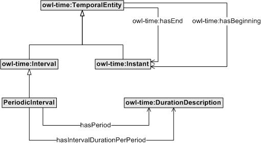

 __This pattern has been certified.__
Related submission, with evaluation history, can be found __here__

#  Graphical representation

__Diagram__

#  General description

  

#  Elements

_The __PeriodicInterval__ Content OP locally defines the following ontology elements:_

 __hasIntervalDurationPerPeriod__ (owl:ObjectProperty) 
  _[hasIntervalDurationPerPeriod](../Submissions/PeriodicInterval/hasIntervalDurationPerPeriod.md "Submissions:PeriodicInterval/hasIntervalDurationPerPeriod") page_
 __hasPeriod__ (owl:ObjectProperty) 
  _[hasPeriod](../Submissions/PeriodicInterval/hasPeriod.md "Submissions:PeriodicInterval/hasPeriod") page_
 __PeriodicInterval__ (owl:Class) 
  _[PeriodicInterval](../Submissions/PeriodicInterval/PeriodicInterval.md "Submissions:PeriodicInterval/PeriodicInterval") page_
#  Additional information

This ontology design pattern extends the OWL-Time ontology ([http://www.w3.org/TR/owl-time](http://www.w3.org/TR/owl-time "http://www.w3.org/TR/owl-time")) defining periodic intervals.

  

#  Scenarios

__Scenarios about PeriodicInterval__
No scenario is added to this Content OP.

#  Reviews

__Reviews about PeriodicInterval__
This revision (revision ID __11172__) takes in account the reviews: none

Other info at [evaluation tab](http://ontologydesignpatterns.org/wiki/index.php?title=Submissions:PeriodicInterval&action=evaluation "http://ontologydesignpatterns.org/wiki/index.php?title=Submissions:PeriodicInterval&action=evaluation")

  

#  Modeling issues

__Modeling issues about PeriodicInterval__
There is no Modeling issue related to this proposal.

  

#  References

[Add a reference](index.php@title=Odp%253AAdd_reference&subject=../Submissions/PeriodicInterval.md "http://ontologydesignpatterns.org/wiki/index.php?title=Odp:Add_reference&subject=Submissions%3APeriodicInterval")

  

Retrieved from "[http://ontologydesignpatterns.org/wiki/Submissions:PeriodicInterval](../Submissions/PeriodicInterval.md)"
 [Categories](http://ontologydesignpatterns.org/wiki/Special:Categories "Special:Categories"): [ProposedContentOP](../Category/ProposedContentOP.md "Category:ProposedContentOP") | [Submitted to event](../Category/Submitted_to_event.md "Category:Submitted to event") | [Review assigned](../Category/Review_assigned.md "Category:Review assigned")