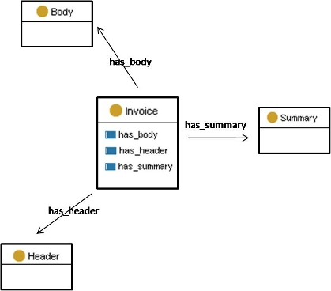

 __This pattern has been certified.__
Related submission, with evaluation history, can be found __here__

#  Graphical representation

__Diagram__

#  General description

  

#  Elements

_The __PharmaInnova__ Content OP locally defines the following ontology elements:_

 __Header__ (owl:Class) The header usually contains important information to identify the invoice like for example the complete address and the company-identification-code. 
  _[Header](../Submissions/PharmaInnova/Header "Submissions:PharmaInnova/Header") page_
 __Body__ (owl:Class) The body contains all relevant invoice information like the amount of products, their net price etc. 
  _[Body](../Submissions/PharmaInnova/Body "Submissions:PharmaInnova/Body") page_
 __Summary__ (owl:Class) Contains a summary of the most relevant invoice information like the payment terms and the total amount. 
  _[Summary](../Submissions/PharmaInnova/Summary "Submissions:PharmaInnova/Summary") page_
 __Invoice__ (owl:Class) 
  _[Invoice](../Submissions/PharmaInnova/Invoice "Submissions:PharmaInnova/Invoice") page_
 __has\_summary__ (owl:ObjectProperty) 
  _[has\_summary](../Submissions/PharmaInnova/has_summary "Submissions:PharmaInnova/has summary") page_
 __has\_header__ (owl:ObjectProperty) 
  _[has\_header](../Submissions/PharmaInnova/has_header "Submissions:PharmaInnova/has header") page_
 __has\_body__ (owl:ObjectProperty) 
  _[has\_body](../Submissions/PharmaInnova/has_body "Submissions:PharmaInnova/has body") page_
#  Additional information

(type): [http://www.w3.org/2002/07/owl#Ontology](http://www.w3.org/2002/07/owl#Ontology "http://www.w3.org/2002/07/owl#Ontology")

(imports): [http://www.ontologydesignpatterns.org/schemas/cpannotationschema.owl](http://www.ontologydesignpatterns.org/schemas/cpannotationschema.owl "http://www.ontologydesignpatterns.org/schemas/cpannotationschema.owl")

#  Scenarios

__Scenarios about PharmaInnova__
No scenario is added to this Content OP.

#  Reviews

__Reviews about PharmaInnova__
There is no review about this proposal.
This revision (revision ID __9111__) takes in account the reviews: none

Other info at [evaluation tab](http://ontologydesignpatterns.org/wiki/index.php?title=Submissions:PharmaInnova&action=evaluation "http://ontologydesignpatterns.org/wiki/index.php?title=Submissions:PharmaInnova&action=evaluation")

  

#  Modeling issues

__Modeling issues about PharmaInnova__
There is no Modeling issue related to this proposal.

  

#  References

[Add a reference](index.php@title=Odp%253AAdd_reference&subject=../Submissions/PharmaInnova "http://ontologydesignpatterns.org/wiki/index.php?title=Odp:Add_reference&subject=Submissions%3APharmaInnova")

  

Retrieved from "[http://ontologydesignpatterns.org/wiki/Submissions:PharmaInnova](../Submissions/PharmaInnova)"
 [Category](http://ontologydesignpatterns.org/wiki/Special:Categories "Special:Categories"): [ProposedContentOP](../Category/ProposedContentOP "Category:ProposedContentOP")