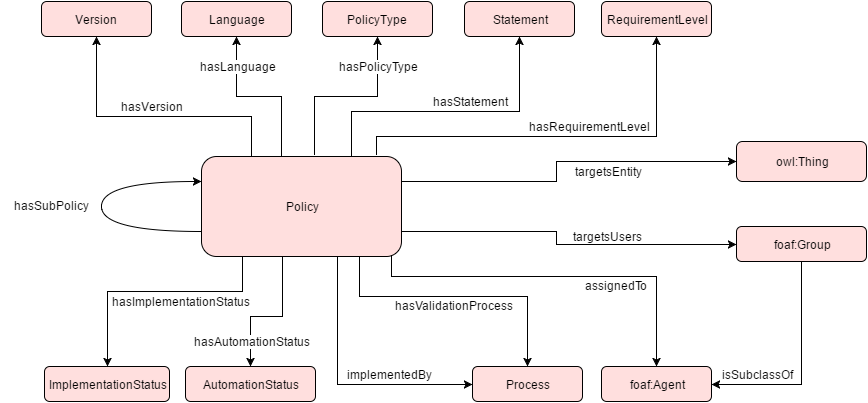

 __This pattern has been certified.__
Related submission, with evaluation history, can be found __here__

#  Graphical representation

__Diagram__

#  General description

  

#  Elements

_The __Policy__ Content OP locally defines the following ontology elements:_

 __assignedTo__ (owl:ObjectProperty) Associates a policy to the agent that is responsible for the application of the policy (person or role). 
  _[assignedTo](../Submissions/Policy/assignedTo.md "Submissions:Policy/assignedTo") page_
 __hasAutomationStatus__ (owl:ObjectProperty) Associates a policy with an automation level. 
  _[hasAutomationStatus](../Submissions/Policy/hasAutomationStatus.md "Submissions:Policy/hasAutomationStatus") page_
 __hasImplementationStatus__ (owl:ObjectProperty) Associates a policy with an implementation level. 
  _[hasImplementationStatus](../Submissions/Policy/hasImplementationStatus.md "Submissions:Policy/hasImplementationStatus") page_
 __hasLanguage__ (owl:ObjectProperty) Associates a policy with the language used for the policy definition. 
  _[hasLanguage](../Submissions/Policy/hasLanguage.md "Submissions:Policy/hasLanguage") page_
 __hasPolicyType__ (owl:ObjectProperty) Associates a policy with a policy type. 
  _[hasPolicyType](../Submissions/Policy/hasPolicyType.md "Submissions:Policy/hasPolicyType") page_
 __hasRequirementLevel__ (owl:ObjectProperty) Associates a policy with an requirement level. 
  _[hasRequirementLevel](../Submissions/Policy/hasRequirementLevel.md "Submissions:Policy/hasRequirementLevel") page_
 __hasStatement__ (owl:ObjectProperty) Associates a policy with a statement, which is a detailed definition of the policy contents. 
  _[hasStatement](../Submissions/Policy/hasStatement.md "Submissions:Policy/hasStatement") page_
 __hasSubPolicy__ (owl:ObjectProperty) Associates a policy to another policy that is contained in the initial. 
  _[hasSubPolicy](../Submissions/Policy/hasSubPolicy.md "Submissions:Policy/hasSubPolicy") page_
 __hasValidationProcess__ (owl:ObjectProperty) Associates a policy with a process that is used to validate the policy. 
  _[hasValidationProcess](../Submissions/Policy/hasValidationProcess.md "Submissions:Policy/hasValidationProcess") page_
 __hasVersion__ (owl:ObjectProperty) Defines a policy's version. 
  _[hasVersion](../Submissions/Policy/hasVersion.md "Submissions:Policy/hasVersion") page_
 __implementedBy__ (owl:ObjectProperty) Associates a policy with a process that is used to implement the policy. 
  _[implementedBy](../Submissions/Policy/implementedBy.md "Submissions:Policy/implementedBy") page_
 __targetsEntity__ (owl:ObjectProperty) Associates a policy with an entity that is subject to the policy. 
  _[targetsEntity](../Submissions/Policy/targetsEntity.md "Submissions:Policy/targetsEntity") page_
 __targetsUsers__ (owl:ObjectProperty) Associates a policy to the user community the policy has been designed for. 
  _[targetsUsers](../Submissions/Policy/targetsUsers.md "Submissions:Policy/targetsUsers") page_
 __AutomationStatus__ (owl:Class) The level of automation of a policy. Specifies if a policy implementation requires human intervention. E.g. manual, automated with human intervention, automated with human validation, fully automated, etc. 
  _[AutomationStatus](../Submissions/Policy/AutomationStatus.md "Submissions:Policy/AutomationStatus") page_
 __Descriptor__ (owl:Class) The various elements describing a policy. 
  _[Descriptor](../Submissions/Policy/Descriptor.md "Submissions:Policy/Descriptor") page_
 __ImplementationStatus__ (owl:Class) The level of implementation of a policy. E.g. implemented, partially implemented, unimplemented, not-implementable, etc. 
  _[ImplementationStatus](../Submissions/Policy/ImplementationStatus.md "Submissions:Policy/ImplementationStatus") page_
 __Language__ (owl:Class) The language used for the policy definition. E.g. natural language, ReAL, SPIN, etc. 
  _[Language](../Submissions/Policy/Language.md "Submissions:Policy/Language") page_
 __Policy__ (owl:Class) A deliberate system of principles to guide decisions and achieve rational outcomes. A policy is a statement of intent, and is implemented as a procedure or protocol. 
  _[Policy](../Submissions/Policy/Policy.md "Submissions:Policy/Policy") page_
 __PolicyType__ (owl:Class) The type of policy. Not all policies are equal; mandatory ones must be implemented to satisfy law or other requirements, others are aspirational, and most are met with the best possible effort. E.g. mandatory, legal requirement, aspirational, business driven, etc. 
  _[PolicyType](../Submissions/Policy/PolicyType.md "Submissions:Policy/PolicyType") page_
 __Process__ (owl:Class) A sequence of interdependent and linked procedures which, at every stage, consume one or more resources (time, energy, machines, money) to convert inputs (data, material, parts, etc.) into outputs. 
  _[Process](../Submissions/Policy/Process.md "Submissions:Policy/Process") page_
 __RequirementLevel__ (owl:Class) The level of a policy's compliance. E.g. must, must not, should, shoud not, may, etc. 
  _[RequirementLevel](../Submissions/Policy/RequirementLevel.md "Submissions:Policy/RequirementLevel") page_
 __Statement__ (owl:Class) Detailed definition of the policy contents. 
  _[Statement](../Submissions/Policy/Statement.md "Submissions:Policy/Statement") page_
 __Version__ (owl:Class) A policy's version 
  _[Version](../Submissions/Policy/Version.md "Submissions:Policy/Version") page_
#  Additional information

#  Scenarios

__Scenarios about Policy__
No scenario is added to this Content OP.

#  Reviews

__Reviews about Policy__
There is no review about this proposal.
This revision (revision ID __13090__) takes in account the reviews: none

Other info at [evaluation tab](http://ontologydesignpatterns.org/wiki/index.php?title=Submissions:Policy&action=evaluation "http://ontologydesignpatterns.org/wiki/index.php?title=Submissions:Policy&action=evaluation")

  

#  Modeling issues

__Modeling issues about Policy__
There is no Modeling issue related to this proposal.

  

#  References

[Add a reference](index.php@title=Odp%253AAdd_reference&subject=../Submissions/Policy.md "http://ontologydesignpatterns.org/wiki/index.php?title=Odp:Add_reference&subject=Submissions%3APolicy")

Retrieved from "[http://ontologydesignpatterns.org/wiki/Submissions:Policy](../Submissions/Policy.md)"
 [Categories](http://ontologydesignpatterns.org/wiki/Special:Categories "Special:Categories"): [ProposedContentOP](../Category/ProposedContentOP.md "Category:ProposedContentOP") | [Waiting for review](../Category/Waiting_for_review.md "Category:Waiting for review")