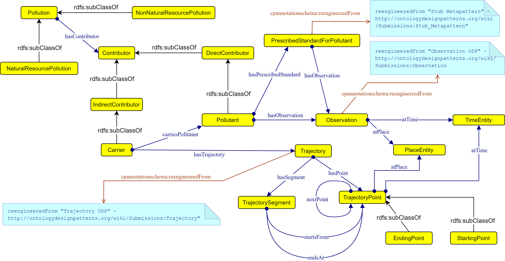

 __This pattern has been certified.__
Related submission, with evaluation history, can be found __here__

#  Graphical representation

__Diagram__

#  General description

  

#  Elements

_The __Pollution__ Content OP locally defines the following ontology elements:_

__Authors__ (owl:AnnotationProperty) 
  _[Authors](../Submissions/Pollution/Authors "Submissions:Pollution/Authors") page_
 __atPlace__ (owl:ObjectProperty) 
  _[atPlace](../Submissions/Pollution/atPlace "Submissions:Pollution/atPlace") page_
 __atTime__ (owl:ObjectProperty) 
  _[atTime](../Submissions/Pollution/atTime "Submissions:Pollution/atTime") page_
 __carriesPollutant__ (owl:ObjectProperty) 
  _[carriesPollutant](../Submissions/Pollution/carriesPollutant "Submissions:Pollution/carriesPollutant") page_
 __endsAt__ (owl:ObjectProperty) Connects a segment to the point it ends at. 
  _[endsAt](../Submissions/Pollution/endsAt "Submissions:Pollution/endsAt") page_
 __hasContributor__ (owl:ObjectProperty) 
  _[hasContributor](../Submissions/Pollution/hasContributor "Submissions:Pollution/hasContributor") page_
 __hasObservation__ (owl:ObjectProperty) 
  _[hasObservation](../Submissions/Pollution/hasObservation "Submissions:Pollution/hasObservation") page_
 __hasPoint__ (owl:ObjectProperty) Relating the trajectory to each of its points. 
  _[hasPoint](../Submissions/Pollution/hasPoint "Submissions:Pollution/hasPoint") page_
 __hasPrescribedStandard__ (owl:ObjectProperty) 
  _[hasPrescribedStandard](../Submissions/Pollution/hasPrescribedStandard "Submissions:Pollution/hasPrescribedStandard") page_
 __hasSegment__ (owl:ObjectProperty) Relating the trajectory to each of its segments. 
  _[hasSegment](../Submissions/Pollution/hasSegment "Submissions:Pollution/hasSegment") page_
 __hasTrajectory__ (owl:ObjectProperty) Anything that has a trajectory can use this property to connect it to the trajectory instance 
  _[hasTrajectory](../Submissions/Pollution/hasTrajectory "Submissions:Pollution/hasTrajectory") page_
 __nextPoint__ (owl:ObjectProperty) Relates one point to the immediately following point in the sequence. 
  _[nextPoint](../Submissions/Pollution/nextPoint "Submissions:Pollution/nextPoint") page_
 __startsFrom__ (owl:ObjectProperty) Connects a segment to the point it starts from. 
  _[startsFrom](../Submissions/Pollution/startsFrom "Submissions:Pollution/startsFrom") page_
 __Carrier__ (owl:Class) Represents streams which carry pollutants to a particular place. 
  _[Carrier](../Submissions/Pollution/Carrier "Submissions:Pollution/Carrier") page_
 __Contributor__ (owl:Class) 
  _[Contributor](../Submissions/Pollution/Contributor "Submissions:Pollution/Contributor") page_
 __DirectContributor__ (owl:Class) Represents concepts which directly represent pollution. For example the concentration of pollutants at a particular spatio-temporal point. 
  _[DirectContributor](../Submissions/Pollution/DirectContributor "Submissions:Pollution/DirectContributor") page_
 __EndingPoint__ (owl:Class) 
  _[EndingPoint](../Submissions/Pollution/EndingPoint "Submissions:Pollution/EndingPoint") page_
 __IndirectContributor__ (owl:Class) Represents concepts which indirectly contribute to pollution of a place. These do not directly represent pollution but have properties which can affect the pollution, for example by changing the concentration of pollutants at a spatio-temporal point. 
  _[IndirectContributor](../Submissions/Pollution/IndirectContributor "Submissions:Pollution/IndirectContributor") page_
 __NaturalResourcePollution__ (owl:Class) Represents pollution on natural resources. Which means the pollution that affects natural resources like air, water, land, etc. 
  _[NaturalResourcePollution](../Submissions/Pollution/NaturalResourcePollution "Submissions:Pollution/NaturalResourcePollution") page_
 __NonNaturalResourcePollution__ (owl:Class) Represents pollution which does not represent natural resource. Examples include, sound, light, space debris, radioactive pollution, thermal pollution. 
  _[NonNaturalResourcePollution](../Submissions/Pollution/NonNaturalResourcePollution "Submissions:Pollution/NonNaturalResourcePollution") page_
 __Observation__ (owl:Class) Observation represents a spatio-temporal observation of pollutants under time and place parameters. 
  _[Observation](../Submissions/Pollution/Observation "Submissions:Pollution/Observation") page_
 __PlaceEntity__ (owl:Class) 
  _[PlaceEntity](../Submissions/Pollution/PlaceEntity "Submissions:Pollution/PlaceEntity") page_
 __Pollutant__ (owl:Class) Represents various pollutants which contaminate the environment and directly represnt/contribute to pollution. Additionally a carrier's trajecectory point may pick up pollutants from a spatio-temporal point, in which case, it is represented by the sub-property carriesPollutant. 
  _[Pollutant](../Submissions/Pollution/Pollutant "Submissions:Pollution/Pollutant") page_
 __Pollution__ (owl:Class) Represnents the notion of Pollution which includes observation of pollutants at spatio-temporal points or the contributors to the pollution which may be spatio-temporal in nature. 
  _[Pollution](../Submissions/Pollution/Pollution "Submissions:Pollution/Pollution") page_
 __PrescribedStandardForPollutant__ (owl:Class) 
  _[PrescribedStandardForPollutant](../Submissions/Pollution/PrescribedStandardForPollutant "Submissions:Pollution/PrescribedStandardForPollutant") page_
 __StartingPoint__ (owl:Class) 
  _[StartingPoint](../Submissions/Pollution/StartingPoint "Submissions:Pollution/StartingPoint") page_
 __TimeEntity__ (owl:Class) 
  _[TimeEntity](../Submissions/Pollution/TimeEntity "Submissions:Pollution/TimeEntity") page_
 __Trajectory__ (owl:Class) Represents a trajectory of points. Examples include drainage/sewage trajectory or air stream trajectory. 
  _[Trajectory](../Submissions/Pollution/Trajectory "Submissions:Pollution/Trajectory") page_
 __TrajectoryPoint__ (owl:Class) A collection of spatio-temporal points represents a trajectory 
  _[TrajectoryPoint](../Submissions/Pollution/TrajectoryPoint "Submissions:Pollution/TrajectoryPoint") page_
 __TrajectorySegment__ (owl:Class) A subset of spatio-temporal trajectory points represent a TrajectorySegment 
  _[TrajectorySegment](../Submissions/Pollution/TrajectorySegment "Submissions:Pollution/TrajectorySegment") page_
#  Additional information

This ontology is an attempt at a ODP designed to model Pollution. Pollution can be defined as

#  Scenarios

__Scenarios about Pollution__
No scenario is added to this Content OP.

#  Reviews

__Reviews about Pollution__
There is no review about this proposal.
This revision (revision ID __14244__) takes in account the reviews: none

Other info at [evaluation tab](http://ontologydesignpatterns.org/wiki/index.php?title=Submissions:Pollution&action=evaluation "http://ontologydesignpatterns.org/wiki/index.php?title=Submissions:Pollution&action=evaluation")

  

#  Modeling issues

__Modeling issues about Pollution__
There is no Modeling issue related to this proposal.

  

#  References

[Add a reference](index.php@title=Odp%253AAdd_reference&subject=../Submissions/Pollution "http://ontologydesignpatterns.org/wiki/index.php?title=Odp:Add_reference&subject=Submissions%3APollution")

  

Retrieved from "[http://ontologydesignpatterns.org/wiki/Submissions:Pollution](../Submissions/Pollution)"
 [Category](http://ontologydesignpatterns.org/wiki/Special:Categories "Special:Categories"): [ProposedContentOP](../Category/ProposedContentOP "Category:ProposedContentOP")