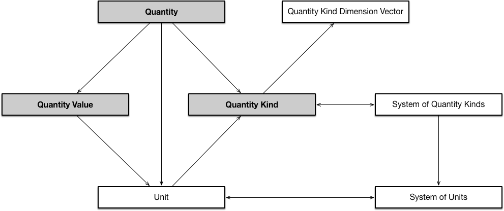

 __This pattern has been certified.__
Related submission, with evaluation history, can be found __here__

#  Graphical representation

__Diagram__

#  General information

  

#  Description

  

#  Example

  

#  Pattern reference

#  Additional information

#  Scenarios

__Scenarios about Quantity Triad Pattern__
No scenario is added to this Content OP.

#  Reviews

__Reviews about Quantity Triad Pattern__
There is no review about this proposal.
This revision (revision ID __13776__) takes in account the reviews: none

Other info at [evaluation tab](http://ontologydesignpatterns.org/wiki/index.php?title=Submissions:Quantity_Triad_Pattern&action=evaluation "http://ontologydesignpatterns.org/wiki/index.php?title=Submissions:Quantity_Triad_Pattern&action=evaluation")

  

#  Modeling issues

__Modeling issues about Quantity Triad Pattern__
There is no Modeling issue related to this proposal.

  

#  References

[Add a reference](index.php@title=Odp%253AAdd_reference&subject=Submissions%253AQuantity+Triad+Pattern.html "http://ontologydesignpatterns.org/wiki/index.php?title=Odp:Add_reference&subject=Submissions%3AQuantity+Triad+Pattern")

  

Retrieved from "[http://ontologydesignpatterns.org/wiki/Submissions:Quantity\_Triad\_Pattern](../Submissions/Quantity_Triad_Pattern)"
 [Categories](http://ontologydesignpatterns.org/wiki/Special:Categories "Special:Categories"): [ArrchitecturalOP](http://ontologydesignpatterns.org/wiki/index.php?title=Category:ArrchitecturalOP&action=edit&redlink=1 "Category:ArrchitecturalOP (not yet written)") | [ProposedArchitecturalOP](../Category/ProposedArchitecturalOP "Category:ProposedArchitecturalOP") | [Waiting for review](../Category/Waiting_for_review "Category:Waiting for review")