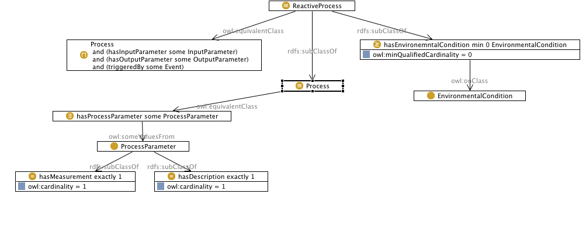

 __This pattern has been certified.__
Related submission, with evaluation history, can be found __here__

#  Graphical representation

__Diagram__

#  General description

  

#  Elements

_The __Reactor pattern__ Content OP locally defines the following ontology elements:_

  __definesCondition__ (owl:ObjectProperty) 
  _[definesCondition](../Submissions/Reactor_pattern/definesCondition.md "Submissions:Reactor pattern/definesCondition") page_
 __hasEnvironemntalCondition__ (owl:ObjectProperty) 
  _[hasEnvironemntalCondition](../Submissions/Reactor_pattern/hasEnvironemntalCondition.md "Submissions:Reactor pattern/hasEnvironemntalCondition") page_
 __hasInputParameter__ (owl:ObjectProperty) 
  _[hasInputParameter](../Submissions/Reactor_pattern/hasInputParameter.md "Submissions:Reactor pattern/hasInputParameter") page_
 __hasMeasurement__ (owl:ObjectProperty) 
  _[hasMeasurement](../Submissions/Reactor_pattern/hasMeasurement.md "Submissions:Reactor pattern/hasMeasurement") page_
 __hasOutputParameter__ (owl:ObjectProperty) 
  _[hasOutputParameter](../Submissions/Reactor_pattern/hasOutputParameter.md "Submissions:Reactor pattern/hasOutputParameter") page_
 __hasProcessParameter__ (owl:ObjectProperty) 
  _[hasProcessParameter](../Submissions/Reactor_pattern/hasProcessParameter.md "Submissions:Reactor pattern/hasProcessParameter") page_
 __triggeredBy__ (owl:ObjectProperty) 
  _[triggeredBy](../Submissions/Reactor_pattern/triggeredBy.md "Submissions:Reactor pattern/triggeredBy") page_
 __hasDescription__ (owl:DatatypeProperty) 
  _[hasDescription](../Submissions/Reactor_pattern/hasDescription.md "Submissions:Reactor pattern/hasDescription") page_
 __EnvironmentalCondition__ (owl:Class) An entity that represents the environmental condition 
  _[EnvironmentalCondition](../Submissions/Reactor_pattern/EnvironmentalCondition.md "Submissions:Reactor pattern/EnvironmentalCondition") page_
 __Event__ (owl:Class) An entity representing the event that triggers the process 
  _[Event](../Submissions/Reactor_pattern/Event.md "Submissions:Reactor pattern/Event") page_
 __InputParameter__ (owl:Class) An entity representing the input to a process 
  _[InputParameter](../Submissions/Reactor_pattern/InputParameter.md "Submissions:Reactor pattern/InputParameter") page_
 __OutputParameter__ (owl:Class) An entity representing the output to a process 
  _[OutputParameter](../Submissions/Reactor_pattern/OutputParameter.md "Submissions:Reactor pattern/OutputParameter") page_
 __Process__ (owl:Class) An entity representing a placeholder for a process. 
  _[Process](../Submissions/Reactor_pattern/Process.md "Submissions:Reactor pattern/Process") page_
 __ProcessParameter__ (owl:Class) An overarching entity representing the parameters defined for the process 
  _[ProcessParameter](../Submissions/Reactor_pattern/ProcessParameter.md "Submissions:Reactor pattern/ProcessParameter") page_
 __ReactiveProcess__ (owl:Class) An entity representing a reactive process 
  _[ReactiveProcess](../Submissions/Reactor_pattern/ReactiveProcess.md "Submissions:Reactor pattern/ReactiveProcess") page_
#  Additional information

The Reactor Pattern enables the modelling of processes that consume inputs and produce outputs under specific environmental conditions and on being triggered by certain events. Reactor pattern is a content ontology design pattern and is especially targeted towards modelling reactive processes with a black box view of the process.

#  Scenarios

__Scenarios about Reactor pattern__
No scenario is added to this Content OP.

#  Reviews

__Reviews about Reactor pattern__
This revision (revision ID __11175__) takes in account the reviews: none

Other info at [evaluation tab](http://ontologydesignpatterns.org/wiki/index.php?title=Submissions:Reactor_pattern&action=evaluation "http://ontologydesignpatterns.org/wiki/index.php?title=Submissions:Reactor_pattern&action=evaluation")

  

#  Modeling issues

__Modeling issues about Reactor pattern__
There is no Modeling issue related to this proposal.

  

#  References

[Add a reference](index.php@title=Odp%253AAdd_reference&subject=Submissions%253AReactor+pattern.html "http://ontologydesignpatterns.org/wiki/index.php?title=Odp:Add_reference&subject=Submissions%3AReactor+pattern")

  

Retrieved from "[http://ontologydesignpatterns.org/wiki/Submissions:Reactor\_pattern](../Submissions/Reactor_pattern.md)"
 [Categories](http://ontologydesignpatterns.org/wiki/Special:Categories "Special:Categories"): [ProposedContentOP](../Category/ProposedContentOP.md "Category:ProposedContentOP") | [Submitted to event](../Category/Submitted_to_event.md "Category:Submitted to event") | [Review assigned](../Category/Review_assigned.md "Category:Review assigned")