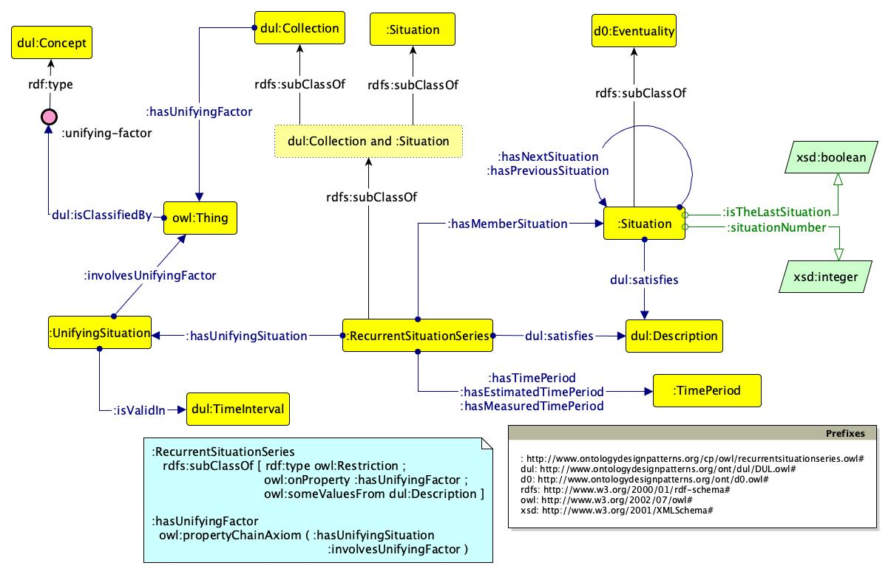

 __This pattern has been certified.__
Related submission, with evaluation history, can be found __here__

#  Graphical representation

__Diagram__

#  General description

  

#  Elements

_The __RecurrentSituationSeries__ Content OP locally defines the following ontology elements:_

 __hasEstimatedTimePeriod__ (owl:ObjectProperty) This property relates a recurrent situation series to an estimated time period. 
  _[hasEstimatedTimePeriod](../Submissions/RecurrentSituationSeries/hasEstimatedTimePeriod.md "Submissions:RecurrentSituationSeries/hasEstimatedTimePeriod") page_
 __hasImmediateNextSituation__ (owl:ObjectProperty) This property relates a situation member of a recurrent situation series to the immediate next situation member of the same recurrent situation series. 
  _[hasImmediateNextSituation](../Submissions/RecurrentSituationSeries/hasImmediateNextSituation.md "Submissions:RecurrentSituationSeries/hasImmediateNextSituation") page_
 __hasImmediatePreviousSituation__ (owl:ObjectProperty) This property relates a situation member of a recurrent situation series to the immediate previous situation member of the same recurrent situation series. 
  _[hasImmediatePreviousSituation](../Submissions/RecurrentSituationSeries/hasImmediatePreviousSituation.md "Submissions:RecurrentSituationSeries/hasImmediatePreviousSituation") page_
 __hasMeasuredTimePeriod__ (owl:ObjectProperty) This property relates a recurrent situation series to a measured time period. 
  _[hasMeasuredTimePeriod](../Submissions/RecurrentSituationSeries/hasMeasuredTimePeriod.md "Submissions:RecurrentSituationSeries/hasMeasuredTimePeriod") page_
 __hasMemberSituation__ (owl:ObjectProperty) This property relates a recurrent situation series to a situation that is member of it. 
  _[hasMemberSituation](../Submissions/RecurrentSituationSeries/hasMemberSituation.md "Submissions:RecurrentSituationSeries/hasMemberSituation") page_
 __hasNextSituation__ (owl:ObjectProperty) This property relates a situation member of a recurrent situation series to a next situation member of the same recurrent situation series. 
  _[hasNextSituation](../Submissions/RecurrentSituationSeries/hasNextSituation.md "Submissions:RecurrentSituationSeries/hasNextSituation") page_
 __hasPreviousSituation__ (owl:ObjectProperty) This property relates a situation member of a recurrent situation series to a previous situation member of the same recurrent situation series. 
  _[hasPreviousSituation](../Submissions/RecurrentSituationSeries/hasPreviousSituation.md "Submissions:RecurrentSituationSeries/hasPreviousSituation") page_
 __hasTimePeriod__ (owl:ObjectProperty) This property relates a recurrent situation series to a time period. 
  _[hasTimePeriod](../Submissions/RecurrentSituationSeries/hasTimePeriod.md "Submissions:RecurrentSituationSeries/hasTimePeriod") page_
 __hasTimePeriodBeforeNextSituation__ (owl:ObjectProperty) This property relates a situation member of a recurrent situation series to the time period elapsing before its next situation. 
  _[hasTimePeriodBeforeNextSituation](../Submissions/RecurrentSituationSeries/hasTimePeriodBeforeNextSituation.md "Submissions:RecurrentSituationSeries/hasTimePeriodBeforeNextSituation") page_
 __hasUnifyingFactor__ (owl:ObjectProperty) This property relates a collection to a unifying factor. 
  _[hasUnifyingFactor](../Submissions/RecurrentSituationSeries/hasUnifyingFactor.md "Submissions:RecurrentSituationSeries/hasUnifyingFactor") page_
 __hasUnifyingSituation__ (owl:ObjectProperty) This property relates a recurrent situation series to a unifying situation. 
  _[hasUnifyingSituation](../Submissions/RecurrentSituationSeries/hasUnifyingSituation.md "Submissions:RecurrentSituationSeries/hasUnifyingSituation") page_
 __involvesUnifyingFactor__ (owl:ObjectProperty) This property relates a unifying situation to the involved unifying factor. 
  _[involvesUnifyingFactor](../Submissions/RecurrentSituationSeries/involvesUnifyingFactor.md "Submissions:RecurrentSituationSeries/involvesUnifyingFactor") page_
 __isEstimatedTimePeriodOf__ (owl:ObjectProperty) This property relates an estimated time period to a recurrent situation series. 
  _[isEstimatedTimePeriodOf](../Submissions/RecurrentSituationSeries/isEstimatedTimePeriodOf.md "Submissions:RecurrentSituationSeries/isEstimatedTimePeriodOf") page_
 __isInvolvedInUnifyingSituation__ (owl:ObjectProperty) This property relates a unifying factor to the unifying situation it is involved in. 
  _[isInvolvedInUnifyingSituation](../Submissions/RecurrentSituationSeries/isInvolvedInUnifyingSituation.md "Submissions:RecurrentSituationSeries/isInvolvedInUnifyingSituation") page_
 __isLocallyInconsistentWith__ (owl:ObjectProperty) This property relates two entities that are considered locally inconsistent. 
  _[isLocallyInconsistentWith](../Submissions/RecurrentSituationSeries/isLocallyInconsistentWith.md "Submissions:RecurrentSituationSeries/isLocallyInconsistentWith") page_
 __isMeasuredTimePeriodOf__ (owl:ObjectProperty) This property relates a measured time period to a recurrent situation series. 
  _[isMeasuredTimePeriodOf](../Submissions/RecurrentSituationSeries/isMeasuredTimePeriodOf.md "Submissions:RecurrentSituationSeries/isMeasuredTimePeriodOf") page_
 __isSituationMemberOf__ (owl:ObjectProperty) This property relates a situation that is member of a recurrent situation series to the recurrent situation series. 
  _[isSituationMemberOf](../Submissions/RecurrentSituationSeries/isSituationMemberOf.md "Submissions:RecurrentSituationSeries/isSituationMemberOf") page_
 __isTimePeriodBeforeNextSituationOf__ (owl:ObjectProperty) This property relates a time period, elapsing before the next situation of a situation member of a recurrent situation series, to one of the member situations. 
  _[isTimePeriodBeforeNextSituationOf](../Submissions/RecurrentSituationSeries/isTimePeriodBeforeNextSituationOf.md "Submissions:RecurrentSituationSeries/isTimePeriodBeforeNextSituationOf") page_
 __isTimePeriodOf__ (owl:ObjectProperty) This property relates a time period to a recurrent situation series having that time period. 
  _[isTimePeriodOf](../Submissions/RecurrentSituationSeries/isTimePeriodOf.md "Submissions:RecurrentSituationSeries/isTimePeriodOf") page_
 __isUnifyingFactorOf__ (owl:ObjectProperty) This property relates a unifying factor to the collection that is unified by that factor. 
  _[isUnifyingFactorOf](../Submissions/RecurrentSituationSeries/isUnifyingFactorOf.md "Submissions:RecurrentSituationSeries/isUnifyingFactorOf") page_
 __isUnifyingSituationOf__ (owl:ObjectProperty) This property relates a unifying situation to the recurrent situation series it unifies. 
  _[isUnifyingSituationOf](../Submissions/RecurrentSituationSeries/isUnifyingSituationOf.md "Submissions:RecurrentSituationSeries/isUnifyingSituationOf") page_
 __isValidIn__ (owl:ObjectProperty) This property relates a unifying situation to its temporal validity. 
  _[isValidIn](../Submissions/RecurrentSituationSeries/isValidIn.md "Submissions:RecurrentSituationSeries/isValidIn") page_
 __isTheLastSituation__ (owl:DatatypeProperty) This property defines if a situation that is member of a recurrent situation series is the last one or not. 
  _[isTheLastSituation](../Submissions/RecurrentSituationSeries/isTheLastSituation.md "Submissions:RecurrentSituationSeries/isTheLastSituation") page_
 __situationNumber__ (owl:DatatypeProperty) This property represents the number of the situation in the recurrent situation series (the first situation, the second situation, etc.) 
  _[situationNumber](../Submissions/RecurrentSituationSeries/situationNumber.md "Submissions:RecurrentSituationSeries/situationNumber") page_
 __RecurrentSituationSeries__ (owl:Class) Recurrent situation series is modeled as an intersection of the classes Collection and Situation. Indeed, a recurrent situation is seen as a collection, since it contains entities that share one or more common properties and are unified conceptually. These entities are member of the collection, and are all consecutive situations, in such a manner that each situation has either a previous situation, or a next situation, or both, unless the series has never been instantiated. At the same time, a recurrent situation is a situation, intended as a relational context in which the contextualized things are based on a frame: a recurrent situation is similar to a plan that defines how the things involved in that plan (i.e. the specific situations) shall be carried out, e.g. where the situations shall be located, in which time of the year, etc. 
  _[RecurrentSituationSeries](../Submissions/RecurrentSituationSeries/RecurrentSituationSeries.md "Submissions:RecurrentSituationSeries/RecurrentSituationSeries") page_
 __Situation__ (owl:Class) This class represents a Situation. 
  _[Situation](../Submissions/RecurrentSituationSeries/Situation.md "Submissions:RecurrentSituationSeries/Situation") page_
 __TimePeriod__ (owl:Class) This class represents a Time Period (e.g. 1 week). 
  _[TimePeriod](../Submissions/RecurrentSituationSeries/TimePeriod.md "Submissions:RecurrentSituationSeries/TimePeriod") page_
 __UnifyingFactor__ (owl:Class) A Unifying Factor is a concept, which classifies an element or property occurring in each situation member of a recurrent situation series, which unifies the collection and makes all the situations attributable to a homogeneous collection. 
  _[UnifyingFactor](../Submissions/RecurrentSituationSeries/UnifyingFactor.md "Submissions:RecurrentSituationSeries/UnifyingFactor") page_
 __UnifyingSituation__ (owl:Class) A Unifying Situation is a situation involving a unifying factor, i.e. a concept classifying an element or property occurring in each situation member of a recurrent situation series, which unifies the collection and makes all the situations attributable to a homogeneous collection, and is valid at a specific time interval. 
  _[UnifyingSituation](../Submissions/RecurrentSituationSeries/UnifyingSituation.md "Submissions:RecurrentSituationSeries/UnifyingSituation") page_
#  Additional information

A pattern for recurrent situation series. This pattern is a new version of the recurrent event series ODP ([http://www.ontologydesignpatterns.org/cp/owl/recurrenteventseries.owl](http://www.ontologydesignpatterns.org/cp/owl/recurrenteventseries.owl "http://www.ontologydesignpatterns.org/cp/owl/recurrenteventseries.owl")), based on new analysis which led to terminological and modelling changes.

#  Scenarios

__Scenarios about RecurrentSituationSeries__
No scenario is added to this Content OP.

#  Reviews

__Reviews about RecurrentSituationSeries__
There is no review about this proposal.
This revision (revision ID __13945__) takes in account the reviews: none

Other info at [evaluation tab](http://ontologydesignpatterns.org/wiki/index.php?title=Submissions:RecurrentSituationSeries&action=evaluation "http://ontologydesignpatterns.org/wiki/index.php?title=Submissions:RecurrentSituationSeries&action=evaluation")

  

#  Modeling issues

__Modeling issues about RecurrentSituationSeries__
There is no Modeling issue related to this proposal.

  

#  References

[Add a reference](index.php@title=Odp%253AAdd_reference&subject=../Submissions/RecurrentSituationSeries.md "http://ontologydesignpatterns.org/wiki/index.php?title=Odp:Add_reference&subject=Submissions%3ARecurrentSituationSeries")

  

Retrieved from "[http://ontologydesignpatterns.org/wiki/Submissions:RecurrentSituationSeries](../Submissions/RecurrentSituationSeries.md)"
 [Category](http://ontologydesignpatterns.org/wiki/Special:Categories "Special:Categories"): [ProposedContentOP](../Category/ProposedContentOP.md "Category:ProposedContentOP")