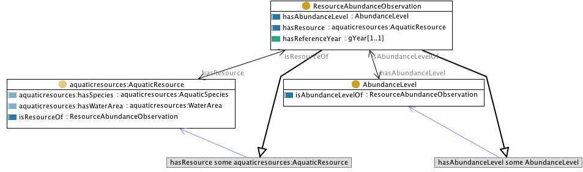

 __This pattern has been certified.__
Related submission, with evaluation history, can be found __here__

#  Graphical representation

__Diagram__

#  General description

  

#  Elements

_The __ResourceAbundanceObservation__ Content OP locally defines the following ontology elements:_

 __AbundanceLevel__ (owl:Class) 
  _[AbundanceLevel](../Submissions/ResourceAbundanceObservation/AbundanceLevel.md "Submissions:ResourceAbundanceObservation/AbundanceLevel") page_
 __ResourceAbundanceObservation__ (owl:Class) An observation of a resource characterised by different parameters. 
  _[ResourceAbundanceObservation](../Submissions/ResourceAbundanceObservation/ResourceAbundanceObservation.md "Submissions:ResourceAbundanceObservation/ResourceAbundanceObservation") page_
 __hasReferenceYear__ (owl:DatatypeProperty) 
  _[hasReferenceYear](../Submissions/ResourceAbundanceObservation/hasReferenceYear.md "Submissions:ResourceAbundanceObservation/hasReferenceYear") page_
 __hasAbundanceLevel__ (owl:ObjectProperty) 
  _[hasAbundanceLevel](../Submissions/ResourceAbundanceObservation/hasAbundanceLevel.md "Submissions:ResourceAbundanceObservation/hasAbundanceLevel") page_
 __hasResource__ (owl:ObjectProperty) 
  _[hasResource](../Submissions/ResourceAbundanceObservation/hasResource.md "Submissions:ResourceAbundanceObservation/hasResource") page_
 __isResourceOf__ (owl:ObjectProperty) 
  _[isResourceOf](../Submissions/ResourceAbundanceObservation/isResourceOf.md "Submissions:ResourceAbundanceObservation/isResourceOf") page_
 __isAbundanceLevelOf__ (owl:ObjectProperty) 
  _[isAbundanceLevelOf](../Submissions/ResourceAbundanceObservation/isAbundanceLevelOf.md "Submissions:ResourceAbundanceObservation/isAbundanceLevelOf") page_
#  Additional information

(type): [http://www.w3.org/2002/07/owl#Ontology](http://www.w3.org/2002/07/owl#Ontology "http://www.w3.org/2002/07/owl#Ontology")

(hasUnitTest): SELECT ?x WHERE {?x a :AquaticResourceObservation.  ?x :hasReferenceYear

#  Scenarios

__Scenarios about ResourceAbundanceObservation__
No scenario is added to this Content OP.

#  Reviews

__Reviews about ResourceAbundanceObservation__
There is no review about this proposal.
This revision (revision ID __9117__) takes in account the reviews: none

Other info at [evaluation tab](http://ontologydesignpatterns.org/wiki/index.php?title=Submissions:ResourceAbundanceObservation&action=evaluation "http://ontologydesignpatterns.org/wiki/index.php?title=Submissions:ResourceAbundanceObservation&action=evaluation")

  

#  Modeling issues

__Modeling issues about ResourceAbundanceObservation__
There is no Modeling issue related to this proposal.

  

#  References

[Add a reference](index.php@title=Odp%253AAdd_reference&subject=../Submissions/ResourceAbundanceObservation.md "http://ontologydesignpatterns.org/wiki/index.php?title=Odp:Add_reference&subject=Submissions%3AResourceAbundanceObservation")

  

Retrieved from "[http://ontologydesignpatterns.org/wiki/Submissions:ResourceAbundanceObservation](../Submissions/ResourceAbundanceObservation.md)"
 [Category](http://ontologydesignpatterns.org/wiki/Special:Categories "Special:Categories"): [ProposedContentOP](../Category/ProposedContentOP.md "Category:ProposedContentOP")