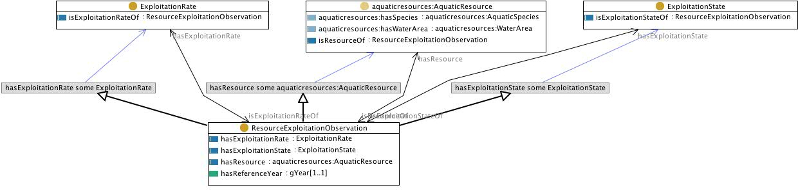

 __This pattern has been certified.__
Related submission, with evaluation history, can be found __here__

#  Graphical representation

__Diagram__

#  General description

  

#  Elements

_The __ResourceExploitationObservation__ Content OP locally defines the following ontology elements:_

 __ResourceExploitationObservation__ (owl:Class) An observation of a resource characterised by different parameters. 
  _[ResourceExploitationObservation](../Submissions/ResourceExploitationObservation/ResourceExploitationObservation.md "Submissions:ResourceExploitationObservation/ResourceExploitationObservation") page_
 __hasReferenceYear__ (owl:DatatypeProperty) 
  _[hasReferenceYear](../Submissions/ResourceExploitationObservation/hasReferenceYear.md "Submissions:ResourceExploitationObservation/hasReferenceYear") page_
 __hasResource__ (owl:ObjectProperty) 
  _[hasResource](../Submissions/ResourceExploitationObservation/hasResource.md "Submissions:ResourceExploitationObservation/hasResource") page_
 __hasExploitationRate__ (owl:ObjectProperty) 
  _[hasExploitationRate](../Submissions/ResourceExploitationObservation/hasExploitationRate.md "Submissions:ResourceExploitationObservation/hasExploitationRate") page_
 __ExploitationRate__ (owl:Class) 
  _[ExploitationRate](../Submissions/ResourceExploitationObservation/ExploitationRate.md "Submissions:ResourceExploitationObservation/ExploitationRate") page_
 __ExploitationState__ (owl:Class) 
  _[ExploitationState](../Submissions/ResourceExploitationObservation/ExploitationState.md "Submissions:ResourceExploitationObservation/ExploitationState") page_
 __hasExploitationState__ (owl:ObjectProperty) 
  _[hasExploitationState](../Submissions/ResourceExploitationObservation/hasExploitationState.md "Submissions:ResourceExploitationObservation/hasExploitationState") page_
 __isExploitationStateOf__ (owl:ObjectProperty) 
  _[isExploitationStateOf](../Submissions/ResourceExploitationObservation/isExploitationStateOf.md "Submissions:ResourceExploitationObservation/isExploitationStateOf") page_
 __isResourceOf__ (owl:ObjectProperty) 
  _[isResourceOf](../Submissions/ResourceExploitationObservation/isResourceOf.md "Submissions:ResourceExploitationObservation/isResourceOf") page_
 __isExploitationRateOf__ (owl:ObjectProperty) 
  _[isExploitationRateOf](../Submissions/ResourceExploitationObservation/isExploitationRateOf.md "Submissions:ResourceExploitationObservation/isExploitationRateOf") page_
#  Additional information

(type): [http://www.w3.org/2002/07/owl#Ontology](http://www.w3.org/2002/07/owl#Ontology "http://www.w3.org/2002/07/owl#Ontology")

(imports): [http://www.ontologydesignpatterns.org/cp/owl/observation.owl](http://www.ontologydesignpatterns.org/cp/owl/observation.owl "http://www.ontologydesignpatterns.org/cp/owl/observation.owl")

(hasUnitTest): SELECT ?x WHERE {?x a :AquaticResourceObservation.  ?x :hasReferenceYear

#  Scenarios

__Scenarios about ResourceExploitationObservation__
No scenario is added to this Content OP.

#  Reviews

__Reviews about ResourceExploitationObservation__
There is no review about this proposal.
This revision (revision ID __9118__) takes in account the reviews: none

Other info at [evaluation tab](http://ontologydesignpatterns.org/wiki/index.php?title=Submissions:ResourceExploitationObservation&action=evaluation "http://ontologydesignpatterns.org/wiki/index.php?title=Submissions:ResourceExploitationObservation&action=evaluation")

  

#  Modeling issues

__Modeling issues about ResourceExploitationObservation__
There is no Modeling issue related to this proposal.

  

#  References

[Add a reference](index.php@title=Odp%253AAdd_reference&subject=../Submissions/ResourceExploitationObservation.md "http://ontologydesignpatterns.org/wiki/index.php?title=Odp:Add_reference&subject=Submissions%3AResourceExploitationObservation")

  

Retrieved from "[http://ontologydesignpatterns.org/wiki/Submissions:ResourceExploitationObservation](../Submissions/ResourceExploitationObservation.md)"
 [Category](http://ontologydesignpatterns.org/wiki/Special:Categories "Special:Categories"): [ProposedContentOP](../Category/ProposedContentOP.md "Category:ProposedContentOP")