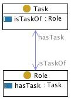

 __This pattern has been certified.__
Related submission, with evaluation history, can be found __here__

#  Graphical representation

__Diagram__

#  General description

  

#  Elements

_The __Role task__ Content OP locally defines the following ontology elements:_

 __role__ (owl:Class) A concept that classifies an object. For example, the role developer classifies a person, the role server classifies a computer machine. A hasTask only Tasks. It is disjoint with Task. 

  _[Role](../Submissions/Role_task/Role.md "Submissions:Role task/Role") page_

 __has task__ (owl:ObjectProperty) A relation between roles and tasks, e.g. 'students have the duty of giving exams' (i.e. the Role 'student' hasTask the Task 'giving exams'). It is the inverse of  [isTaskOf](../Submissions/Role_task/isTaskOf.md "Submissions:Role task/isTaskOf"). 

  _[hasTask](../Submissions/Role_task/hasTask.md "Submissions:Role task/hasTask") page_

 __Task__ (owl:Class) A piece of work to be done or undertaken. A Task is assigned to only  [Roles](../Submissions/Role_task/Role.md "Submissions:Role task/Role") through the property  [isTaskOf](../Submissions/Role_task/isTaskOf.md "Submissions:Role task/isTaskOf"). 

  _[Task](../Submissions/Role_task/Task.md "Submissions:Role task/Task") page_

 __is task ok__ (owl:ObjectProperty) A relation between  [roles](../Submissions/Role_task/Role.md "Submissions:Role task/Role") and  [tasks](../Submissions/Role_task/Task.md "Submissions:Role task/Task"), e.g. 'students have the duty of giving exams' (i.e. the Role 'student' hasTask the Task 'giving exams'). It is the inverse of  [hasTask](../Submissions/Role_task/hasTask.md "Submissions:Role task/hasTask"). 

  _[isTaskOf](../Submissions/Role_task/isTaskOf.md "Submissions:Role task/isTaskOf") page_
#  Additional information

This CP is typically used in composition with the  [agent role](../Submissions/AgentRole.md "Submissions:AgentRole") CP, or  [object role](../Submissions/Objectrole.md "Submissions:Objectrole") CP. It can be also used with the  [description](../Submissions/Description.md "Submissions:Description") CP, when used for representing e.g., plans, workflows.

#  Scenarios

__Scenarios about Role task__
No scenario is added to this Content OP.

#  Reviews

__Reviews about Role task__
There is no review about this proposal.
This revision (revision ID __9119__) takes in account the reviews: none

Other info at [evaluation tab](http://ontologydesignpatterns.org/wiki/index.php?title=Submissions:Role_task&action=evaluation "http://ontologydesignpatterns.org/wiki/index.php?title=Submissions:Role_task&action=evaluation")

  

#  Modeling issues

__Modeling issues about Role task__
There is no Modeling issue related to this proposal.

  

#  References

[Add a reference](index.php@title=Odp%253AAdd_reference&subject=Submissions%253ARole+task.html "http://ontologydesignpatterns.org/wiki/index.php?title=Odp:Add_reference&subject=Submissions%3ARole+task")

  

Retrieved from "[http://ontologydesignpatterns.org/wiki/Submissions:Role\_task](../Submissions/Role_task.md)"
 [Category](http://ontologydesignpatterns.org/wiki/Special:Categories "Special:Categories"): [ProposedContentOP](../Category/ProposedContentOP.md "Category:ProposedContentOP")