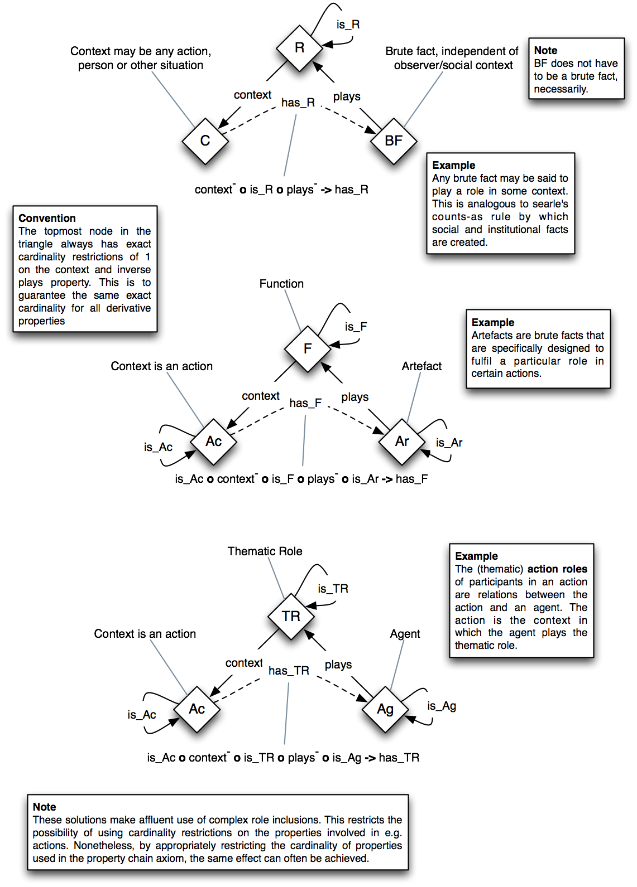

 __This pattern has been certified.__
Related submission, with evaluation history, can be found __here__

#  Graphical representation

__Diagram__

#  General description

  

#  Elements

_The __Roles (OWL 2)__ Content OP locally defines the following ontology elements:_

#  Additional information

This pattern is made available under the CC-BY licence ([http://creativecommons.org/licenses/by/2.0/](http://creativecommons.org/licenses/by/2.0/ "http://creativecommons.org/licenses/by/2.0/")). Under this licence the pattern can be freely reused but reusers should include an attribution to the original author (Rinke Hoekstra)

In your academic publications, please refer to this pattern by citing:

Rinke Hoekstra. Representing social reality in OWL 2. In Evren Sirin and Kendall Clark, editors, Proceedings of OWLED 2010, June 2010.

and/or

Rinke Hoekstra. Ontology Representation – Design Patterns and Ontologies that Make Sense, volume 197 of Frontiers of Artificial Intelligence and Applications. IOS Press, Amsterdam, June 2009.

  

#  Scenarios

__Scenarios about Roles (OWL 2)__
No scenario is added to this Content OP.

#  Reviews

__Reviews about Roles (OWL 2)__
There is no review about this proposal.
This revision (revision ID __10279__) takes in account the reviews: none

Other info at [evaluation tab](http://ontologydesignpatterns.org/wiki/index.php?title=Submissions:Roles_%28OWL_2%29&action=evaluation "http://ontologydesignpatterns.org/wiki/index.php?title=Submissions:Roles_%28OWL_2%29&action=evaluation")

  

#  Modeling issues

__Modeling issues about Roles (OWL 2)__
There is no Modeling issue related to this proposal.

  

#  References

[Add a reference](index.php@title=Odp%253AAdd_reference&subject=Submissions%253ARoles+(OWL+2).html "http://ontologydesignpatterns.org/wiki/index.php?title=Odp:Add_reference&subject=Submissions%3ARoles+%28OWL+2%29")

Retrieved from "[http://ontologydesignpatterns.org/wiki/Submissions:Roles\_%28OWL\_2%29](../Submissions/Roles_(OWL_2).md).md).html)"
 [Categories](http://ontologydesignpatterns.org/wiki/Special:Categories "Special:Categories"): [ProposedContentOP](../Category/ProposedContentOP.md "Category:ProposedContentOP") | [Waiting for review](../Category/Waiting_for_review.md "Category:Waiting for review")