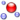

 __This pattern has been certified.__
Related submission, with evaluation history, can be found __here__

#  Graphical representation

__Diagram__
_(this article has no graphical representation)_

#  General description

  

#  Elements

_The __Scorepart__ Content OP locally defines the following ontology elements:_

 __Part__ (owl:Class) A part of a a score notation or a symbolic notation assigned to a specific instrument. 
  _[Part](../Submissions/Scorepart/Part "Submissions:Scorepart/Part") page_
 __Section__ (owl:Class) A group of notes that share the same metric and clef. 
  _[Section](../Submissions/Scorepart/Section "Submissions:Scorepart/Section") page_
 __Instrument__ (owl:Class) Any of various devices or contrivances that can be used to produce musical tones or sound. Any taxonomy can be used to subsume this concept. The default one is one extracted by Ivan Herman from the Musicbrainz instrument taxonomy, conforming to SKOS. This concept holds a seeAlso link towards this taxonomy. 
  _[Instrument](../Submissions/Scorepart/Instrument "Submissions:Scorepart/Instrument") page_
 __Voice__ (owl:Class) One of several parts that can be performed within the same staff (e.g. alto and soprano). 
  _[Voice](../Submissions/Scorepart/Voice "Submissions:Scorepart/Voice") page_
 __HomogeneousFragment__ (owl:Class) A group of notes that share the same metric and clef. 
  _[HomogeneousFragment](../Submissions/Scorepart/HomogeneousFragment "Submissions:Scorepart/HomogeneousFragment") page_
 __hasMidiProgram__ (owl:DatatypeProperty) The instrument playing a specific part expressed by a MIDI program. 
  _[hasMidiProgram](../Submissions/Scorepart/hasMidiProgram "Submissions:Scorepart/hasMidiProgram") page_
 __hasStaff__ (owl:DatatypeProperty) The staff assigned to a specific instrument part in a music score. 
  _[hasStaff](../Submissions/Scorepart/hasStaff "Submissions:Scorepart/hasStaff") page_
 __hasClef__ (owl:DatatypeProperty) The clef that describes the hight of a note in a music score. 
  _[hasClef](../Submissions/Scorepart/hasClef "Submissions:Scorepart/hasClef") page_
 __hasTempo__ (owl:DatatypeProperty) The tempo of an homogeneous fragment, expressed in bpm (integer). 
  _[hasTempo](../Submissions/Scorepart/hasTempo "Submissions:Scorepart/hasTempo") page_
 __hasMetric__ (owl:DatatypeProperty) The metric of a specific section of a music score. 
  _[hasMetric](../Submissions/Scorepart/hasMetric "Submissions:Scorepart/hasMetric") page_
 __isPlayedBy__ (owl:ObjectProperty) Connects the part of the score/symbolic notation to the instrument that is assigned to play such part. 
  _[isPlayedBy](../Submissions/Scorepart/isPlayedBy "Submissions:Scorepart/isPlayedBy") page_
 __hasVoice__ (owl:ObjectProperty) Connects the part of the score/symbolic notation to its constituing sections. 
  _[hasVoice](../Submissions/Scorepart/hasVoice "Submissions:Scorepart/hasVoice") page_
 __hasSection__ (owl:ObjectProperty) Connects the part of the score/symbolic notation to its constituing sections. 
  _[hasSection](../Submissions/Scorepart/hasSection "Submissions:Scorepart/hasSection") page_
 __hasFragment__ (owl:ObjectProperty) Connects the part of the score/symbolic notation to its constituing sections. 
  _[hasFragment](../Submissions/Scorepart/hasFragment "Submissions:Scorepart/hasFragment") page_
 __isFragmentOf__ (owl:ObjectProperty) Inverse of hasFragment 
  _[isFragmentOf](../Submissions/Scorepart/isFragmentOf "Submissions:Scorepart/isFragmentOf") page_
 __isSectionOf__ (owl:ObjectProperty) Inverse of hasSection. Connects the section of the score/symbolic notation to the belongng part. 
  _[isSectionOf](../Submissions/Scorepart/isSectionOf "Submissions:Scorepart/isSectionOf") page_
 __isVoiceOf__ (owl:ObjectProperty) Inverse of hasVoice. Connects the voice of the score/symbolic notation to the belonging part. 
  _[isVoiceOf](../Submissions/Scorepart/isVoiceOf "Submissions:Scorepart/isVoiceOf") page_
 __playsPart__ (owl:ObjectProperty) Inverse of isPlayedBy. Connects an instrument to the the part that the instrument plays. 
  _[playsPart](../Submissions/Scorepart/playsPart "Submissions:Scorepart/playsPart") page_
#  Additional information

#  Scenarios

__Scenarios about Scorepart__
No scenario is added to this Content OP.

#  Reviews

__Reviews about Scorepart__
There is no review about this proposal.
This revision (revision ID __14271__) takes in account the reviews: none

Other info at [evaluation tab](http://ontologydesignpatterns.org/wiki/index.php?title=Submissions:Scorepart&action=evaluation "http://ontologydesignpatterns.org/wiki/index.php?title=Submissions:Scorepart&action=evaluation")

#  Modeling issues

__Modeling issues about Scorepart__
There is no Modeling issue related to this proposal.

#  References

[Add a reference](index.php@title=Odp%253AAdd_reference&subject=../Submissions/Scorepart "http://ontologydesignpatterns.org/wiki/index.php?title=Odp:Add_reference&subject=Submissions%3AScorepart")

  

The Score Part pattern models the structure and the hierarchies of a music score.
In this module are used as template the following Ontology Design Patterns:

Retrieved from "[http://ontologydesignpatterns.org/wiki/Submissions:Scorepart](../Submissions/Scorepart)"
 [Category](http://ontologydesignpatterns.org/wiki/Special:Categories "Special:Categories"): [ProposedContentOP](../Category/ProposedContentOP "Category:ProposedContentOP")