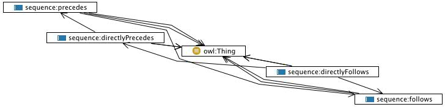

 __This pattern has been certified.__
Related submission, with evaluation history, can be found __here__

#  Graphical representation

__Diagram__

#  General description

  

#  Elements

_The __Sequence__ Content OP locally defines the following ontology elements:_

 __directlyFollows__ (owl:ObjectProperty) The intransitive follows relation. For example, Wednesday directly precedes Thursday. Directness of precedence depends on the designer conceptualization. 
  _[directlyFollows](../Submissions/Sequence/directlyFollows.md "Submissions:Sequence/directlyFollows") page_
 __directlyPrecedes__ (owl:ObjectProperty) The intransitive precedes relation. For example, Monday directly precedes Tuesday. Directness of precedence depends on the designer conceptualization. 
  _[directlyPrecedes](../Submissions/Sequence/directlyPrecedes.md "Submissions:Sequence/directlyPrecedes") page_
 __follows__ (owl:ObjectProperty) A relation between entities, expressing a 'sequence' schema. 
E.g. 'year 2000 follows 1999', 'preparing coffee' follows 'deciding what coffee to use', 'II World War follows I World War', etc. 

It can be used between tasks, processes or time intervals, and subproperties would fit best in order to distinguish the different uses. 

  _[follows](../Submissions/Sequence/follows.md "Submissions:Sequence/follows") page_
 __precedes__ (owl:ObjectProperty) A relation between entities, expressing a 'sequence' schema. 
E.g. 'year 1999 precedes 2000', 'deciding what coffee to use' precedes 'preparing coffee', 'World War II follows World War I', 'in the Milan to Rome autoroute, Bologna precedes Florence', etc.

It can then be used between tasks, processes, time intervals, spatially locate objects, situations, etc. 

Subproperties can be defined in order to distinguish the different uses. 

  _[precedes](../Submissions/Sequence/precedes.md "Submissions:Sequence/precedes") page_
#  Additional information

#  Scenarios

__Scenarios about Sequence__
No scenario is added to this Content OP.

#  Reviews

__Reviews about Sequence__
There is no review about this proposal.
This revision (revision ID __9120__) takes in account the reviews: none

Other info at [evaluation tab](http://ontologydesignpatterns.org/wiki/index.php?title=Submissions:Sequence&action=evaluation "http://ontologydesignpatterns.org/wiki/index.php?title=Submissions:Sequence&action=evaluation")

  

#  Modeling issues

__Modeling issues about Sequence__
There is no Modeling issue related to this proposal.

  

#  References

[Add a reference](index.php@title=Odp%253AAdd_reference&subject=../Submissions/Sequence.md "http://ontologydesignpatterns.org/wiki/index.php?title=Odp:Add_reference&subject=Submissions%3ASequence")

  

Retrieved from "[http://ontologydesignpatterns.org/wiki/Submissions:Sequence](../Submissions/Sequence.md)"
 [Category](http://ontologydesignpatterns.org/wiki/Special:Categories "Special:Categories"): [ProposedContentOP](../Category/ProposedContentOP.md "Category:ProposedContentOP")