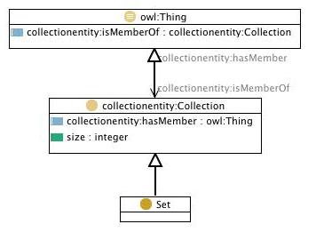

 __This pattern has been certified.__
Related submission, with evaluation history, can be found __here__

#  Graphical representation

__Diagram__

#  General description

  

#  Elements

_The __Set__ Content OP locally defines the following ontology elements:_

 __Set__ (owl:Class) Set - A collection that cannot contain duplicate elements. 
  _[Set](../Submissions/Set/Set.md "Submissions:Set/Set") page_
 __size__ (owl:DatatypeProperty) size - The number of items belonging to a collection 
  _[size](../Submissions/Set/size.md "Submissions:Set/size") page_
#  Additional information

A Set is a collection that cannot contain duplicate elements. A Set is expressed by linking to it directly all the members (elements), multiple identical values of members (elements) will be eliminated because by default they are treated as a set.

The collections ontology (part of the SWAN ontologies) that this pattern is based on was created by Paolo Ciccarese - Massachusetts General Hospital/Harvard Medical School, and Marco Ocana - Balboa Systems Inc. The original ontologies, and related information, are available under a [Creative Commons License](http://creativecommons.org/licenses/by/1.0/ "http://creativecommons.org/licenses/by/1.0/").

#  Scenarios

__Scenarios about Set__
No scenario is added to this Content OP.

#  Reviews

__Reviews about Set__
There is no review about this proposal.
This revision (revision ID __10366__) takes in account the reviews: none

Other info at [evaluation tab](http://ontologydesignpatterns.org/wiki/index.php?title=Submissions:Set&action=evaluation "http://ontologydesignpatterns.org/wiki/index.php?title=Submissions:Set&action=evaluation")

  

#  Modeling issues

__Modeling issues about Set__
There is no Modeling issue related to this proposal.

  

#  References

[Add a reference](index.php@title=Odp%253AAdd_reference&subject=../Submissions/Set.md "http://ontologydesignpatterns.org/wiki/index.php?title=Odp:Add_reference&subject=Submissions%3ASet")

  

Retrieved from "[http://ontologydesignpatterns.org/wiki/Submissions:Set](../Submissions/Set.md)"
 [Category](http://ontologydesignpatterns.org/wiki/Special:Categories "Special:Categories"): [ProposedContentOP](../Category/ProposedContentOP.md "Category:ProposedContentOP")