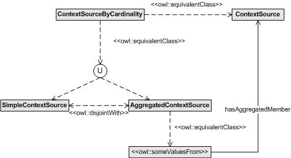

__Description:__ Modelling simple and aggregated context sources within the mIO! ontology network.
__Diagram__

__OWL file:__ OWL implemetation is missing. Please add it through the __edit__ link.

Retrieved from "[http://ontologydesignpatterns.org/wiki/Submissions:SimpleOrAggregated/Scenario\_2](../../Community/FSDAS_Scenario_2)"
 [Category](http://ontologydesignpatterns.org/wiki/Special:Categories "Special:Categories"): [Scenario](../../Category/Scenario "Category:Scenario")