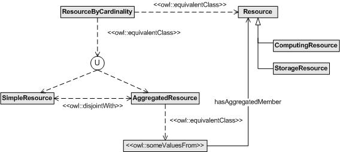

__Description:__ Modelling simple and aggregated resources. These resources are also organized by types, specifically, they can be computing or storage resources.
__Diagram__

__OWL file:__ OWL implemetation is missing. Please add it through the __edit__ link.

Retrieved from "[http://ontologydesignpatterns.org/wiki/Submissions:SimpleOrAggregated/Scenario\_3](../../Submissions/SimpleOrAggregated/Scenario_3)"
 [Category](http://ontologydesignpatterns.org/wiki/Special:Categories "Special:Categories"): [Scenario](../../Category/Scenario "Category:Scenario")