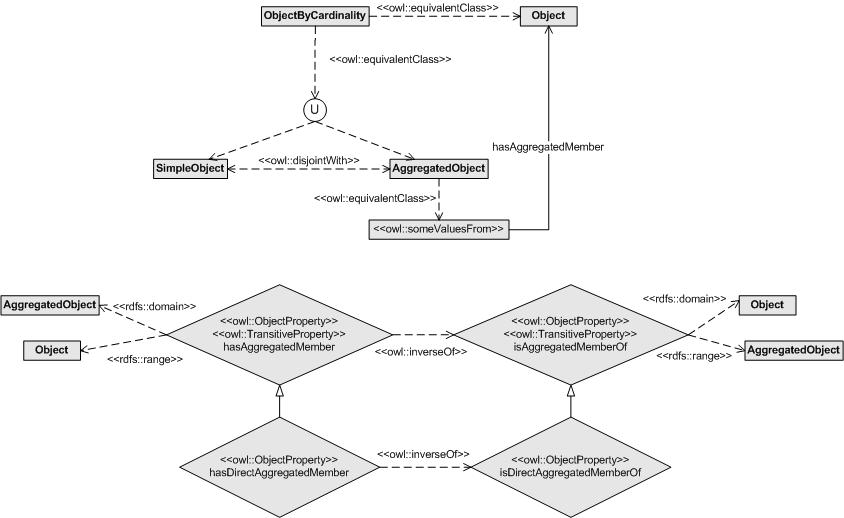

 __This pattern has been certified.__
Related submission, with evaluation history, can be found __here__

#  Graphical representation

__Diagram__

#  General description

  

#  Elements

_The __SimpleOrAggregated__ Content OP locally defines the following ontology elements:_

 __hasAggregatedMember__ (owl:ObjectProperty) 
  _[hasAggregatedMember](../Submissions/SimpleOrAggregated/hasAggregatedMember "Submissions:SimpleOrAggregated/hasAggregatedMember") page_
 __isAggregatedMemberOf__ (owl:ObjectProperty) 
  _[isAggregatedMemberOf](../Submissions/SimpleOrAggregated/isAggregatedMemberOf "Submissions:SimpleOrAggregated/isAggregatedMemberOf") page_
 __AggregatedObject__ (owl:Class) An object that is an aggregation of two or more objects.
  

Un objeto resultante de la agregación de dos o más objetos. 

  _[AggregatedObject](../Submissions/SimpleOrAggregated/AggregatedObject "Submissions:SimpleOrAggregated/AggregatedObject") page_
 __Object__ (owl:Class) Any physical, social, or mental object, or a substance.
  

Cualquier objeto físico, social o mental o sustancia. 

  _[Object](../Submissions/SimpleOrAggregated/Object "Submissions:SimpleOrAggregated/Object") page_
 __ObjectByCardinality__ (owl:Class) 
  _[ObjectByCardinality](../Submissions/SimpleOrAggregated/ObjectByCardinality "Submissions:SimpleOrAggregated/ObjectByCardinality") page_
 __SimpleObject__ (owl:Class) A simple object, that is, an object that has no aggregated objects.
  

Un objeto simple, es decir, un objeto que no tiene objetos agregados. 

  _[SimpleObject](../Submissions/SimpleOrAggregated/SimpleObject "Submissions:SimpleOrAggregated/SimpleObject") page_
#  Additional information

#  Scenarios

__Scenarios about SimpleOrAggregated__
* Modelling simple and aggregated service providers within the mIO! ontology network. Service providers are also organized by types. [>>>](../Submissions/SimpleOrAggregated/Scenario_1 "http://ontologydesignpatterns.org/wiki/Submissions:SimpleOrAggregated/Scenario_1")
* Modelling simple and aggregated context sources within the mIO! ontology network. [>>>](../Submissions/SimpleOrAggregated/Scenario_2 "http://ontologydesignpatterns.org/wiki/Submissions:SimpleOrAggregated/Scenario_2")
* Modelling simple and aggregated resources. These resources are also organized by types, specifically, they can be computing or storage resources. [>>>](../Submissions/SimpleOrAggregated/Scenario_3 "http://ontologydesignpatterns.org/wiki/Submissions:SimpleOrAggregated/Scenario_3")

#  Reviews

__Reviews about SimpleOrAggregated__
This revision (revision ID __10064__) takes in account the reviews: none

Other info at [evaluation tab](http://ontologydesignpatterns.org/wiki/index.php?title=Submissions:SimpleOrAggregated&action=evaluation "http://ontologydesignpatterns.org/wiki/index.php?title=Submissions:SimpleOrAggregated&action=evaluation")

  

#  Modeling issues

__Modeling issues about SimpleOrAggregated__
There is no Modeling issue related to this proposal.

  

#  References

[Add a reference](index.php@title=Odp%253AAdd_reference&subject=../Submissions/SimpleOrAggregated "http://ontologydesignpatterns.org/wiki/index.php?title=Odp:Add_reference&subject=Submissions%3ASimpleOrAggregated")

  

Retrieved from "[http://ontologydesignpatterns.org/wiki/Submissions:SimpleOrAggregated](../Submissions/SimpleOrAggregated)"
 [Categories](http://ontologydesignpatterns.org/wiki/Special:Categories "Special:Categories"): [ProposedContentOP](../Category/ProposedContentOP "Category:ProposedContentOP") | [Waiting for review](../Category/Waiting_for_review "Category:Waiting for review") | [Submitted to event](../Category/Submitted_to_event "Category:Submitted to event") | [Review assigned](../Category/Review_assigned "Category:Review assigned")