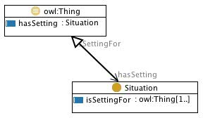

 __This pattern has been certified.__
Related submission, with evaluation history, can be found __here__

#  Graphical representation

__Diagram__

#  General description

  

#  Elements

_The __Situation__ Content OP locally defines the following ontology elements:_

 __hasSetting__ (owl:ObjectProperty) A relation between entities and situations, e.g. 'this morning I've prepared my coffee with a new fantastic Arabica' (i.e.: (an amount of) a new fantastic Arabica hasSetting the preparation of my coffee this morning). 
  _[hasSetting](../Submissions/Situation/hasSetting.md "Submissions:Situation/hasSetting") page_
 __isSettingFor__ (owl:ObjectProperty) 
  _[isSettingFor](../Submissions/Situation/isSettingFor.md "Submissions:Situation/isSettingFor") page_
 __Situation__ (owl:Class) A view on a set of entities. It can be seen as a 'relational context', reifying a relation.
For example, a PlanExecution is a context including some actions executed by agents according to certain parameters and expected tasks to be achieved from a Plan; a DiagnosedSituation is a context of observed entities that is interpreted on the basis of a Diagnosis, etc.

Situation is also able to represent reified n-ary relations, where isSettingFor is the top-level relation for all binary projections of the n-ary relation. If used in a transformation pattern for n-ary relations, the designer should take care of:

- creating only one situation for each instance of an n-ary relation, otherwise the 'identification constraint' (Calvanese et al., IJCAI 2001) could be violated

- adding an 'exact cardinality' restriction corresponding to the arity of the n-ary relation, otherwise the designer would actually represent a polymorphic relation. 

  _[Situation](../Submissions/Situation/Situation.md "Submissions:Situation/Situation") page_
#  Additional information

(type): [http://www.w3.org/2002/07/owl#Ontology](http://www.w3.org/2002/07/owl#Ontology "http://www.w3.org/2002/07/owl#Ontology")

(versionInfo): Created by Aldo Gangemi and Valentina Presutti

(imports): [http://www.ontologydesignpatterns.org/schemas/cpannotationschema.owl](http://www.ontologydesignpatterns.org/schemas/cpannotationschema.owl "http://www.ontologydesignpatterns.org/schemas/cpannotationschema.owl")

#  Scenarios

__Scenarios about Situation__
* I prepared a coffee with my heater, 300 ml of water, and an Arabica coffee mix. [>>>](../Submissions/Situation/Scenario_1.md "http://ontologydesignpatterns.org/wiki/Submissions:Situation/Scenario_1")

#  Reviews

__Reviews about Situation__
There is no review about this proposal.
This revision (revision ID __9122__) takes in account the reviews: none

Other info at [evaluation tab](http://ontologydesignpatterns.org/wiki/index.php?title=Submissions:Situation&action=evaluation "http://ontologydesignpatterns.org/wiki/index.php?title=Submissions:Situation&action=evaluation")

  

#  Modeling issues

__Modeling issues about Situation__

  

#  References

[Add a reference](index.php@title=Odp%253AAdd_reference&subject=../Submissions/Situation.md "http://ontologydesignpatterns.org/wiki/index.php?title=Odp:Add_reference&subject=Submissions%3ASituation")

  

Retrieved from "[http://ontologydesignpatterns.org/wiki/Submissions:Situation](../Submissions/Situation.md)"
 [Categories](http://ontologydesignpatterns.org/wiki/Special:Categories "Special:Categories"): [ProposedContentOP](../Category/ProposedContentOP.md "Category:ProposedContentOP") | [Waiting for review](../Category/Waiting_for_review.md "Category:Waiting for review")