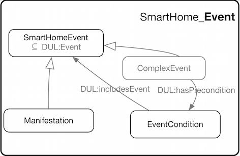

 __This pattern has been certified.__
Related submission, with evaluation history, can be found __here__

#  Graphical representation

__Diagram__

#  General description

  

#  Elements

_The __SmartHome Event__ Content OP locally defines the following ontology elements:_

 __ComplexEvent__ (owl:Class) 
  _[ComplexEvent](../Submissions/SmartHome_Event/ComplexEvent.md "Submissions:SmartHome Event/ComplexEvent") page_
 __EventCondition__ (owl:Class) 
  _[EventCondition](../Submissions/SmartHome_Event/EventCondition.md "Submissions:SmartHome Event/EventCondition") page_
 __Manifestation__ (owl:Class) 
  _[Manifestation](../Submissions/SmartHome_Event/Manifestation.md "Submissions:SmartHome Event/Manifestation") page_
[Submissions:SmartHome Event/event](http://ontologydesignpatterns.org/wiki/Special:AddData/Ontology Element Form/Submissions:SmartHome_Event/event "Submissions:SmartHome Event/event (not yet written)")  _[event](http://ontologydesignpatterns.org/wiki/Special:AddData/Ontology Element Form/Submissions:SmartHome_Event/event "Submissions:SmartHome Event/event (not yet written)") page_
#  Additional information

#  Scenarios

__Scenarios about SmartHome Event__
No scenario is added to this Content OP.

#  Reviews

__Reviews about SmartHome Event__
There is no review about this proposal.
This revision (revision ID __13371__) takes in account the reviews: none

Other info at [evaluation tab](http://ontologydesignpatterns.org/wiki/index.php?title=Submissions:SmartHome_Event&action=evaluation "http://ontologydesignpatterns.org/wiki/index.php?title=Submissions:SmartHome_Event&action=evaluation")

  

#  Modeling issues

__Modeling issues about SmartHome Event__
There is no Modeling issue related to this proposal.

  

#  References

[Add a reference](index.php@title=Odp%253AAdd_reference&subject=Submissions%253ASmartHome+Event.html "http://ontologydesignpatterns.org/wiki/index.php?title=Odp:Add_reference&subject=Submissions%3ASmartHome+Event")

  

Retrieved from "[http://ontologydesignpatterns.org/wiki/Submissions:SmartHome\_Event](../Submissions/SmartHome_Event.md)"
 [Category](http://ontologydesignpatterns.org/wiki/Special:Categories "Special:Categories"): [ProposedContentOP](../Category/ProposedContentOP.md "Category:ProposedContentOP")